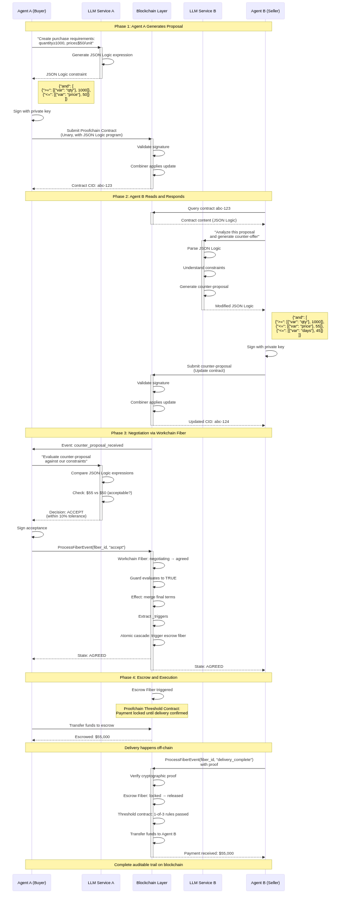
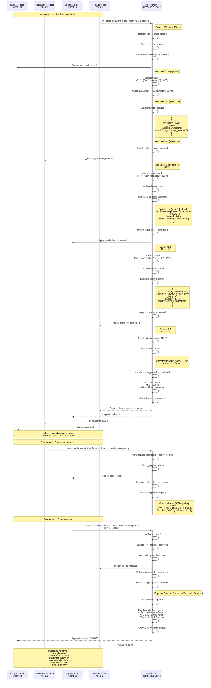
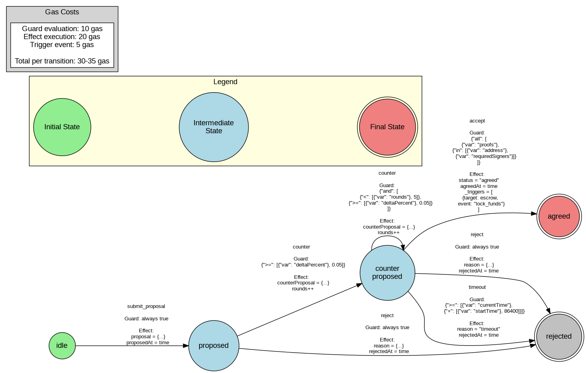
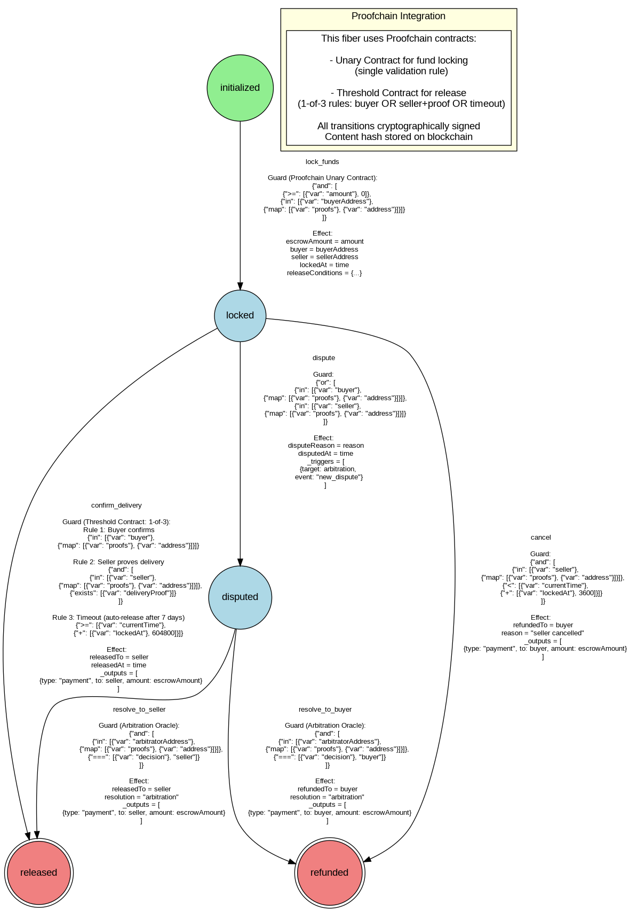
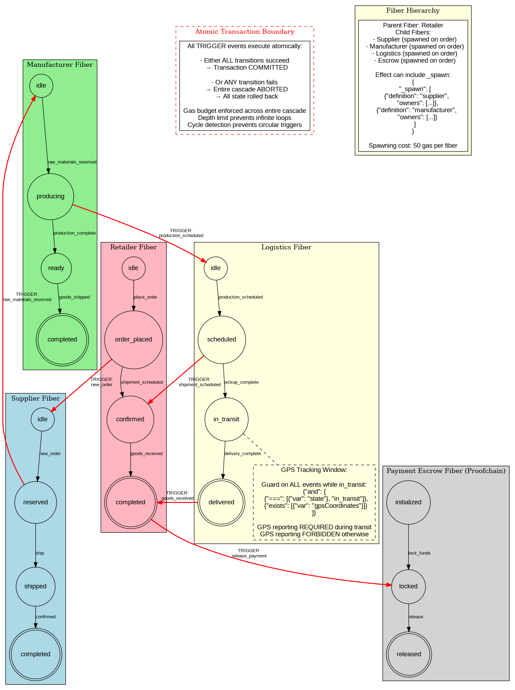
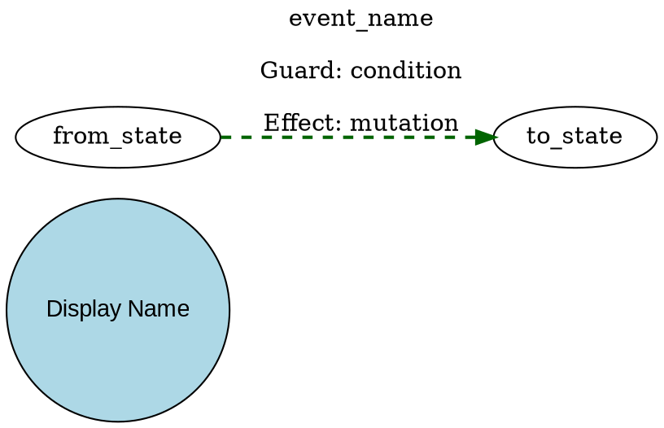
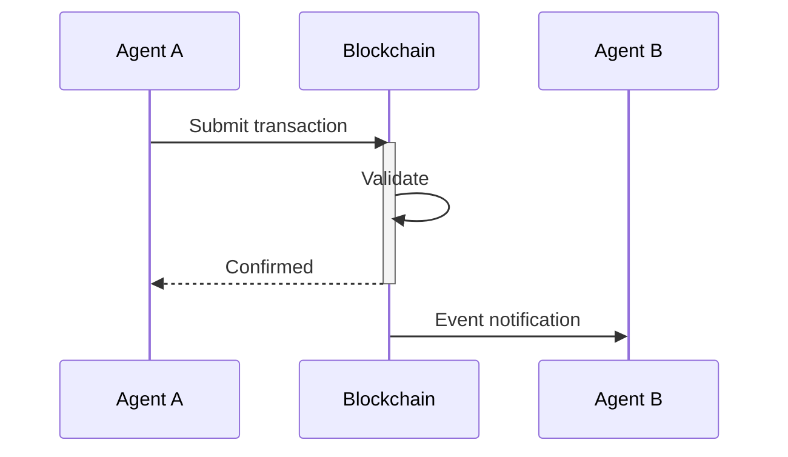

# Workchain Diagrams

This directory contains visual representations of the Workchain JSON Logic VM ecosystem, illustrating how AI agents can coordinate using deterministic, blockchain-backed workflows.

---

## AI Agent Protocol Layer Diagrams (NEW)

### Overall Stack Architecture

**File**: `architecture-stack.png` ([source](architecture-stack.dot))


This diagram shows the complete four-layer stack:

1. **Layer 0 - Blockchain**: Tessellation providing consensus, monotonic state progression, and immutable audit trail
2. **Layer 1 - Metakit**: JSON Logic VM with 50+ operators, gas metering, and deterministic evaluation
3. **Layer 2 - Proofchain**: State locking primitives (Owned, Unary, Threshold contracts) with progressive complexity
4. **Layer 3 - Workchain**: Fiber orchestration with atomic multi-agent coordination
5. **Layer 4 - AI Agent Applications**: Real-world use cases leveraging the stack

Key properties: JSON-native, deterministic, resource-bounded, cryptographically authorized, immutable audit, atomic coordination, human-readable.

---

### AI Agent Negotiation Sequence

**File**: `agent-negotiation-sequence.png` ([source](agent-negotiation-sequence.mmd))



**Scenario**: Two AI agents (Buyer and Seller) negotiate a procurement contract through multiple phases:

1. **Phase 1**: Agent A generates purchase requirements as JSON Logic
2. **Phase 2**: Agent B reads the proposal and generates counter-offer
3. **Phase 3**: Agents iterate via Workchain fiber state transitions
4. **Phase 4**: Agreement triggers escrow contract (Proofchain threshold contract)

**Key Features**:
- LLMs generate JSON Logic expressions natively
- Blockchain provides immutable negotiation trail
- Workchain fiber manages negotiation states
- Proofchain threshold contract handles escrow
- Atomic transition from negotiation to execution
- Cryptographic signatures at each step

---

### Autonomous Supply Chain Sequence

**File**: `supply-chain-sequence.png` ([source](supply-chain-sequence.mmd))



**Scenario**: Four coordinated AI agents manage end-to-end supply chain:

- **Supplier Agent**: Inventory management, order fulfillment
- **Manufacturer Agent**: Production scheduling
- **Logistics Agent**: Shipping coordination with GPS tracking
- **Retailer Agent**: Order placement and receipt confirmation

**Key Features**:
- **Atomic cascades**: One event triggers chain of state transitions across multiple fibers
- **Gas metering**: Each operation consumes gas, total tracked across entire cascade
- **All-or-nothing semantics**: Either all transitions succeed (commit) or all abort (rollback)
- **GPS tracking windows**: Contract enforces GPS reporting only during transit phase
- **Payment release**: Threshold contract releases payment on delivery confirmation

---

### Negotiation State Machine

**File**: `negotiation-state-machine.png` ([source](negotiation-state-machine.dot))



**States**: idle → proposed → counter_proposed → agreed/rejected

**Key Transitions**:
- `submit_proposal`: Always true guard, stores proposal
- `counter`: Delta ≥5% guard (prevents endless minor adjustments)
- `accept`: All signers verified guard, triggers escrow via `_triggers`
- `reject`: Always true guard, records reason
- `timeout`: Time > 24h guard, auto-reject

**Gas Costs**: Guard (10) + Effect (20) + Trigger (5) = 30-35 gas per transition

---

### Escrow State Machine with Proofchain Integration

**File**: `escrow-state-machine.png` ([source](escrow-state-machine.dot))



**States**: initialized → locked → released/refunded (or through disputed)

**Key Transitions**:
1. `lock_funds`: **Proofchain Unary Contract** validates amount and buyer signature
2. `confirm_delivery`: **Proofchain Threshold Contract** (1-of-3 rules):
   - Rule 1: Buyer confirms
   - Rule 2: Seller proves delivery
   - Rule 3: Timeout (auto-release after 7 days)
3. `dispute`: Either party can dispute, triggers arbitration fiber
4. `resolve_to_seller/buyer`: Arbitrator decision executed

**Demonstrates**: Integration of Proofchain contracts within Workchain fibers for complex authorization.

---

### Supply Chain Fiber Network

**File**: `supply-chain-fiber-network.png` ([source](supply-chain-fiber-network.dot))



**Four Coordinated Fibers**:
1. **Supplier**: idle → reserved → shipped → completed
2. **Manufacturer**: idle → producing → ready → completed
3. **Logistics**: idle → scheduled → in_transit → delivered (with GPS tracking window)
4. **Retailer**: idle → order_placed → confirmed → completed
5. **Escrow**: initialized → locked → released (Proofchain contract)

**Cross-Fiber Triggers** (red bold arrows):
- Retailer order → Supplier
- Supplier → Manufacturer
- Manufacturer → Logistics
- Logistics → Retailer
- Retailer → Escrow

**Atomic Transaction Boundary**: All triggers execute atomically - either ALL succeed or ALL abort.

**Fiber Hierarchy**: Retailer is parent, spawns child fibers (50 gas per spawn).

---

## Existing State Machine Diagrams

### Fuel Logistics Contract
- `fuel_contract_states.png` - Main contract state machine
- `gps_tracker_states.png` - GPS tracking fiber
- `quality_inspection_states.png` - Quality verification fiber
- `supplier_approval_states.png` - Supplier approval workflow

### Clinical Trial Management System
- `clinical_trial_lab_states.png` - Lab results state machine (demonstrates multiple guards on same event)
- `clinical_trial_coordinator_states.png` - Trial coordinator state machine (phase progression with suspension)

### Real Estate Lifecycle Management
- `real_estate_property_states.png` - Property state machine (full lifecycle from sale to foreclosure)
- `real_estate_mortgage_states.png` - Mortgage state machine (complex delinquency ladder with same-state transitions)
- `real_estate_contract_states.png` - Purchase contract state machine (multi-party defaults with earnest money)

### Economic Simulation (Riverdale)
- `riverdale_bank_states.png` - Commercial bank
- `riverdale_consumer_states.png` - Consumer behavior
- `riverdale_federal_reserve_states.png` - Central bank
- `riverdale_governance_states.png` - Governance/regulation
- `riverdale_manufacturer_states.png` - Production
- `riverdale_retailer_states.png` - Retail operations

---

## Regenerating Diagrams

### Mermaid Sequence Diagrams

```bash
mmdc -i agent-negotiation-sequence.mmd -o agent-negotiation-sequence.png -b transparent
mmdc -i supply-chain-sequence.mmd -o supply-chain-sequence.png -b transparent
```

### Graphviz Dot Diagrams

To regenerate all PNG images from DOT source files:

```bash
cd diagrams
for f in *.dot; do dot -Tpng "$f" -o "${f%.dot}.png"; done
```

Or regenerate a single diagram:

```bash
dot -Tpng negotiation-state-machine.dot -o negotiation-state-machine.png
```

---

## Prerequisites

### Graphviz (for dot diagrams)

```bash
# Ubuntu/Debian
sudo apt-get install graphviz

# macOS
brew install graphviz

# Fedora/RHEL
sudo dnf install graphviz
```

### Mermaid CLI (for sequence diagrams)

```bash
npm install -g @mermaid-js/mermaid-cli
```

---

## Diagram Features

### Color Coding

- **Light Blue**: Normal states
- **Light Green**: Initial states
- **Light Coral/Red**: Final states or error states
- **Yellow/Light Yellow**: Active/processing states
- **Orange**: Warning/review states
- **Gold**: Special completion states (e.g., paid off)
- **Gray**: Bank-owned/special states
- **Light Pink**: Retailer/customer states

### Edge Styles

- **Solid lines**: Primary transitions
- **Dashed lines**: Recovery/return paths or special transitions
- **Dotted lines**: Reset/cleanup transitions
- **Thick lines (penwidth=2+)**: Critical path transitions
- **Red bold lines**: Cross-fiber triggers (atomic cascades)
- **Blue lines**: Trigger events that cause cross-machine effects

### Node Shapes

- **Circle**: Regular state
- **Double circle**: Final state (terminal, no outbound transitions)
- **Point**: Start marker (black dot)
- **Box**: Process or annotation
- **Ellipse**: Agent or external entity
- **Record**: Structured component description

---

## Key Concepts Illustrated

### 1. JSON Logic as Agent Language
- LLMs generate JSON Logic expressions natively
- Human-readable and auditable
- Token-efficient (50-70% cost reduction vs. code generation)
- Deterministic execution (same input → same output)

### 2. Blockchain as Trust Layer
- Immutable audit trail
- Cryptographic authorization (multi-sig)
- Monotonic state progression
- Byzantine fault tolerance

### 3. Progressive Complexity (Proofchain)
- **Level 1**: Owned records (simple multi-sig)
- **Level 2**: Unary contracts (single validation rule)
- **Level 3**: Threshold contracts (M-of-N rules)

### 4. Atomic Coordination (Workchain)
- Cross-fiber triggers create cascades
- All-or-nothing transaction semantics
- Gas metering prevents runaway execution
- Depth limits prevent infinite loops
- Cycle detection prevents circular triggers

### 5. Resource Management
- **Gas budget**: Each operation has a cost
- **Depth tracking**: Limit cascade nesting
- **Cycle detection**: Abort on circular triggers
- **Timeout guards**: Prevent indefinite waiting

### 6. Integration Patterns
- Workchain fibers reference Proofchain contracts
- Fibers handle orchestration
- Contracts handle complex locking/validation
- Combined: powerful workflow + authorization

---

## Editing Diagrams

### Graphviz DOT Syntax



### Mermaid Sequence Diagram Syntax



---

## Related Documentation

- `../AI_AGENT_PROTOCOL_LAYER.md` - Comprehensive overview of the AI agent ecosystem
- `../STATE_MACHINE_EXAMPLES.md` - Detailed workflow descriptions for existing diagrams
- `../README.md` - Workchain project overview

---

## Use Case Categories

1. **Inter-Business Coordination**: Negotiation, procurement, supply chain
2. **Financial Services**: Escrow, payment processing, lending
3. **Compliance & Audit**: Regulatory reporting, KYC/AML checks
4. **Multi-Party Governance**: DAO voting, threshold approvals
5. **Process Automation**: Manufacturing, logistics, quality control
6. **Marketplace Protocols**: Agent discovery, reputation, payment
