# OttoChain Corporate Governance Domain

Production-ready state machines for traditional business entity governance. This domain provides comprehensive tracking of corporate lifecycle, board operations, shareholder activities, securities management, and regulatory compliance.

## Overview

The corporate governance domain consists of **10 interconnected state machines** that model the complete lifecycle and operations of a business entity. These machines work together through cross-machine guards and events to ensure proper authorization, sequencing, and audit trails for all corporate actions.

### Design Philosophy

1. **Separation of Concerns**: Each machine handles a distinct aspect of governance
2. **Cross-Machine Validation**: Guards reference other machines to enforce dependencies
3. **Audit Trail**: All transitions emit events for complete traceability
4. **Real-World Fidelity**: Models actual corporate law requirements (Delaware focus, broadly applicable)
5. **Extensibility**: Context schemas support jurisdiction-specific variations

---

## State Machine Inventory

| Machine | Purpose | States |
|---------|---------|--------|
| `corporate-entity` | Master corporate record | INCORPORATING → ACTIVE → SUSPENDED → DISSOLVED |
| `corporate-board` | Board of directors | ACTIVE ↔ IN_MEETING ↔ QUORUM_LOST |
| `corporate-shareholders` | Shareholder meetings | SCHEDULED → RECORD_DATE_SET → PROXY_PERIOD → IN_SESSION → VOTING → CLOSED |
| `corporate-officers` | Executive officers | ACTIVE (self-transitions) |
| `corporate-bylaws` | Governing documents | DRAFT → ADOPTED ↔ AMENDING |
| `corporate-committee` | Board committees | FORMING → ACTIVE ↔ IN_MEETING ↔ NON_COMPLIANT → DISBANDED |
| `corporate-resolution` | Formal actions | DRAFT → PROPOSED → VOTING → APPROVED → EXECUTED |
| `corporate-proxy` | Voting proxies | GRANTED → ACTIVE → VOTED / REVOKED / EXPIRED |
| `corporate-securities` | Equity transactions | AUTHORIZED → ISSUED ↔ TRANSFERRED ↔ TREASURY → RETIRED |
| `corporate-compliance` | Regulatory status | COMPLIANT ↔ REVIEW_PENDING ↔ DEFICIENT ↔ REMEDIATED |

---

## State Machine Relationship Diagram

```
                                    ┌─────────────────────────────────────────┐
                                    │         CORPORATE ENTITY                │
                                    │  (Master Record - Share Structure)      │
                                    │  INCORPORATING → ACTIVE → DISSOLVED     │
                                    └───────────────────┬─────────────────────┘
                                                        │
                    ┌───────────────────────────────────┼───────────────────────────────────┐
                    │                                   │                                   │
                    ▼                                   ▼                                   ▼
    ┌───────────────────────────┐       ┌───────────────────────────┐       ┌───────────────────────────┐
    │      CORPORATE BOARD      │       │    CORPORATE OFFICERS     │       │    CORPORATE BYLAWS       │
    │  (Directors & Meetings)   │       │   (Executive Management)  │       │   (Governing Documents)   │
    │  ACTIVE ↔ IN_MEETING      │       │   ACTIVE (appointments)   │       │   DRAFT → ADOPTED         │
    └─────────────┬─────────────┘       └─────────────┬─────────────┘       └─────────────┬─────────────┘
                  │                                   │                                   │
                  │ creates/manages                   │ appointed by                      │ amended by
                  ▼                                   │                                   │
    ┌───────────────────────────┐                     │                                   │
    │   CORPORATE COMMITTEE     │                     │                                   │
    │  (Audit, Compensation,    │◄────────────────────┘                                   │
    │   Nominating, etc.)       │                                                         │
    │  FORMING → ACTIVE         │                                                         │
    └─────────────┬─────────────┘                                                         │
                  │                                                                       │
                  │ recommends / approves                                                 │
                  ▼                                                                       │
    ┌───────────────────────────────────────────────────────────────────────────────────┐│
    │                           CORPORATE RESOLUTION                                    ││
    │            (Formal Actions - Board & Shareholder Approvals)                       ││
    │            DRAFT → PROPOSED → VOTING → APPROVED → EXECUTED                        │◄┘
    │                                                                                   │
    │  Guards reference: board quorum, shareholder votes, committee authority           │
    └───────────────────────────────────────────────────────────────────────────────────┘
                  │                           │                           │
                  │ authorizes                │ authorizes                │ authorizes
                  ▼                           ▼                           ▼
    ┌───────────────────────┐   ┌───────────────────────┐   ┌───────────────────────────┐
    │  CORPORATE SECURITIES │   │ CORPORATE SHAREHOLDERS│   │   CORPORATE COMPLIANCE    │
    │  (Stock Issuance,     │   │ (Meetings & Voting)   │   │   (Filings & Status)      │
    │   Transfers)          │   │                       │   │                           │
    │  AUTHORIZED → ISSUED  │   │ SCHEDULED → VOTING    │   │ COMPLIANT → DEFICIENT     │
    └───────────────────────┘   │      → CLOSED         │   └───────────────────────────┘
                                └───────────┬───────────┘
                                            │
                                            │ uses
                                            ▼
                                ┌───────────────────────┐
                                │    CORPORATE PROXY    │
                                │  (Voting Delegation)  │
                                │  GRANTED → ACTIVE     │
                                │      → VOTED          │
                                └───────────────────────┘
```

---

## Cross-Machine Dependencies

### Critical Guards (Authorization Requirements)

| Action | Requires | From Machine |
|--------|----------|--------------|
| Stock issuance | Board resolution in EXECUTED state | corporate-resolution |
| Officer appointment | Board resolution in EXECUTED state | corporate-resolution |
| Charter amendment | Board + Shareholder resolutions EXECUTED | corporate-resolution |
| Committee action | Committee quorum + charter authority | corporate-committee |
| Proxy vote | Proxy in ACTIVE state (not REVOKED) | corporate-proxy |
| Director election | Meeting with quorum | corporate-board |
| Bylaw amendment (certain provisions) | Shareholder approval | corporate-shareholders |

### Event Propagation

```
RESOLUTION_EXECUTED ──────► Triggers: stock issuance, officer appointment, etc.
SHARES_ISSUED ────────────► Updates: corporate-entity share counts
DIRECTOR_ELECTED ─────────► Updates: corporate-board roster
CORPORATION_SUSPENDED ────► Triggers: corporate-compliance deficiency
PROXY_VOTE_CAST ──────────► Updates: corporate-shareholders vote tally
```

---

## Example Workflows

### 1. Corporation Formation

```mermaid
sequenceDiagram
    participant Entity as corporate-entity
    participant Board as corporate-board
    participant Officers as corporate-officers
    participant Bylaws as corporate-bylaws
    participant Securities as corporate-securities
    
    Note over Entity: State: INCORPORATING
    
    Entity->>Entity: File articles with state
    Entity->>Entity: incorporate() → ACTIVE
    
    Note over Bylaws: State: DRAFT
    Bylaws->>Bylaws: adopt() → ADOPTED
    
    Note over Board: Initialize board
    Board->>Board: elect_director() (initial directors)
    Board->>Board: call_meeting() (organizational meeting)
    Board->>Board: open_meeting() → IN_MEETING
    
    Note over Officers: Appoint initial officers
    Board->>Officers: Resolution: appoint CEO
    Officers->>Officers: appoint_officer(CEO)
    Officers->>Officers: appoint_officer(Secretary)
    
    Note over Securities: Issue founder shares
    Board->>Securities: Resolution: authorize stock issuance
    Securities->>Securities: authorize_shares()
    Securities->>Securities: issue_shares() → ISSUED
    
    Board->>Board: adjourn() → ACTIVE
```



**Steps:**
1. Create entity in INCORPORATING state with share structure
2. File articles → `incorporate` → ACTIVE
3. Adopt bylaws → ADOPTED
4. Hold organizational board meeting
5. Elect initial directors
6. Appoint officers (CEO, Secretary, CFO, etc.)
7. Authorize and issue founder shares
8. Set up compliance tracking

### 2. Annual Shareholder Meeting

```mermaid
sequenceDiagram
    participant SH as corporate-shareholders
    participant Board as corporate-board
    participant Proxy as corporate-proxy
    participant Resolution as corporate-resolution
    
    Note over Board: Board schedules meeting
    Board->>Resolution: draft_resolution(schedule annual meeting)
    Resolution->>Resolution: propose() → PROPOSED
    Resolution->>Resolution: open_voting() → VOTING
    Resolution->>Resolution: close_voting_approved() → APPROVED
    Resolution->>Resolution: execute() → EXECUTED
    
    Note over SH: State: SCHEDULED
    SH->>SH: schedule_annual()
    SH->>SH: set_record_date() → RECORD_DATE_SET
    SH->>SH: register_eligible_shareholders()
    
    Note over Proxy: Proxy solicitation
    SH->>SH: open_proxy_period() → PROXY_PERIOD
    
    loop For each shareholder
        Proxy->>Proxy: grant_proxy() → GRANTED
        Proxy->>Proxy: activate() → ACTIVE
    end
    
    Note over SH: Meeting day
    SH->>SH: open_meeting() → IN_SESSION
    SH->>SH: open_polls() → VOTING
    
    loop For each vote
        Proxy->>Proxy: vote_proxy()
        SH->>SH: cast_vote()
    end
    
    SH->>SH: close_polls() → IN_SESSION
    SH->>SH: certify_results() → CLOSED
    
    Note over Proxy: Post-meeting
    Proxy->>Proxy: complete_voting() → VOTED
```



**Steps:**
1. Board approves meeting date via resolution
2. Schedule meeting, set record date
3. Determine eligible shareholders
4. Open proxy period, distribute proxy materials
5. Collect proxies
6. Convene meeting, establish quorum
7. Open polls for each agenda item
8. Collect votes (in-person + proxy)
9. Close polls, certify results
10. Record meeting results

### 3. Stock Issuance (Private Placement)


**Guards Enforced:**
- Board meeting must have quorum
- Resolution must be in EXECUTED state before issuance
- Entity must be in ACTIVE state (not SUSPENDED)
- Shares must not exceed authorized count

---

## Key Business Rules Encoded

### Board Governance
- **Quorum**: Majority of filled seats required to transact business
- **Staggered Boards**: Support for Class I/II/III directors with staggered terms
- **Independence**: Tracks director independence status for committee eligibility
- **Quorum Loss**: Automatic transition when directors depart mid-meeting

### Shareholder Voting
- **Record Date**: Determines who can vote (10-60 days before meeting)
- **Cumulative Voting**: Supported for director elections
- **Class Voting**: Different share classes vote separately when required
- **Proxy Mechanics**: Tracks grant, revocation, supersession, expiration

### Securities
- **Restricted Stock**: Tracks Rule 144, lock-up, vesting restrictions
- **Transfer Restrictions**: Right of first refusal, legend requirements
- **Corporate Actions**: Stock splits, dividends affect share counts
- **Treasury Stock**: Repurchased shares tracked separately

### Compliance
- **Filing Calendar**: Tracks all required filings by jurisdiction
- **Deficiency Management**: Cure deadlines, penalties, remediation
- **Good Standing**: Certificate tracking for lending/financing
- **Foreign Qualification**: Multi-state registration tracking

---

## Integration Points with Other OttoChain Domains

### DAOs / On-Chain Governance
- Corporate entities can own tokens (securities machine tracks)
- Board votes could trigger on-chain proposals
- Shareholder voting could use token-weighted systems

### Smart Contracts
- Resolution execution could trigger contract calls
- Stock issuance could mint NFT certificates
- Proxy grants could be on-chain attestations

### Identity / KYC
- Shareholder verification for record date
- Accredited investor status for securities exemptions
- Director independence verification

### Document Management
- Resolution text, meeting minutes, certificates
- SEC filings, annual reports
- Stock certificates and legends

### Financial / Accounting
- Dividend payments from securities actions
- Franchise tax calculations from compliance
- Cap table for financial reporting

---

## Jurisdiction Considerations

These machines are designed primarily for **Delaware corporations** but are adaptable:

### Delaware-Specific Features
- Default quorum rules (majority)
- Written consent without meeting
- Director removal standards
- Stock transfer agent requirements

### Adaptations Needed for Other Jurisdictions
- **California**: Different quorum rules, cumulative voting defaults
- **Nevada**: Privacy provisions, broader indemnification
- **Wyoming**: DAO LLC integration
- **International**: Different corporate forms, governance requirements

The `jurisdiction` context field in each machine allows for jurisdiction-specific rule variations.

---

## File Inventory

```
corporate/
├── README.md                    # This file
├── corporate-entity.json        # Master corporate record (21KB)
├── corporate-board.json         # Board of directors (25KB)
├── corporate-shareholders.json  # Shareholder meetings (29KB)
├── corporate-officers.json      # Executive officers (20KB)
├── corporate-bylaws.json        # Governing documents (18KB)
├── corporate-committee.json     # Board committees (22KB)
├── corporate-resolution.json    # Formal actions (27KB)
├── corporate-proxy.json         # Proxy mechanics (19KB)
├── corporate-securities.json    # Equity transactions (28KB)
└── corporate-compliance.json    # Regulatory status (30KB)
```

**Total: ~239KB of comprehensive corporate governance logic**

---

## Usage Examples

### Initialize a New Corporation

```javascript
// 1. Create the entity
const entity = await otto.create('corporate-entity', {
  entityId: 'acme-corp-001',
  legalName: 'Acme Corporation',
  entityType: 'C_CORP',
  jurisdiction: { state: 'DE', country: 'USA' },
  registeredAgent: { name: 'CT Corporation', /* ... */ },
  shareStructure: {
    classes: [{
      classId: 'common',
      className: 'Common Stock',
      authorized: 10000000,
      parValue: 0.0001,
      votingRights: true
    }]
  }
});

// 2. Incorporate
await otto.transition(entity, 'incorporate', {
  approvalDate: '2024-01-15',
  stateFileNumber: 'DE-12345678'
});

// 3. Initialize compliance tracking
const compliance = await otto.create('corporate-compliance', {
  complianceId: 'acme-compliance-001',
  entityId: 'acme-corp-001',
  jurisdiction: { state: 'DE' },
  registeredAgents: [{ jurisdiction: 'DE', agentName: 'CT Corporation', /* ... */ }]
});
```

### Issue Stock with Board Approval

```javascript
// 1. Create and approve resolution
const resolution = await otto.create('corporate-resolution', {
  resolutionId: 'res-2024-001',
  entityId: 'acme-corp-001',
  title: 'Authorize Founder Stock Issuance',
  resolutionType: 'BOARD_RESOLUTION',
  category: 'STOCK_ISSUANCE',
  resolvedClauses: ['Issue 1,000,000 shares of Common Stock to founders'],
  approvalRequirements: { approverType: 'BOARD', threshold: 'MAJORITY_PRESENT' }
});

// ... (voting process)
await otto.transition(resolution, 'execute', { executedBy: 'secretary-001' });

// 2. Now issue the shares (guard checks resolution is EXECUTED)
const shares = await otto.create('corporate-securities', {
  securityId: 'sec-001',
  entityId: 'acme-corp-001',
  shareClass: 'common',
  shareCount: 1000000
});

await otto.transition(shares, 'issue_shares', {
  holderId: 'founder-001',
  holderName: 'Jane Founder',
  holderType: 'INDIVIDUAL',
  issuanceDate: '2024-01-20',
  form: 'BOOK_ENTRY',
  boardResolutionRef: 'res-2024-001',
  consideration: { type: 'CASH', value: 100 }
});
```

---

## Version History

| Version | Date | Changes |
|---------|------|---------|
| 1.0.0 | 2024-02 | Initial release - all 10 machines |

---

## License

MIT License - See individual machine files for details.

---

*Built for OttoChain by OttoThink 🧠*
