# Clinical Trial Management System

This document describes a comprehensive clinical trial workflow modeling a Phase III clinical trial from recruitment through regulatory approval, demonstrating multi-party coordination, adverse event handling, and regulatory compliance.

## Table of Contents

1. [Overview](#overview)
2. [Participants and Roles](#participants-and-roles)
3. [State Machines](#state-machines)
   - [Trial Coordinator](#1-trial-coordinator-state-machine)
   - [Patient Enrollment](#2-patient-enrollment-state-machine)
   - [Lab Results](#3-lab-results-state-machine)
   - [Adverse Event Monitor](#4-adverse-event-monitor-state-machine)
   - [Regulatory Review](#5-regulatory-review-state-machine)
   - [Insurance Coverage](#6-insurance-coverage-state-machine)
4. [Workflow Example](#workflow-example)
5. [Key Features Demonstrated](#key-features-demonstrated)
6. [Test Location](#test-location)

---

## Overview

### Workflow Sequence


The Clinical Trial Management System models a complete Phase III clinical trial lifecycle with:

- **6 interconnected state machines** coordinating the entire workflow
- **Multi-party coordination** across patients, labs, monitors, and regulators
- **Adverse event handling** with escalation paths and trial suspension
- **Multiple guards on same event** for complex lab result outcomes
- **Bi-directional transitions** supporting pause/resume workflows
- **Trigger events** with computed payloads for cross-machine coordination
- **Regulatory compliance** with FDA-style oversight

### Key Workflow

```
Recruitment → Enrollment → Active Trial → Lab Processing →
Adverse Event Monitoring → Regulatory Review → Completion
```

---

## Participants and Roles

- **Alice** - Trial Coordinator
- **Bob** - Patient
- **Charlie** - Lab Technician
- **Dave** - Adverse Event Monitor
- **Eve** - Regulator
- **Insurance** - Coverage Provider

---

## State Machines

### 1. Trial Coordinator State Machine

**Purpose**: Manages overall trial phases and progression through clinical trial phases.

**States**: 9 total states
- `recruiting` - Enrolling patients
- `active` - Trial in progress
- `phase_1` - Phase I clinical testing
- `phase_2` - Phase II clinical testing
- `phase_3` - Phase III clinical testing
- `under_review` - Regulatory review in progress
- `completed` - Trial finished (final state)
- `suspended` - Trial temporarily halted
- `terminated` - Trial permanently stopped (final state)

#### State Diagram


Source: `diagrams/clinical_trial_coordinator_states.dot`

#### Key Features

**Primary Path**:
```
recruiting → active → phase_1 → phase_2 → phase_3 → under_review → completed
```

**Alternate Paths**:
- `active` ⇄ `suspended` (bi-directional: trial can be suspended and resumed)
- `suspended` → `terminated` (permanent shutdown)

**Cross-Machine Dependencies**:
- Phase advancement requires checking adverse event status
- Completion requires all patients to have completed trial
- Review entry triggers regulatory review process

---

### 2. Patient Enrollment State Machine

**Purpose**: Tracks individual patient journey through the clinical trial with support for pause/resume and adverse events.

**States**: 9 total states
- `screening` - Initial eligibility assessment
- `enrolled` - Patient accepted into trial
- `active` - Actively participating
- `paused` - Temporarily suspended participation
- `visit_scheduled` - Next visit scheduled
- `visit_completed` - Visit finished
- `adverse_event` - Safety event occurred
- `withdrawn` - Patient left trial (final state)
- `completed` - Patient finished trial (final state)

#### Key Features

**Happy Path**:
```
screening → enrolled → active → visit_scheduled → visit_completed → completed
```

**Bi-directional Transitions** 🌟:
```
active ⇄ paused (patient can pause and resume)
```

**Adverse Event Paths**:
```
visit_completed → adverse_event → active (if resolved)
visit_completed → adverse_event → withdrawn (if critical)
active → paused → withdrawn (voluntary withdrawal)
```

**Trigger Events**:
- `complete_visit` triggers `process_sample` on Lab Results machine
- Adverse events trigger `report_event` on Adverse Event Monitor

---

### 3. Lab Results State Machine

**Purpose**: Processes patient samples with complex quality assessment demonstrating multiple guards on same event.

**States**: 8 total states
- `pending` - Sample not yet received
- `received` - Sample in lab
- `processing` - Analysis in progress
- `passed` - High quality results (final state)
- `questionable` - Acceptable but concerning (final state)
- `failed` - Poor quality (final state)
- `critical` - Dangerous biomarker levels (final state)
- `retest_required` - Contamination detected (final state)

#### State Diagram


Source: `diagrams/clinical_trial_lab_states.dot`

#### Key Features

**Multiple Guards on Same Event** 🌟:

The `complete` event from `processing` state can transition to **5 different states** based on complex conditions:

```
processing --[complete]--> passed
  Guard: quality ≥ 90 AND not contaminated AND biomarker < 100

processing --[complete]--> questionable
  Guard: 70 ≤ quality < 90 AND not contaminated

processing --[complete]--> failed
  Guard: quality < 70 AND not contaminated

processing --[complete]--> critical
  Guard: biomarker ≥ 500

processing --[complete]--> retest_required
  Guard: contaminated = true
```

This demonstrates **state fan-out** based on payload data analysis.

**Quality Criteria**:
- Quality score: 0-100 scale
- Contamination: boolean test
- Biomarker level: numeric threshold (500 = critical)

**Critical Results**:
- Critical results trigger adverse event reporting
- May lead to trial suspension

---

### 4. Adverse Event Monitor State Machine

**Purpose**: Tracks and escalates safety issues during the trial.

**States**: 5 total states
- `monitoring` - Baseline state, watching for issues
- `event_reported` - Safety event logged
- `investigating` - Analyzing severity
- `resolved` - Non-critical, patient can continue
- `escalated` - Critical, requires trial action (final state)

#### Key Features

**Monitoring Loop**:
```
monitoring → event_reported → investigating → resolved → monitoring
```

**Critical Path**:
```
investigating → escalated (if severity high)
```

**Cross-Machine Effects**:
- Escalated events can trigger trial suspension
- Critical biomarker results trigger event reporting

---

### 5. Regulatory Review State Machine

**Purpose**: FDA-style oversight and approval process for the clinical trial.

**States**: 5 total states
- `approved` - Initial trial approval granted
- `monitoring` - Ongoing oversight
- `reviewing` - Active review in progress
- `final_approved` - Trial results approved (final state)
- `rejected` - Trial rejected (final state)

#### Key Features

**Approval Path**:
```
approved → monitoring → reviewing → final_approved
```

**Review Criteria**:
- Compliance score ≥ 90%
- No critical adverse events
- Complete data submission

**Trial Dependencies**:
- Trial cannot start without regulatory approval
- Trial completion triggers final review

---

### 6. Insurance Coverage State Machine

**Purpose**: Manages patient coverage and claims processing throughout the trial.

**States**: 5 total states
- `active` - Coverage in effect
- `claim_filed` - Claim submitted
- `claim_processing` - Under review
- `claim_approved` - Claim authorized
- `claim_paid` - Payment issued

#### Key Features

**Claims Cycle**:
```
active → claim_filed → claim_processing → claim_approved → claim_paid → active
```

This is a **reentrant cycle** - patient can file multiple claims throughout trial.

**Coverage Requirements**:
- Patient must have active coverage before enrollment
- Claims tied to specific visit events

---

## Workflow Example

### Complete Trial Workflow

```
PHASE 1: Enrollment
━━━━━━━━━━━━━━━━━━━━━━━━━━━━━━━━━━━━━━━━━━━━━━
1. Patient: screening → enrolled (with consent)
2. Insurance: Check coverage active
3. Patient: enrolled → active

4. Trial: recruiting → active
5. Regulatory: Check approval status = "approved"
6. Trial: active → phase_1

PHASE 2: Visit & Lab Processing
━━━━━━━━━━━━━━━━━━━━━━━━━━━━━━━━━━━━━━━━━━━━━━
7. Patient: active → visit_scheduled
8. Lab: pending → received (sample collection)

9. Patient: visit_scheduled → visit_completed
   TRIGGER → Lab: process_sample

10. Lab: received → processing → passed
    Complete event with: quality=95, contaminated=false, biomarker=85
    Guard: quality ≥ 90 AND not contaminated AND biomarker < 100

11. Patient: visit_completed → active (continue trial)

PHASE 3: Adverse Event Path (if critical)
━━━━━━━━━━━━━━━━━━━━━━━━━━━━━━━━━━━━━━━━━━━━━━
Alternative Path:

10alt. Lab: processing → critical
       Complete event with: biomarker=550
       Guard: biomarker ≥ 500

11alt. Lab: TRIGGER → Adverse Event Monitor: report_event
       Adverse Event: monitoring → event_reported

12alt. Adverse Event: event_reported → investigating

13alt-a. IF non-critical:
         Adverse Event: investigating → resolved → monitoring
         Patient: Can resume trial

13alt-b. IF critical:
         Adverse Event: investigating → escalated
         Trial: active → suspended
         Patient: adverse_event → withdrawn

PHASE 4: Completion & Review
━━━━━━━━━━━━━━━━━━━━━━━━━━━━━━━━━━━━━━━━━━━━━━
(After 20 visits completed)

14. Patient: active → completed (visitCount=20)

15. Trial: phase_3 → under_review
    TRIGGER → Regulatory: begin_review

16. Regulatory: monitoring → reviewing

17. Regulatory: reviewing → final_approved
    Guard: compliance ≥ 90

18. Trial: under_review → completed
```

### Sequence Diagram

```mermaid
sequenceDiagram
    participant Patient as Patient (Bob)
    participant Trial as Trial Coordinator (Alice)
    participant Lab as Lab (Charlie)
    participant AE as Adverse Event (Dave)
    participant Reg as Regulator (Eve)
    participant Ins as Insurance

    Note over Patient,Ins: Phase 1: Enrollment
    Patient->>Ins: Check coverage
    Ins-->>Patient: Coverage active
    Patient->>Patient: enroll (with consent)
    Patient->>Patient: activate

    Trial->>Reg: Check approval
    Reg-->>Trial: Approved
    Trial->>Trial: start_trial

    Note over Patient,Lab: Phase 2: Visit & Lab Processing
    Patient->>Patient: schedule_visit
    Lab->>Lab: receive_sample
    Patient->>Lab: complete_visit (TRIGGER)
    activate Lab
    Lab->>Lab: process_sample
    Lab->>Lab: complete (quality=95)
    Lab-->>Patient: Result: passed
    deactivate Lab
    Patient->>Patient: continue

    Note over Patient,AE: Phase 3: Adverse Event Path (if critical)
    alt Critical Lab Result
        Lab->>AE: TRIGGER: report_event
        AE->>AE: investigate
        alt Non-critical
            AE->>AE: resolve
            Patient->>Patient: Resume trial
        else Critical
            AE->>AE: escalate
            Trial->>Trial: suspend
        end
    end

    Note over Trial,Reg: Phase 4: Completion & Review
    Patient->>Patient: complete_trial (20 visits)
    Trial->>Reg: TRIGGER: begin_review
    Reg->>Reg: approve (compliance≥90)
    Trial->>Trial: finalize
    Trial->>Trial: completed
```



---

## Key Features Demonstrated

### 1. Multiple Guards on Same Event 🌟

**Pattern**: Event fan-out with complex conditional logic

The Lab Results `complete` event demonstrates 5 possible outcomes from a single transition, each with distinct guard conditions:

| Target State | Guard Condition | Interpretation |
|--------------|----------------|----------------|
| `passed` | quality ≥ 90 AND ¬contaminated AND biomarker < 100 | Excellent results |
| `questionable` | 70 ≤ quality < 90 AND ¬contaminated | Acceptable but concerning |
| `failed` | quality < 70 AND ¬contaminated | Poor quality |
| `critical` | biomarker ≥ 500 | Dangerous levels |
| `retest_required` | contaminated = true | Sample contamination |

This pattern enables complex decision trees within state machine logic.

### 2. Bi-directional Transitions

**Pattern**: Pause and resume workflows

Patient enrollment supports temporary suspension:

```
active ⇄ paused
```

**Use Cases**:
- Patient requests temporary leave
- Trial coordinator pauses participation
- Patient can resume at same point

**Recovery Paths**:
```
adverse_event → active (if event resolved)
```

Demonstrates **resilient workflows** with recovery options.

### 3. Trigger Events with Computed Payloads

**Pattern**: Cross-machine coordination with data transformation

Visit completion triggers lab processing:

```
Patient: complete_visit
  TRIGGER → Lab: process_sample
  Payload: {
    patientId: event.patientId,
    sampleId: computedSampleId,
    visitNumber: state.visitCount,
    timestamp: event.timestamp
  }
```

Data flows between machines with context-aware transformations.

### 4. Cross-Machine Dependencies

**Pattern**: State transition guards checking other machines

Trial phase advancement checks multiple conditions:

```
Trial: phase_1 → phase_2
  Dependencies:
    - No escalated adverse events
    - Minimum patient enrollment met
    - Regulatory status = "approved"
```

Enables **coordinated multi-machine workflows**.

### 5. Structured Outputs

**Pattern**: Formatted output generation for external systems

- **Webhooks** on patient enrollment (notify hospital systems)
- **Email notifications** on trial completion
- **Regulatory reports** on adverse event escalation
- **Insurance claims** on visit completion

### 6. Long-term Lifecycle Management

**Pattern**: Multi-month/year processes with persistent state

Clinical trials span months to years:
- Tracks 20+ visits per patient
- Maintains cumulative quality metrics
- Records complete adverse event history
- Supports audit trail requirements

---

## Feature Matrix

| Feature | Demonstrated | Details |
|---------|-------------|---------|
| **Multiple Guards** | ✅ | Lab `complete` → 5 different states |
| **Bi-directional Transitions** | ✅ | Patient `active` ⇄ `paused` |
| **Trigger Events** | ✅ | Visit completion triggers lab processing |
| **Cross-Machine Dependencies** | ✅ | Trial checks adverse events and regulatory status |
| **Structured Outputs** | ✅ | Webhooks, emails, regulatory reports |
| **State Fan-Out** | ✅ | Single event, multiple target states |
| **Recovery Paths** | ✅ | Adverse event resolution back to active |
| **Long-term Tracking** | ✅ | Multi-month trial with cumulative metrics |

---

## Complexity Metrics

- **Total State Machines**: 6
- **Total States**: 47 across all machines
- **Total Transitions**: 35+ defined transitions
- **Cross-Machine Dependencies**: 8+ dependency checks
- **Multiple-Guard Events**: 1 event with 5 outcomes (Lab `complete`)
- **Bi-directional Transitions**: 2 (patient pause/resume, adverse event recovery)
- **Trigger Events**: 4 types (lab processing, adverse events, reviews, claims)
- **Final States**: 9 (completed, withdrawn, passed, questionable, failed, critical, retest, escalated, final_approved, rejected, terminated)

---

## Use Cases

This pattern applies to:

1. **Clinical Trials**: Multi-phase drug and device trials with regulatory oversight
2. **Patient Monitoring**: Long-term care coordination across multiple providers
3. **Laboratory Workflows**: Sample processing with complex quality gates
4. **Regulatory Compliance**: FDA, EMA, or other regulatory body oversight
5. **Insurance Claims Processing**: Healthcare claims with approval workflows
6. **Safety Monitoring**: Adverse event tracking in any regulated environment
7. **Multi-Party Healthcare**: Coordination across providers, labs, insurers, regulators

---

## Test Location

`modules/shared-data/src/test/scala/xyz/kd5ujc/shared_data/examples/ClinicalTrialStateMachineSuite.scala`

### Test Statistics

- **State Transitions**: 23+ tracked transitions
- **Patients Enrolled**: 1 (Bob)
- **Lab Samples Processed**: Multiple with varying quality scores
- **Visit Count**: 20 visits to completion
- **Adverse Events**: Both resolved and escalated scenarios tested
- **Final State**: `completed` ✅

---

## Conclusion

The Clinical Trial Management System demonstrates that the `DeterministicEventProcessor` infrastructure supports:

✅ **Multiple guards** on single events for complex decision logic (5 outcomes)
✅ **Bi-directional transitions** for pause/resume workflows
✅ **Trigger events** with computed payloads for cross-machine coordination
✅ **Cross-machine dependencies** for multi-party workflow orchestration
✅ **Structured outputs** for external system integration
✅ **State fan-out** enabling complex conditional branching
✅ **Recovery paths** from error states back to normal operation
✅ **Long-term lifecycle management** spanning months/years

The JSON-encoded approach enables this complex clinical trial workflow to be defined, tested, and deployed without writing custom state machine code. The workflow demonstrates patterns applicable to regulated healthcare environments, multi-party coordination, and safety-critical systems requiring detailed audit trails and compliance tracking.