# Fuel Logistics Contract with GPS Tracking

This document describes a complete fuel logistics workflow demonstrating multi-stage contract approval with integrated GPS tracking during transit.

## Table of Contents

1. [Overview](#overview)
2. [Participants and Roles](#participants-and-roles)
3. [State Machines](#state-machines)
   - [Fuel Contract](#1-fuel-contract-state-machine)
   - [GPS Tracker](#2-gps-tracker-state-machine)
   - [Supplier Approval](#3-supplier-approval-state-machine)
   - [Quality Inspection](#4-quality-inspection-state-machine)
4. [Workflow Example](#workflow-example)
5. [Key Features Demonstrated](#key-features-demonstrated)
6. [Test Location](#test-location)

---

## Overview

The Fuel Logistics example models a complete fuel delivery contract lifecycle with:

- **4 interconnected state machines** coordinating the entire workflow
- **Multi-stage approval process** (supplier verification → contract approval → quality inspection)
- **GPS tracking window** that is activated only during transit phase
- **Cross-machine dependencies** ensuring proper sequencing of operations
- **Quality gates** at critical checkpoints (supplier compliance, fuel quality)
- **Automated settlement** upon successful completion

### Key Economic Flow

```
Draft Contract → Supplier Review → GPS Activation → Transit (GPS Tracking Active) →
Delivery → Quality Inspection → Settlement
```

---

## Participants and Roles

- **Alice** - Buyer / Contract Owner
- **Bob** - Supplier Approval Officer
- **Charlie** - Quality Inspector
- **Dave** - Truck Driver

---

## State Machines

### 1. Fuel Contract State Machine

**Purpose**: Main contract managing the complete lifecycle from draft through settlement.

**States**: 11 total states
- `draft` - Initial contract creation
- `supplier_review` - Awaiting supplier approval
- `supplier_approved` - Supplier verified and approved
- `gps_ready` - GPS activated, shipment prepared
- `in_transit` - Active delivery (GPS tracking window) 🌟
- `delivered` - Fuel delivered, GPS tracking stopped
- `quality_check` - Quality inspection in progress
- `inspected` - Quality inspection passed
- `settling` - Payment processing
- `settled` - Contract completed (final state)
- `rejected` - Quality inspection failed (final state)

#### State Diagram


Source: `diagrams/fuel_contract_states.dot`

#### Key Features

**Multi-Stage Approval**:
```
draft → supplier_review → supplier_approved → gps_ready → in_transit
```

**GPS Tracking Window** 🌟:
- Contract can only enter `in_transit` if GPS is actively tracking
- Contract can only exit to `delivered` if GPS has stopped and has ≥3 data points
- Enforces GPS tracking throughout delivery

**Quality Gate**:
```
quality_check → inspected (if quality ≥ 85)
quality_check → rejected (if quality < 85 OR contamination detected)
```

**Cross-Machine Dependencies**:
- `supplier_approved` transition requires: `SupplierApproval.status === "approved"`
- `gps_ready` transition requires: `GPSTracker.status === "active"`
- `in_transit` transition requires: `GPSTracker.status === "tracking"` AND `dataPointCount > 0`
- `delivered` transition requires: `GPSTracker.status === "stopped"` AND `dataPointCount ≥ 3`
- `quality_check` transition requires: `QualityInspection.status === "scheduled"`
- `inspected` transition requires: `QualityInspection.status === "passed"` AND `qualityScore ≥ 85`

**Computed Fields**:
- `totalAmount = fuelQuantity * pricePerLiter` (calculated during settlement)
- Captures GPS metrics: `totalDistance`, `gpsDataPoints` from tracker

#### State Details

| State | Purpose | Entry Requirements | Key Data Captured |
|-------|---------|-------------------|-------------------|
| `draft` | Initial state | None | contractId, buyer, fuelType, quantity, price |
| `supplier_review` | Supplier vetting | quantity ≥ 1000 | submittedAt |
| `supplier_approved` | Supplier verified | Supplier.status = "approved" | approvedSupplier, supplierApprovedAt |
| `gps_ready` | Shipment prepared | GPS.status = "active" | vehicleId, driverId, shipmentPreparedAt |
| `in_transit` | Active delivery | GPS.status = "tracking", dataPoints > 0 | transitStartedAt, estimatedArrival |
| `delivered` | Delivery complete | GPS.status = "stopped", dataPoints ≥ 3 | deliveredAt, totalDistance, gpsDataPoints |
| `quality_check` | Inspection initiated | Inspection.status = "scheduled" | inspectionInitiatedAt |
| `inspected` | Quality verified | Inspection passed, quality ≥ 85 | inspectedAt, qualityScore, qualityReport |
| `settling` | Payment processing | Previous state inspected | settlementInitiatedAt, totalAmount |
| `settled` | **Final state** | Payment confirmed | settledAt, paymentConfirmation |
| `rejected` | **Final state** | Quality failed | rejectedAt, rejectionReason, qualityScore |

---

### 2. GPS Tracker State Machine

**Purpose**: Tracks vehicle location during fuel delivery, logs GPS coordinates.

**States**: 5 total states
- `inactive` - Tracker not assigned
- `active` - Tracker activated for vehicle
- `tracking` - Actively logging GPS positions 🌟
- `stopped` - Tracking complete
- `archived` - Data archived (final state)

#### State Diagram


Source: `diagrams/gps_tracker_states.dot`

#### Key Features

**Position Logging** 🌟:
- `tracking → tracking` self-transition on `log_position` event
- Updates latitude, longitude, timestamp
- Increments `dataPointCount`
- Accumulates `totalDistance` with each position update

**Data Integrity**:
- Cannot stop tracking until at least 1 data point logged
- Limits to 100 data points maximum (prevents unbounded growth)
- Preserves origin coordinates (`originLat`, `originLon`)
- Records final position (`finalLat`, `finalLon`)

**Lifecycle**:
```
inactive → active → tracking → [log_position × N] → stopped → archived
```

#### State Details

| State | Purpose | Transitions | Key Data |
|-------|---------|-------------|----------|
| `inactive` | Initial state | activate | trackerId |
| `active` | Ready to track | start_tracking | vehicleId, activatedAt, dataPointCount=0 |
| `tracking` | Logging positions | log_position (self), stop_tracking | lat/lon, dataPointCount, totalDistance |
| `stopped` | Tracking complete | archive | stoppedAt, finalLat, finalLon |
| `archived` | **Final state** | None | archivedAt |

**Self-Transition Effect** (tracking → tracking):
```javascript
effect: [
  ["lastLat", event.latitude],
  ["lastLon", event.longitude],
  ["lastUpdate", event.timestamp],
  ["dataPointCount", state.dataPointCount + 1],
  ["totalDistance", state.totalDistance + event.distanceDelta]
]
```

---

### 3. Supplier Approval State Machine

**Purpose**: Vets fuel supplier for compliance and licensing before contract approval.

**States**: 4 total states
- `pending` - Awaiting review
- `reviewing` - Under compliance assessment
- `approved` - Supplier verified (non-final, can be referenced)
- `rejected` - Supplier failed verification (final state)

#### State Diagram


Source: `diagrams/supplier_approval_states.dot`

#### Key Features

**Multiple Guards on Same Event** 🌟:
The `approve` event from `reviewing` state has two possible outcomes:
- → `approved` if `complianceScore ≥ 75` AND `licenseValid === true`
- → `rejected` if `complianceScore < 75` OR `licenseValid === false`

**Non-Final Approval State**:
- `approved` is NOT a final state (unlike typical approval patterns)
- Allows contract to reference `Supplier.status === "approved"` later
- Enables continued monitoring or audit operations

#### State Details

| State | Purpose | Transitions |
|-------|---------|-------------|
| `pending` | Initial state | begin_review |
| `reviewing` | Compliance check | approve (with guards) |
| `approved` | Verified supplier | (non-final) |
| `rejected` | **Final state** | None |

**Approval Criteria**:
- Compliance score ≥ 75 (0-100 scale)
- Valid operating license
- Both conditions must be true for approval

---

### 4. Quality Inspection State Machine

**Purpose**: Post-delivery quality verification of fuel shipment.

**States**: 5 total states
- `pending` - Awaiting scheduling
- `scheduled` - Inspector assigned
- `inspecting` - Active quality assessment
- `passed` - Quality verified (final state)
- `failed` - Quality rejected (final state)

#### State Diagram


Source: `diagrams/quality_inspection_states.dot`

#### Key Features

**Multiple Guards on Same Event** 🌟:
The `complete` event from `inspecting` state has two possible outcomes:
- → `passed` if `qualityScore ≥ 85` AND `contaminationDetected === false`
- → `failed` if `qualityScore < 85` OR `contaminationDetected === true`

**Contract Integration**:
- Contract cannot proceed to `inspected` unless inspection is `passed`
- Failed inspection triggers contract `rejected` state
- Quality score propagated to contract state

#### State Details

| State | Purpose | Quality Criteria |
|-------|---------|------------------|
| `pending` | Initial state | - |
| `scheduled` | Inspector assigned | - |
| `inspecting` | Testing in progress | - |
| `passed` | **Final state** | Quality ≥ 85, no contamination |
| `failed` | **Final state** | Quality < 85 OR contamination |

**Quality Metrics**:
- Quality score: 0-100 scale (85 minimum for pass)
- Contamination detection: boolean test
- Report ID generated for passed inspections

---

## Workflow Example

### Complete Happy Path Workflow

```
PHASE 1: Contract Initiation & Supplier Approval
━━━━━━━━━━━━━━━━━━━━━━━━━━━━━━━━━━━━━━━━━━━━━━
1. Contract: draft → supplier_review
   Event: submit_for_approval
   Guard: fuelQuantity ≥ 1000, pricePerLiter ≥ 0

2. Supplier: pending → reviewing
   Event: begin_review

3. Supplier: reviewing → approved
   Event: approve
   Guard: complianceScore ≥ 75, licenseValid = true
   Payload: complianceScore=90, licenseValid=true

4. Contract: supplier_review → supplier_approved
   Event: supplier_approved
   Dependency: Supplier.status === "approved" ✓
   Captures: approvedSupplier = "Global Fuel Co"

PHASE 2: GPS Activation & Shipment Preparation
━━━━━━━━━━━━━━━━━━━━━━━━━━━━━━━━━━━━━━━━━━━━━━
5. GPS: inactive → active
   Event: activate
   Payload: vehicleId = "TRUCK-42"

6. Contract: supplier_approved → gps_ready
   Event: prepare_shipment
   Dependency: GPS.status === "active" ✓
   Captures: vehicleId, driverId

PHASE 3: Transit & GPS Tracking Window
━━━━━━━━━━━━━━━━━━━━━━━━━━━━━━━━━━━━━━━━━━━━━━
7. GPS: active → tracking
   Event: start_tracking
   Payload: lat=40.7128, lon=-74.0060 (New York)
   Effect: originLat/originLon set, dataPointCount=1

8. Contract: gps_ready → in_transit
   Event: begin_transit
   Dependency: GPS.status === "tracking" ✓
   Dependency: GPS.dataPointCount > 0 ✓
   🌟 GPS TRACKING WINDOW OPENS

9. GPS: tracking → tracking (self-transition)
   Event: log_position
   Payload: lat=40.7580, lon=-73.9855, distanceDelta=5
   Effect: dataPointCount=2, totalDistance=5

10. GPS: tracking → tracking (self-transition)
    Event: log_position
    Payload: lat=40.8500, lon=-73.8700, distanceDelta=8
    Effect: dataPointCount=3, totalDistance=13

11. GPS: tracking → tracking (self-transition)
    Event: log_position
    Payload: lat=41.0000, lon=-73.7500, distanceDelta=12
    Effect: dataPointCount=4, totalDistance=25

12. GPS: tracking → stopped
    Event: stop_tracking
    Guard: dataPointCount ≥ 1 ✓
    Effect: finalLat/finalLon captured
    🌟 GPS TRACKING WINDOW CLOSES

PHASE 4: Delivery & Quality Inspection
━━━━━━━━━━━━━━━━━━━━━━━━━━━━━━━━━━━━━━━━━━━━━━
13. Contract: in_transit → delivered
    Event: confirm_delivery
    Dependency: GPS.status === "stopped" ✓
    Dependency: GPS.dataPointCount ≥ 3 ✓
    Captures: totalDistance=25, gpsDataPoints=4

14. Inspection: pending → scheduled
    Event: schedule
    Payload: inspector = Charlie

15. Contract: delivered → quality_check
    Event: initiate_inspection
    Dependency: Inspection.status === "scheduled" ✓

16. Inspection: scheduled → inspecting
    Event: begin_inspection

17. Inspection: inspecting → passed
    Event: complete
    Guard: qualityScore ≥ 85, contaminationDetected = false
    Payload: qualityScore=95, contaminationDetected=false

18. Contract: quality_check → inspected
    Event: inspection_complete
    Dependency: Inspection.status === "passed" ✓
    Dependency: Inspection.qualityScore ≥ 85 ✓
    Captures: qualityScore=95, qualityReport="QC-REPORT-001"

PHASE 5: Settlement
━━━━━━━━━━━━━━━━━━━━━━━━━━━━━━━━━━━━━━━━━━━━━━
19. Contract: inspected → settling
    Event: initiate_settlement
    Effect: totalAmount = 5000 × 2 = 10000

20. Contract: settling → settled
    Event: finalize_settlement
    Guard: paymentConfirmation ≥ totalAmount
    Payload: paymentConfirmation=10000
    Effect: contractCompleted = true
    ✅ FINAL STATE REACHED
```

### Sequence Diagram

```mermaid
sequenceDiagram
    participant Contract as FuelContract
    participant GPS as GPSTracker
    participant Supplier as SupplierApproval
    participant Inspection as QualityInspection

    Note over Contract,Inspection: Phase 1: Approval
    Contract->>Contract: submit_for_approval
    Supplier->>Supplier: begin_review → approve
    Contract->>Supplier: Check status = "approved"
    Contract->>Contract: supplier_approved

    Note over Contract,Inspection: Phase 2: GPS Setup
    GPS->>GPS: activate
    Contract->>GPS: Check status = "active"
    Contract->>Contract: prepare_shipment

    Note over Contract,Inspection: Phase 3: Transit (GPS Tracking Active)
    GPS->>GPS: start_tracking
    Contract->>GPS: Check status = "tracking"
    Contract->>Contract: begin_transit

    loop GPS Tracking Window
        GPS->>GPS: log_position
        Note right of GPS: lat/lon updates
    end

    GPS->>GPS: stop_tracking
    Contract->>GPS: Check status = "stopped"
    Contract->>Contract: confirm_delivery

    Note over Contract,Inspection: Phase 4: Quality Check
    Inspection->>Inspection: schedule → begin_inspection
    Contract->>Inspection: Check status = "scheduled"
    Contract->>Contract: initiate_inspection
    Inspection->>Inspection: complete (passed)
    Contract->>Inspection: Check status = "passed"
    Contract->>Contract: inspection_complete

    Note over Contract,Inspection: Phase 5: Settlement
    Contract->>Contract: initiate_settlement → finalize_settlement
    Note over Contract: ✅ settled
```



---

## Key Features Demonstrated

### 1. GPS Tracking Window 🌟

**Pattern**: Time-bound monitoring activated only during specific contract phase

The contract enforces GPS tracking exclusively during transit:

**Activation Requirements**:
- Contract → `gps_ready`: Requires GPS in `active` state
- Contract → `in_transit`: Requires GPS in `tracking` state with data points logged

**Deactivation Requirements**:
- Contract → `delivered`: Requires GPS in `stopped` state with ≥3 data points

**Data Capture**:
- Contract captures GPS metrics upon delivery: `totalDistance`, `gpsDataPoints`
- Provides immutable proof of delivery route

### 2. Self-Transition with State Updates

**Pattern**: Same-state transition that accumulates data

GPS Tracker's `log_position` event:
```
tracking --[log_position]--> tracking
```

Each invocation:
- Updates `lastLat`, `lastLon`, `lastUpdate`
- Increments `dataPointCount`
- Accumulates `totalDistance`

Demonstrates incremental state mutation without state change.

### 3. Multiple Guards on Same Event

**Pattern**: Event fan-out based on complex conditions

**Supplier Approval** (`approve` event):
```
reviewing --[approve]--> approved   (if compliance ≥ 75 AND license valid)
reviewing --[approve]--> rejected   (if compliance < 75 OR license invalid)
```

**Quality Inspection** (`complete` event):
```
inspecting --[complete]--> passed   (if quality ≥ 85 AND no contamination)
inspecting --[complete]--> failed   (if quality < 75 OR contamination)
```

Single event, multiple outcomes based on payload data.

### 4. Cross-Machine Dependencies with Data Extraction

**Pattern**: State transitions gated by other machines' state AND data

Contract extracts data from dependency machines:

```javascript
// From SupplierApproval
"approvedSupplier": machines.${supplierCid}.state.supplierName

// From GPSTracker
"totalDistance": machines.${gpsTrackerCid}.state.totalDistance
"gpsDataPoints": machines.${gpsTrackerCid}.state.dataPointCount

// From QualityInspection
"qualityScore": machines.${inspectionCid}.state.qualityScore
"qualityReport": machines.${inspectionCid}.state.reportId
```

Demonstrates rich cross-machine data flow.

### 5. Computed Fields in Effects

**Pattern**: Dynamic calculation during state transition

Settlement calculation:
```javascript
"totalAmount": {
  "*": [
    { "var": "state.fuelQuantity" },
    { "var": "state.pricePerLiter" }
  ]
}
```

Example: 5000 liters × $2/liter = $10,000 total

### 6. Multi-Stage Approval Workflow

**Pattern**: Sequential validation gates

```
Draft → Supplier Review → GPS Ready → In Transit → Quality Check → Settlement
```

Each stage gates the next:
1. Supplier must be approved before GPS activation
2. GPS must be active before shipment preparation
3. GPS must be tracking before transit
4. GPS must be stopped before delivery confirmation
5. Quality must pass before settlement

### 7. Non-Final Approval States

**Pattern**: Approval states that remain queryable

`SupplierApproval.approved` is NOT a final state:
- Allows contract to check `Supplier.status === "approved"` later
- Could support re-verification or audit workflows
- Demonstrates stateful approval tracking

---

## Feature Matrix

| Feature | Demonstrated | Details |
|---------|-------------|---------|
| **GPS Tracking Window** | ✅ | Active only during `in_transit` state |
| **Self-Transition** | ✅ | GPS `log_position` updates position/distance |
| **Multiple Guards** | ✅ | Supplier approval, quality inspection |
| **Cross-Machine Dependencies** | ✅ | 6 dependency checks across workflow |
| **Data Extraction** | ✅ | GPS metrics, quality scores propagated |
| **Computed Fields** | ✅ | Settlement amount calculation |
| **Multi-Stage Approval** | ✅ | Supplier → GPS → Quality gates |
| **Non-Final States** | ✅ | `approved`, `stopped` remain queryable |
| **Final State Fan-Out** | ✅ | `settled` (success), `rejected` (failure) |

---

## Complexity Metrics

- **Total State Machines**: 4
- **Total States**: 25 across all machines
- **Total Transitions**: 20 defined transitions
- **Self-Transitions**: 1 (GPS position logging)
- **Cross-Machine Dependencies**: 6 dependency checks
- **Multiple-Guard Events**: 2 events (supplier approve, quality complete)
- **Final States**: 4 (settled, rejected, archived, passed, failed)
- **Data Points Logged**: 4 GPS positions in test (unlimited in production)

---

## JSON-Encoded Benefits

All machines are **fully JSON-encoded**, providing:

1. **Zero-Code Deployment**: Contract terms defined in configuration
2. **Runtime Flexibility**: GPS tracking parameters adjustable without code changes
3. **Auditability**: Complete workflow logic visible in JSON definitions
4. **Portability**: Contract definitions transferable across environments
5. **Validation**: Schema-validated at creation, catches configuration errors early

---

## Use Cases

This pattern applies to:

1. **Supply Chain Logistics**: Track shipments with GPS, verify quality, settle payments
2. **Cold Chain Monitoring**: Temperature tracking during pharmaceutical delivery
3. **Hazardous Material Transport**: Regulatory compliance with route verification
4. **Last-Mile Delivery**: Package tracking with proof of delivery
5. **Fleet Management**: Vehicle monitoring with performance metrics
6. **Customs Clearance**: Border crossing verification with GPS timestamps
7. **Cargo Insurance**: Route deviation detection for claims processing

---

## Test Location

`modules/shared-data/src/test/scala/xyz/kd5ujc/shared_data/examples/FuelLogisticsStateMachineSuite.scala`

### Test Statistics

- **Total Events Executed**: 20
- **State Transitions**: 19 tracked transitions
- **GPS Data Points Logged**: 4 positions
- **Total Distance Tracked**: 25 units
- **Quality Score**: 95 (passing threshold: 85)
- **Settlement Amount**: 10,000 (5000 liters × $2/liter)
- **Final State**: `settled` ✅

### Test Structure

1. **Machine Definitions** (lines 26-500): JSON-encoded state machine definitions
2. **Initial State Creation** (lines 502-600): Economic starting conditions
3. **Event Execution** (lines 602-900): 20-step sequential workflow
4. **State Verification** (lines 902-950): Comprehensive expectations

---

## Conclusion

The Fuel Logistics example demonstrates that the `DeterministicEventProcessor` infrastructure supports:

✅ **GPS tracking window** activated only during specific contract phases
✅ **Self-transitions** for incremental data accumulation (position logging)
✅ **Multiple guards** on single events for complex decision logic
✅ **Cross-machine dependencies** with data extraction (6 dependency checks)
✅ **Computed fields** for dynamic calculations (settlement amount)
✅ **Multi-stage approvals** with sequential validation gates
✅ **Non-final approval states** for continued monitoring
✅ **Final state fan-out** for success/failure paths

The JSON-encoded approach enables this complex logistics workflow to be defined, tested, and deployed without writing custom state machine code for each entity type. The workflow demonstrates patterns applicable to real-world supply chain, transportation, and delivery verification systems.