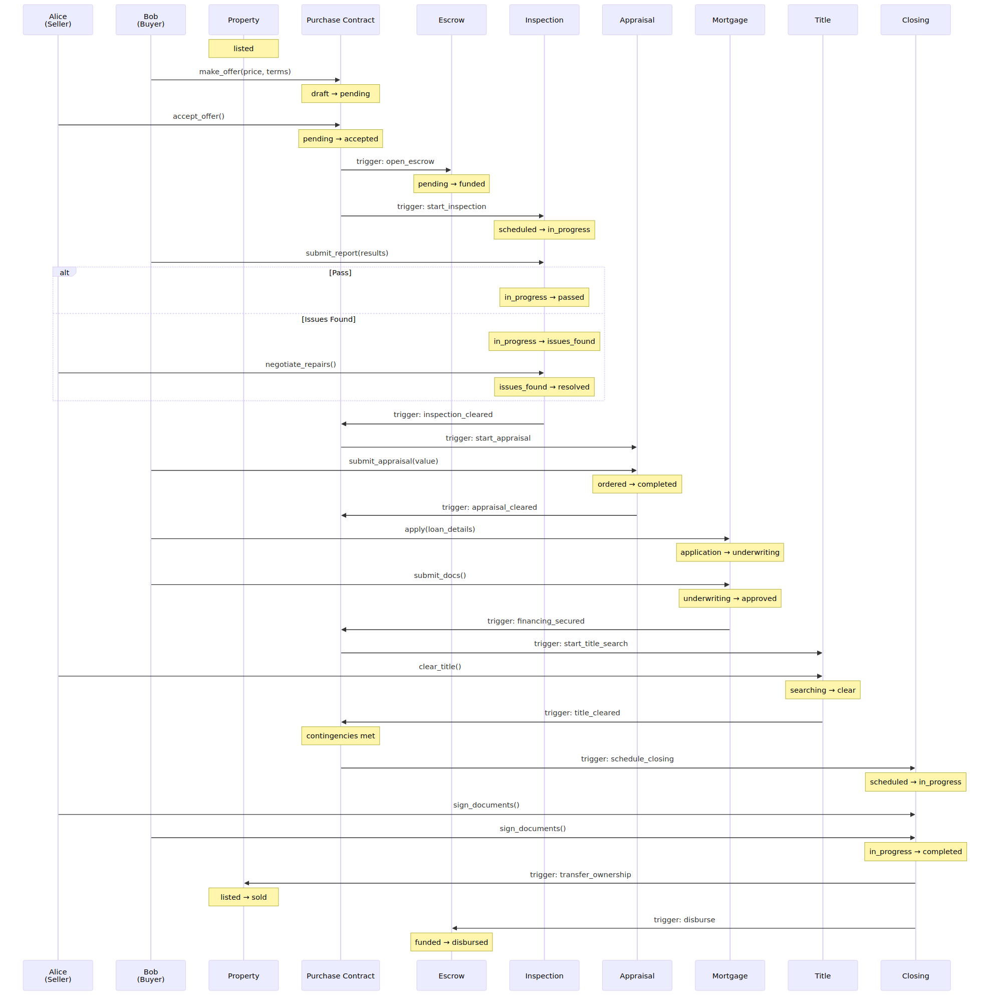
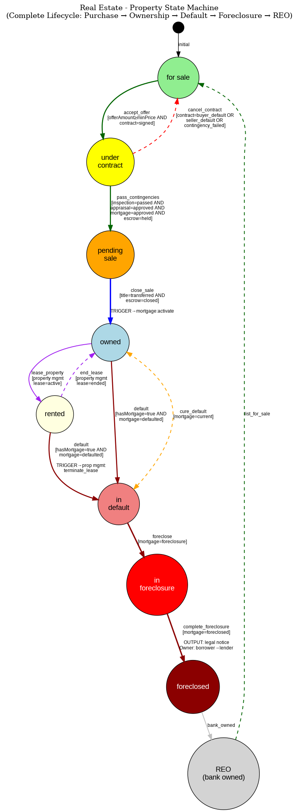
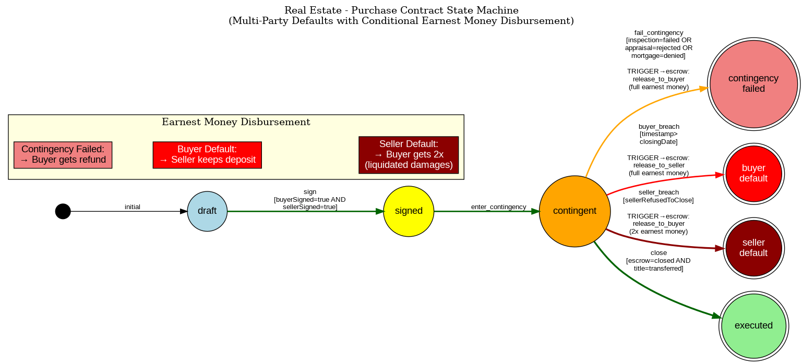
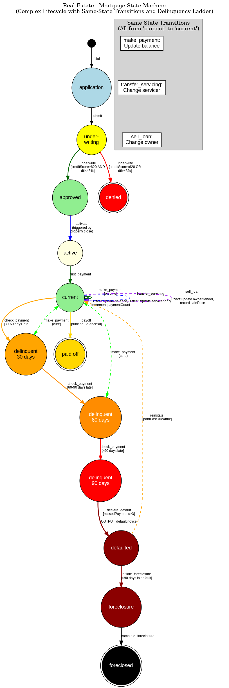

# Real Estate Lifecycle Management

This document describes a complete real estate transaction workflow from listing through purchase, mortgage servicing, potential default, foreclosure, and bank ownership (REO). Demonstrates long-term asset lifecycle management with multiple parties and complex financial instruments.

## Table of Contents

1. [Overview](#overview)
2. [Participants and Roles](#participants-and-roles)
3. [State Machines](#state-machines)
   - [Property](#1-property-state-machine)
   - [Purchase Contract](#2-purchase-contract-state-machine)
   - [Escrow](#3-escrow-state-machine)
   - [Inspection](#4-inspection-state-machine)
   - [Appraisal](#5-appraisal-state-machine)
   - [Mortgage](#6-mortgage-state-machine)
   - [Title](#7-title-state-machine)
   - [Property Management](#8-property-management-state-machine)
4. [Workflow Example](#workflow-example)
5. [Key Features Demonstrated](#key-features-demonstrated)
6. [Test Location](#test-location)

---

## Overview

### Workflow Sequence



A complete real estate transaction workflow demonstrating:

- **8 interconnected state machines** managing the entire property lifecycle
- **8 active participants** coordinating transactions
- **Long-term asset lifecycle** from sale through ownership, default, foreclosure
- **Multiple self-transitions** on same state with different effects
- **Bi-directional recovery paths** for delinquency and default
- **Complex multi-machine guards** requiring 4 machines in specific states
- **Conditional earnest money disbursement** based on contract outcome
- **Mortgage servicing** including secondary market transfers

### Key Lifecycle Flows

**Purchase Flow**:
```
Listing → Offer → Contract → Contingencies → Closing → Ownership
```

**Mortgage Flow**:
```
Application → Underwriting → Approval → Active Servicing → Payoff
```

**Default Flow**:
```
Current → Delinquent (30/60/90) → Default → Foreclosure → REO → Re-list
```

---

## Participants and Roles

- **Alice** - Seller / Original Owner
- **Bob** - Buyer / New Owner / Borrower
- **Charlie** - Escrow Agent
- **Dave** - Inspector
- **Eve** - Appraiser
- **Faythe** - Lender (Mortgage Bank)
- **Grace** - Title Company
- **Heidi** - Property Manager

---

## State Machines

### 1. Property State Machine

**Purpose**: Core asset that accumulates history and transfers ownership through entire lifecycle.

**States**: 9 total states
- `for_sale` - Listed on market
- `under_contract` - Accepted offer
- `pending_sale` - Contingencies satisfied
- `owned` - Normal ownership
- `rented` - Tenant occupied
- `in_default` - Mortgage default
- `in_foreclosure` - Active foreclosure
- `foreclosed` - Foreclosure completed
- `reo` - Bank-owned (Real Estate Owned)

#### State Diagram



Source: `diagrams/real_estate_property_states.dot`

#### Key Features

**Purchase Path**:
```
for_sale → under_contract → pending_sale → owned → rented → owned
```

**Default Path**:
```
owned → in_default → in_foreclosure → foreclosed → reo → for_sale
```

**Recovery Path** 🌟:
```
in_default ⇄ owned (cure default with payment)
```

**Ownership Transfer**:
- Property tracks `owner` field, updated during closing
- Tracks complete ownership history
- Accumulates transaction history

**Cross-Machine Guards**:
- `pass_contingencies` requires checking 4 machines:
  - Inspection: `status === "passed" OR "passed_with_repairs"`
  - Appraisal: `status === "approved"`
  - Mortgage: `status === "approved"`
  - Escrow: `status === "held"`

**Trigger Events**:
- `close_sale` triggers `activate` on Mortgage machine
- `default` triggers `terminate_lease` on Property Management
- `foreclose` triggers `complete_foreclosure` on Mortgage

---

### 2. Purchase Contract State Machine

**Purpose**: Manages offer, acceptance, contingencies, and potential defaults by either party.

**States**: 7 total states
- `draft` - Offer being prepared
- `signed` - Both parties signed
- `contingent` - Subject to contingencies
- `executed` - Successfully closed (final state)
- `contingency_failed` - Inspection/appraisal/financing failed (final state)
- `buyer_default` - Buyer missed closing (final state)
- `seller_default` - Seller refused to close (final state)

#### State Diagram



Source: `diagrams/real_estate_contract_states.dot`

#### Key Features

**Success Path**:
```
draft → signed → contingent → executed
```

**Failure Paths with Earnest Money Disbursement** 🌟:

```
contingent → contingency_failed
  Effect: Earnest money → buyer (not their fault)

contingent → buyer_default
  Guard: Buyer missed closing date
  Effect: Earnest money → seller (buyer breach)

contingent → seller_default
  Guard: Seller refused to close
  Effect: 2x earnest money → buyer (liquidated damages)
```

**Multi-Party Signatures**:
- Requires both `buyerSigned` and `sellerSigned` to be true
- Timestamp tracking for signature dates

**Contingency Period**:
- Inspection contingency (10 days)
- Appraisal contingency (15 days)
- Financing contingency (30 days)

---

### 3. Escrow State Machine

**Purpose**: Holds and disburses earnest money based on contract outcomes.

**States**: 7 total states
- `empty` - No funds held
- `funded` - Earnest money deposited
- `held` - Holding during contingencies
- `disbursed` - Released per contract terms
- `closed` - Escrow closed (final state)
- `released_to_buyer` - Refunded to buyer (final state)
- `released_to_seller` - Released to seller (final state)

#### Key Features

**Normal Flow**:
```
empty → funded → held → disbursed → closed
```

**Failure Disbursements** 🌟:

```
held → released_to_buyer
  Triggers: Contingency failure
  Output: Payment of earnest money amount

held → released_to_seller
  Triggers: Buyer default
  Output: Payment of earnest money amount

held → released_to_buyer (2x amount)
  Triggers: Seller default
  Output: Payment of 2× earnest money (liquidated damages)
```

**Payment Outputs**:
- Structured payment outputs with recipient, amount, reason
- Immutable disbursement record

---

### 4. Inspection State Machine

**Purpose**: Property condition assessment with multiple outcome levels.

**States**: 6 total states
- `pending` - Not yet scheduled
- `scheduled` - Inspector assigned
- `completed` - Inspection finished
- `passed` - No significant issues (final state)
- `passed_with_repairs` - Minor issues, repairs agreed (final state)
- `failed` - Major issues found (final state)

#### Key Features

**Multiple Guards on Same Event** 🌟:

The `approve` event from `completed` state has 3 possible outcomes:

```
completed --[approve]--> passed
  Guard: issueCount = 0

completed --[approve]--> passed_with_repairs
  Guard: 1 ≤ issueCount ≤ 3 AND repairsAgreed = true

completed --[approve]--> failed
  Guard: issueCount > 3 OR (issueCount > 0 AND repairsAgreed = false)
```

**Inspection Report**:
- Issues categorized by severity
- Repair cost estimates
- Repair agreement tracking

**Contract Impact**:
- `failed` triggers contingency failure in contract
- `passed_with_repairs` requires repair addendum

---

### 5. Appraisal State Machine

**Purpose**: Property valuation for lending purposes.

**States**: 5 total states
- `pending` - Not yet ordered
- `ordered` - Appraiser assigned
- `completed` - Appraisal finished
- `approved` - Value supports loan (final state)
- `rejected` - Value too low (final state)

#### Key Features

**Valuation Path**:
```
pending → ordered → completed → approved/rejected
```

**Approval Logic**:
```
completed → approved
  Guard: appraisedValue ≥ expectedValue × 0.95
  (Within 5% of expected)

completed → rejected
  Guard: appraisedValue < expectedValue × 0.95
  (More than 5% below expected)
```

**Loan Impact**:
- Lender uses appraised value for loan-to-value calculation
- Low appraisal may require increased down payment or fail financing contingency

---

### 6. Mortgage State Machine

**Purpose**: Most complex machine - full loan lifecycle including origination, servicing transfers, delinquency, and foreclosure.

**States**: 13 total states
- `application` - Initial application
- `underwriting` - Credit and income verification
- `approved` - Loan approved
- `denied` - Application rejected (final state)
- `active` - Loan activated at closing
- `current` - Payments up to date
- `delinquent_30` - 30 days past due
- `delinquent_60` - 60 days past due
- `delinquent_90` - 90+ days past due
- `defaulted` - Loan in default
- `foreclosure` - Foreclosure initiated
- `foreclosed` - Foreclosure completed (final state)
- `paid_off` - Loan fully repaid (final state)

#### State Diagram



Source: `diagrams/real_estate_mortgage_states.dot`

#### Key Features

**Origination**:
```
application → underwriting → approved → active → current
```

**Multiple Self-Transitions on Same State** 🌟:

The `current` state has 3 different events that transition back to `current`:

```
current --[make_payment]--> current
  Effect: principalBalance -= paymentAmount
          paymentCount++
          lastPaymentDate = timestamp

current --[transfer_servicing]--> current
  Effect: servicer = newServicer
          servicingTransferDate = timestamp
          (balance unchanged)

current --[sell_loan]--> current
  Effect: owner = newOwner
          lender = newLender
          salePrice = amount
          (balance unchanged)
```

This demonstrates **same-state, different-effect** transitions for loan servicing operations.

**Delinquency Ladder with Recovery** 🌟:

```
current → delinquent_30 ⇄ current (cure with payment)
        → delinquent_60 ⇄ current (cure with payment)
        → delinquent_90 → defaulted
```

Bi-directional paths allow borrower to cure delinquency at early stages.

**Default Path**:
```
defaulted --[reinstate]--> current (if past due paid)
defaulted --[initiate_foreclosure]--> foreclosure → foreclosed
```

**Payoff**:
```
current --[pay_off]--> paid_off (loan satisfied)
```

**Payment Calculation**:
```
principalBalance -= (monthlyPayment - (principalBalance × interestRate / 12))
```

**Servicing Transfer**:
- Loan servicing can be transferred to different servicer
- Loan ownership can be sold (secondary market)
- Both operations preserve loan balance and terms

---

### 7. Title State Machine

**Purpose**: Ownership transfer and recording, title search, and insurance.

**States**: 6 total states
- `pending` - Title search not started
- `searching` - Researching ownership history
- `clear` - No issues found
- `issues_found` - Liens or encumbrances discovered
- `insured` - Title insurance issued
- `transferred` - Ownership recorded (final state)

#### Key Features

**Clear Title Path**:
```
pending → searching → clear → insured → transferred
```

**Issues Path**:
```
pending → searching → issues_found → clear (after resolution) → insured → transferred
```

**Title Issues**:
- Liens (mechanic's, tax, judgment)
- Encumbrances (easements, restrictions)
- Ownership disputes
- Must be cleared before closing

**Title Insurance**:
- Protects buyer and lender from defects
- Issued only after clear title confirmed

---

### 8. Property Management State Machine

**Purpose**: Rental operations when property is investment property.

**States**: 7 total states
- `available` - Ready to rent
- `showing` - Touring potential tenants
- `lease_pending` - Application in progress
- `lease_active` - Tenant in place
- `lease_ended` - Normal lease expiration
- `eviction` - Legal eviction in progress
- `terminated` - Lease terminated due to foreclosure (final state)

#### Key Features

**Rental Cycle**:
```
available → showing → lease_pending → lease_active → lease_ended → available
```

**Eviction Path**:
```
lease_active → eviction → available (after eviction completed)
```

**Foreclosure Termination** 🌟:
```
lease_active → terminated
  Triggered by: Property foreclosure
  Effect: Tenant notified, lease terminated
```

This demonstrates **external trigger terminating child process**.

**Rent Tracking**:
- Monthly rent collection
- Security deposit management
- Lease renewal tracking

---

## Workflow Example

### Complete Transaction Workflow

```
PHASE 1: Contract & Escrow
━━━━━━━━━━━━━━━━━━━━━━━━━━━━━━━━━━━━━━━━━━━━━━
1. Property: for_sale → under_contract (offer accepted)
2. Contract: draft → signed (buyer + seller signatures)
3. Escrow: empty → funded ($10,000 earnest money)
4. Escrow: funded → held
5. Contract: signed → contingent

PHASE 2: Contingencies
━━━━━━━━━━━━━━━━━━━━━━━━━━━━━━━━━━━━━━━━━━━━━━
6. Inspection: pending → scheduled → completed
7. Inspection: completed → passed_with_repairs
   Guard: issueCount=1, repairsAgreed=true

8. Appraisal: pending → ordered → completed
9. Appraisal: completed → approved
   Appraised: $510k, Expected: $500k (within 5%)

10. Mortgage: application → underwriting
    Guard: creditScore=720, dti=35%

11. Mortgage: underwriting → approved
    Guard: creditScore ≥ 620, dti ≤ 43%

PHASE 3: Closing
━━━━━━━━━━━━━━━━━━━━━━━━━━━━━━━━━━━━━━━━━━━━━━
12. Property: under_contract → pending_sale
    Dependencies checked:
      - Inspection: "passed_with_repairs" ✓
      - Appraisal: "approved" ✓
      - Mortgage: "approved" ✓
      - Escrow: "held" ✓

13. Title: pending → searching → clear → insured → transferred

14. Escrow: held → disbursed → closed

15. Property: pending_sale → owned
    TRIGGER → Mortgage: activate
    Effect: owner = Bob (was Alice)
            purchasePrice = $500,000
            closingDate = timestamp

16. Mortgage: approved → active → current
    Effect: servicer = Faythe (lender)
            principalBalance = $400,000
            interestRate = 3.5%

17. Contract: contingent → executed

PHASE 4: Ownership & Payments
━━━━━━━━━━━━━━━━━━━━━━━━━━━━━━━━━━━━━━━━━━━━━━
18. Mortgage: current → current (make_payment)
    Effect: principalBalance = $399,500 (paid $500 principal)
            paymentCount = 1

19. Mortgage: current → current (transfer_servicing)
    Effect: servicer = "Servicer Co" (was "Faythe")
            (secondary market servicing transfer)

20. Mortgage: current → current (sell_loan)
    Effect: owner = "Bank2" (was "Bank1")
            lender = "Bank2"
            (loan sold on secondary market)

PHASE 5: Rental Operations (Optional)
━━━━━━━━━━━━━━━━━━━━━━━━━━━━━━━━━━━━━━━━━━━━━━
21. Property: owned → rented
22. Property Management: available → showing → lease_pending → lease_active
23. (Rent collected monthly)
24. Property Management: lease_ended → available
25. Property: rented → owned

PHASE 6: Delinquency & Foreclosure (If occurs)
━━━━━━━━━━━━━━━━━━━━━━━━━━━━━━━━━━━━━━━━━━━━━━
Alternative Path:

18alt. Mortgage: current → delinquent_30 (30 days late)

19alt-a. IF CURED:
         Mortgage: delinquent_30 → current (payment made)

19alt-b. IF NOT CURED:
         Mortgage: delinquent_30 → delinquent_60 → delinquent_90

20alt. Mortgage: delinquent_90 → defaulted
       Property: owned → in_default

21alt. Mortgage: defaulted → foreclosure
       Property: in_default → in_foreclosure
       Property Management: lease_active → terminated (if rented)

22alt. Mortgage: foreclosure → foreclosed
       Property: in_foreclosure → foreclosed → reo
       Effect: owner = "Bank" (lender takes ownership)
               Output: Legal notice of foreclosure

23alt. Property: reo → for_sale (bank lists property)
       (Cycle can repeat)
```

### Sequence Diagram

```mermaid
sequenceDiagram
    participant Buyer as Buyer (Bob)
    participant Seller as Seller (Alice)
    participant Contract as Contract
    participant Escrow as Escrow (Charlie)
    participant Insp as Inspector (Dave)
    participant Appr as Appraiser (Eve)
    participant Mort as Mortgage (Faythe)
    participant Title as Title (Grace)
    participant Prop as Property

    Note over Buyer,Prop: Phase 1: Contract & Escrow
    Contract->>Contract: sign (buyer+seller)
    Prop->>Prop: accept_offer
    Buyer->>Escrow: deposit ($10k)
    Escrow->>Escrow: hold
    Contract->>Contract: enter_contingency

    Note over Insp,Appr: Phase 2: Contingencies
    Insp->>Insp: schedule → complete
    Insp->>Insp: approve (1 issue, repairs agreed)

    Appr->>Appr: order → complete ($510k)
    Appr->>Appr: review (approved)

    Mort->>Mort: submit → underwrite
    Mort->>Mort: approve (credit=720, dti=35%)

    Note over Prop,Title: Phase 3: Closing
    Prop->>Prop: pass_contingencies ✓
    Note right of Prop: Checks: inspection=passed<br/>appraisal=approved<br/>mortgage=approved<br/>escrow=held

    Title->>Title: search → clear → insure → transfer
    Escrow->>Escrow: disburse → close

    Prop->>Mort: close_sale (TRIGGER: activate)
    activate Mort
    Mort->>Mort: Set servicer=lender
    Mort->>Mort: Set principalBalance=$400k
    deactivate Mort

    Prop->>Prop: Owner: Alice → Bob
    Contract->>Contract: close (executed)

    Note over Buyer,Mort: Phase 4: Ownership & Payments
    Buyer->>Mort: first_payment ($500 principal)
    Mort->>Mort: current (balance=$399,500)

    Note over Mort: Optional: Secondary Market
    Mort->>Mort: sell_loan (owner: Bank1 → Bank2)
    Mort->>Mort: transfer_servicing (servicer: Bank1 → Servicer Co)

    Note over Buyer,Prop: Phase 5: Delinquency (if occurs)
    alt Missed Payments
        Mort->>Mort: check_payment (30 days late)
        Mort->>Mort: delinquent_30

        alt Cure
            Buyer->>Mort: make_payment
            Mort->>Mort: current (cured)
        else Further Delinquency
            Mort->>Mort: check_payment (90 days)
            Mort->>Mort: delinquent_90 → defaulted
            Prop->>Prop: default

            Mort->>Mort: initiate_foreclosure
            Prop->>Prop: foreclose

            Mort->>Mort: complete_foreclosure
            Prop->>Prop: complete_foreclosure
            Note right of Prop: Legal notice output<br/>Owner: Bob → Bank
            Prop->>Prop: bank_owned (REO)
        end
    end
```

---

## Key Features Demonstrated

### 1. Multiple Self-Transitions on Same State 🌟

**Pattern**: Same state with different effects based on event type

Mortgage `current` → `current` with 3 different events:

| Event | Effect | Use Case |
|-------|--------|----------|
| `make_payment` | Updates balance, increments paymentCount | Regular monthly payment |
| `transfer_servicing` | Changes servicer field only | Servicing rights sold |
| `sell_loan` | Changes owner/lender field, records sale price | Loan sold on secondary market |

This enables **continuous operations** without state changes.

### 2. Bi-directional Recovery Paths 🌟

**Pattern**: Error recovery with state reversal

Mortgage delinquency allows cure:
```
current ⇄ delinquent_30 ⇄ delinquent_60
```

Property default allows recovery:
```
owned ⇄ in_default
```

Borrower can recover from early-stage delinquency by making payments.

### 3. Complex Multi-Machine Guards

**Pattern**: Transition requiring multiple machines in specific states

Property `pass_contingencies` checks **4 machines**:

```javascript
dependencies: [
  {
    machine: "Inspection",
    condition: {
      "or": [
        {"===": [{"var": "state.status"}, "passed"]},
        {"===": [{"var": "state.status"}, "passed_with_repairs"]}
      ]
    }
  },
  {
    machine: "Appraisal",
    condition: {"===": [{"var": "state.status"}, "approved"]}
  },
  {
    machine: "Mortgage",
    condition: {"===": [{"var": "state.status"}, "approved"]}
  },
  {
    machine: "Escrow",
    condition: {"===": [{"var": "state.status"}, "held"}]}
  }
]
```

All 4 conditions must be true for contingencies to pass.

### 4. Conditional Earnest Money Disbursement

**Pattern**: Outcome-based payment routing

| Scenario | Recipient | Amount | Reason |
|----------|-----------|--------|--------|
| Contingency failure | Buyer | 1× earnest money | Buyer protected by contingency |
| Buyer default | Seller | 1× earnest money | Buyer breached contract |
| Seller default | Buyer | 2× earnest money | Liquidated damages for seller breach |

Different contract outcomes trigger different payment flows with structured outputs.

### 5. Trigger with Conditional Payloads

**Pattern**: Cross-machine coordination with computed data

Property close triggers mortgage activation:

```javascript
trigger: {
  machine: "Mortgage",
  event: "activate",
  payload: {
    "closingDate": {"var": "event.timestamp"},
    "propertyValue": {"var": "state.purchasePrice"}
  }
}
```

Data flows from property to mortgage during closing.

### 6. Structured Outputs

**Pattern**: Formatted output for external systems

- **Legal Notice** on foreclosure completion (court filing)
- **Payment Disbursements** from escrow (wire instructions)
- **Default Notices** on delinquency milestones (collection letters)
- **Title Transfer** recording (county records)

### 7. Long-term Lifecycle Management

**Pattern**: Multi-year processes with complete history

Property can go through multiple ownership cycles:
```
Sale → Foreclosure → REO → Re-sale → Foreclosure → REO → Re-sale...
```

Tracks:
- Complete ownership history
- Transaction prices over time
- Mortgage payment history
- Delinquency and recovery events
- Foreclosure proceedings

---

## Feature Matrix

| Feature | Demonstrated | Details |
|---------|-------------|---------|
| **Same-State Transitions** | ✅ | Mortgage payment/servicing/sale on `current` state |
| **Bi-directional Paths** | ✅ | Delinquency recovery, default cure |
| **Complex Multi-Machine Guards** | ✅ | Contingencies require 4 machines in sync |
| **Conditional Disbursements** | ✅ | Earnest money routing based on outcome |
| **Trigger with Payloads** | ✅ | Closing data flows to mortgage |
| **Structured Outputs** | ✅ | Legal notices, payments, defaults |
| **Long-term Lifecycle** | ✅ | Years of ownership, multiple transactions |
| **Multiple Guards** | ✅ | Inspection outcomes (3 states from 1 event) |

---

## Complexity Metrics

- **Total State Machines**: 8
- **Total States**: 58 across all machines
- **Total Transitions**: 45+ defined transitions
- **Self-Transitions**: 3 (mortgage payment/servicing/sale)
- **Bi-directional Transitions**: 4 (delinquency recovery paths)
- **Cross-Machine Dependencies**: 10+ relationships
- **Multiple-Guard Events**: 2 (inspection, appraisal)
- **Trigger Events**: 4 types (mortgage activation, foreclosure, lease termination)
- **Final States**: 12 terminal states across machines

---

## Use Cases

This pattern applies to:

1. **Real Estate Transactions**: Residential and commercial property sales
2. **Mortgage Servicing**: Loan origination, servicing, secondary market
3. **Property Management**: Rental operations, lease management
4. **Foreclosure Processing**: Default management, REO operations
5. **Title & Escrow**: Ownership transfer, funds management
6. **Home Inspection**: Property condition assessment
7. **Appraisal Services**: Property valuation workflows
8. **Default Servicing**: Collections, loss mitigation, foreclosure

---

## Test Location

`modules/shared-data/src/test/scala/xyz/kd5ujc/shared_data/examples/RealEstateStateMachineSuite.scala`

### Test Statistics

- **State Transitions**: 23+ tracked transitions
- **Purchase Price**: $500,000
- **Down Payment**: $100,000 (20%)
- **Loan Amount**: $400,000
- **Earnest Money**: $10,000
- **Appraised Value**: $510,000 (2% above expected)
- **Final State**: Various outcomes tested (owned, foreclosed, paid_off)

---

## Conclusion

The Real Estate Lifecycle Management example demonstrates that the `DeterministicEventProcessor` infrastructure supports:

✅ **Multiple self-transitions** on same state with different effects (payment/servicing/sale)
✅ **Bi-directional recovery paths** for delinquency and default cure
✅ **Complex multi-machine guards** requiring 4 machines in specific states
✅ **Conditional earnest money disbursement** based on contract outcomes
✅ **Trigger with conditional payloads** for cross-machine data flow
✅ **Structured outputs** (legal notices, payments, default letters)
✅ **Long-term lifecycle management** spanning years of property ownership
✅ **Multiple guards** on single events for inspection/appraisal outcomes

The JSON-encoded approach enables this complex real estate workflow to be defined, tested, and deployed without writing custom state machine code. The workflow demonstrates patterns applicable to real estate transactions, mortgage servicing, property management, foreclosure processing, and long-term asset lifecycle management systems.