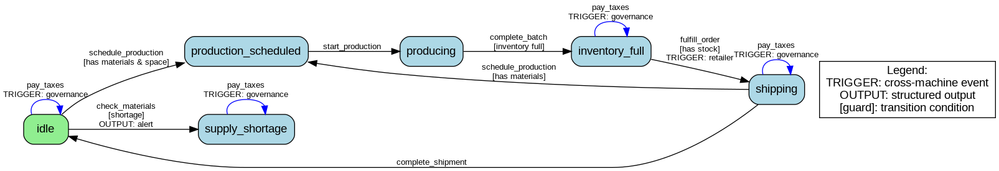
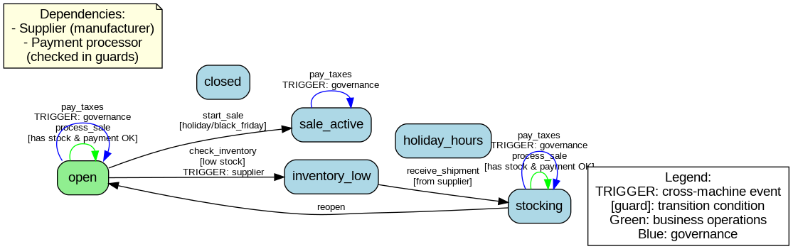
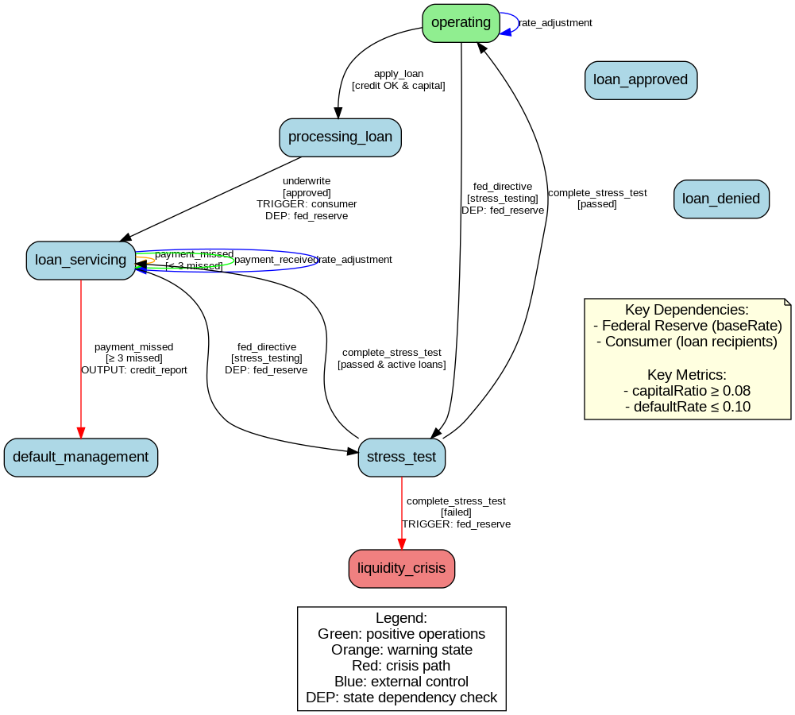
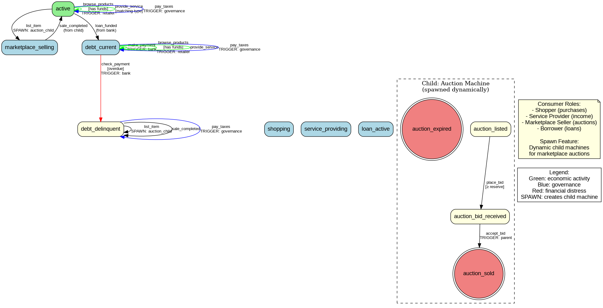
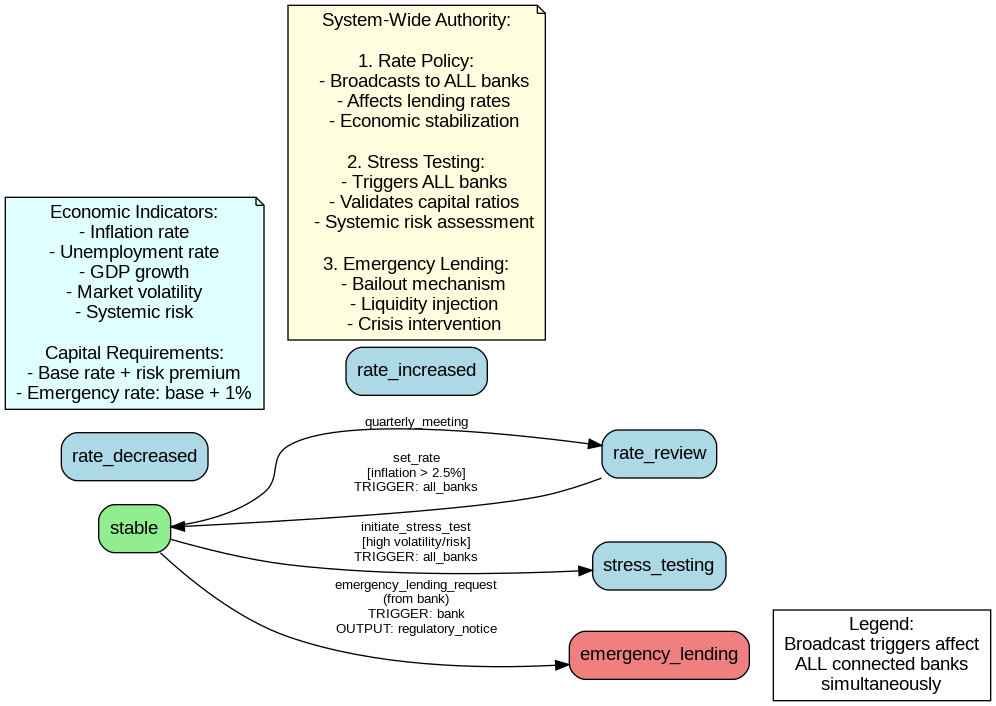
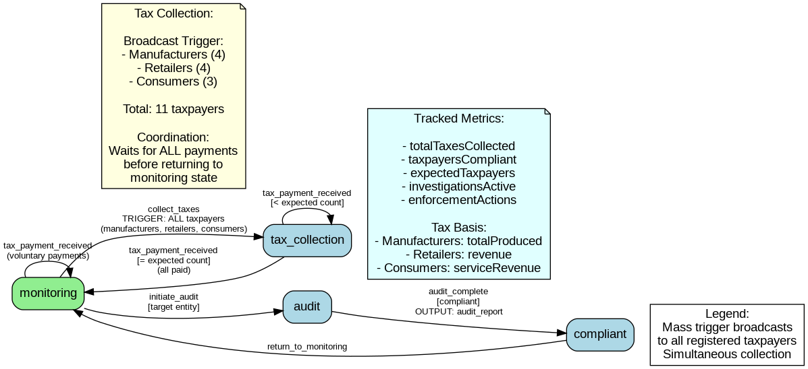

# Riverdale Economy: Multi-Party Economic Ecosystem

This document describes a comprehensive economic simulation demonstrating advanced state machine capabilities across an entire interconnected economy with manufacturing, retail, banking, consumers, monetary policy, and governance.

## Table of Contents

1. [Overview](#overview)
2. [Participants and Roles](#participants-and-roles)
3. [State Machines](#state-machines)
   - [Manufacturer](#1-manufacturer-state-machine)
   - [Retailer](#2-retailer-state-machine)
   - [Bank](#3-bank-state-machine)
   - [Consumer](#4-consumer-state-machine)
   - [Federal Reserve](#5-federal-reserve-state-machine)
   - [Governance](#6-governance-state-machine)
4. [System Integration Patterns](#system-integration-patterns)
5. [Advanced Features Demonstrated](#advanced-features-demonstrated)
6. [Test Location](#test-location)

---

## Overview

The Riverdale Economy simulation models a complete economic ecosystem with:

- **17 machine instances** across 6 machine types
- **13 active participants** (Alice through Xavier, plus Yolanda and Zoe)
- **37 total states** across all machine types
- **Cross-machine triggers** creating economic cascades
- **Parent-child spawning** for dynamic marketplace auctions
- **Complex dependency graphs** modeling real economic relationships
- **Broadcast triggers** for system-wide coordination (taxes, monetary policy)
- **60+ sequential events** demonstrating economic lifecycles

### Key Economic Flows

```
Raw Materials → Manufacturer → Retailer → Consumer
                                          ↓
                                      Bank Loans
                                          ↓
                                   Federal Reserve
                                          ↓
                                      Governance
                                     (Tax Collection)
```

---

## Participants and Roles

### Manufacturers (4 instances)
- **Alice** - SteelCore Manufacturing
- **Bob** - AgriGrow Farms
- **Charlie** - TechParts Inc
- **Dave** - TextileWorks Co

### Retailers (4 instances)
- **Heidi** - QuickFix Hardware (supplied by Alice)
- **Grace** - FreshFoods Market (supplied by Bob)
- **Ivan** - StyleHub Boutique (supplied by Dave)
- **Faythe** - (Additional retailer)

### Banks (3 instances)
- **Oscar** - Riverdale National Bank
- **Peggy** - SecureCredit Union
- **Quentin** - VentureForward Capital

### Consumers (3 instances)
- **Ruth** - Software Developer
- **Sybil** - Crafts Seller
- **Victor** - Collector

### Federal Reserve (1 instance)
- **Yolanda** - Federal Reserve Branch

### Governance (1 instance)
- **Xavier** - Riverdale Governance Authority

### Infrastructure (1 instance)
- **Niaj** - PayFlow Processing (Payment Processor)

---

## State Machines

### 1. Manufacturer State Machine

**States**: 6 (idle, production_scheduled, producing, inventory_full, shipping, supply_shortage)

**Purpose**: Models production cycles, inventory management, and supply chain operations.

#### State Diagram



Source: `diagrams/riverdale_manufacturer_states.dot`

#### Key Features

**Production Flow**:
```
idle → production_scheduled → producing → inventory_full → shipping → idle
```

**Crisis Path**:
- `idle` → `supply_shortage` (when raw materials insufficient)
- Outputs alert for supply chain disruption

**Cross-Machine Triggers**:
- `fulfill_order` triggers `receive_shipment` on Retailer machines
- `pay_taxes` triggers `tax_payment_received` on Governance machine

**Self-Transitions**:
- Multiple states support `pay_taxes` without changing state
- Enables taxation at any point in production cycle

**Guards**:
- Production requires: `rawMaterials ≥ requiredMaterials` AND `inventory < maxInventory`
- Order fulfillment requires: `inventory ≥ orderQuantity`

#### State Details

| State | Purpose | Key Fields Updated |
|-------|---------|-------------------|
| `idle` | Awaiting production order | status |
| `production_scheduled` | Batch scheduled | scheduledAt, batchSize |
| `producing` | Active production | productionStartedAt, rawMaterials (decremented) |
| `inventory_full` | Batch complete, max capacity | inventory, totalProduced, completedAt |
| `shipping` | Fulfilling retailer order | shipmentCount, inventory (decremented) |
| `supply_shortage` | Insufficient raw materials | shortageDetectedAt |

---

### 2. Retailer State Machine

**States**: 6 (open, stocking, sale_active, inventory_low, closed, holiday_hours)

**Purpose**: Models retail operations, inventory management, and seasonal sales.

#### State Diagram



Source: `diagrams/riverdale_retailer_states.dot`

#### Key Features

**Inventory Management**:
```
open → inventory_low → stocking → open
```

**Seasonal Operations**:
- `open` → `sale_active` (holiday/black_friday seasons)
- Applies discount rates during sales

**Cross-Machine Dependencies**:
- Checks **Supplier** (manufacturer) availability via `dependencies`
- Checks **Payment Processor** status: `machines.$paymentProcessorCid.state.status === "active"`

**Reorder Triggers**:
- When `stock < reorderThreshold`, triggers `fulfill_order` on supplier
- Automatic supply chain coordination

**Self-Transitions**:
- `process_sale` can execute in `open` or `stocking` states
- Continuous business operations during restocking

#### State Details

| State | Purpose | Key Operations |
|-------|---------|----------------|
| `open` | Normal business hours | process_sale, check_inventory |
| `stocking` | Receiving shipment | update stock, process_sale allowed |
| `sale_active` | Promotional period | discounted pricing |
| `inventory_low` | Below reorder threshold | reorder triggered |
| `closed` | Not operating | (unused in test) |
| `holiday_hours` | Special schedule | (unused in test) |

---

### 3. Bank State Machine

**States**: 8 (operating, processing_loan, loan_approved, loan_denied, loan_servicing, default_management, stress_test, liquidity_crisis)

**Purpose**: Models lending operations, loan servicing, regulatory compliance, and crisis scenarios.

#### State Diagram



Source: `diagrams/riverdale_bank_states.dot`

#### Key Features

**Loan Origination**:
```
operating → processing_loan → loan_servicing
```

**Delinquency Ladder**:
```
loan_servicing → [payment_missed < 3] → loan_servicing
loan_servicing → [payment_missed ≥ 3] → default_management
```

**Regulatory Oversight**:
- Federal Reserve can trigger `stress_test` via `fed_directive`
- Banks must maintain `capitalRatio ≥ 0.08` and `defaultRate ≤ 0.10`
- Failure triggers `liquidity_crisis` → emergency lending request

**Cross-Machine Coordination**:
- `underwrite` checks Federal Reserve: `machines.$federalReserveCid.state.status === "stable"`
- Approved loans trigger `loan_funded` on Consumer machines
- Calculates interest rate: `baseRate + riskPremium` from Federal Reserve

**Structured Outputs**:
- Credit reports on loan defaults (90+ days delinquent)
- Regulatory notices on emergency lending

#### State Details

| State | Purpose | Transitions |
|-------|---------|-------------|
| `operating` | Standard operations | apply_loan, rate_adjustment, stress_test entry |
| `processing_loan` | Underwriting | → loan_servicing (approved) |
| `loan_servicing` | Active loan portfolio | payment tracking, delinquency monitoring |
| `default_management` | Non-performing loans | handles ≥3 missed payments |
| `stress_test` | Regulatory examination | capital ratio calculation |
| `liquidity_crisis` | Failed stress test | emergency lending trigger |

**Key Metrics**:
- `capitalRatio = reserveCapital / loanPortfolio`
- `defaultRate = defaultedLoans / activeLoans`
- `minCreditScore = 600`
- `maxDTI = 0.43` (43% debt-to-income)

---

### 4. Consumer State Machine

**States**: 7 main states + 4 child states (active, shopping, service_providing, marketplace_selling, loan_active, debt_current, debt_delinquent)

**Purpose**: Models consumer behavior including shopping, service provision, marketplace selling, and debt management.

#### State Diagram



Source: `diagrams/riverdale_consumer_states.dot`

#### Key Features

**Multi-Role Operations**:
- **Shopper**: `browse_products` triggers `process_sale` on retailers
- **Service Provider**: `provide_service` generates income
- **Marketplace Seller**: `list_item` spawns dynamic auction children
- **Borrower**: `loan_funded` initiates debt tracking

**Loan Lifecycle**:
```
active → debt_current → [make_payment loop] → debt_current
                     → [overdue] → debt_delinquent
```

**Parent-Child Spawning** 🌟:
- `list_item` event creates child **Auction** machines dynamically
- Child machines have own lifecycle: `listed → bid_received → sold`
- Child completion triggers `sale_completed` back to parent
- Demonstrates dynamic machine creation pattern

**Self-Transitions**:
- `active` and `debt_current` states allow continuous:
  - Shopping (browse_products)
  - Service provision (provide_service)
  - Tax payments (pay_taxes)

**Payment Calculations**:
```
loanBalance -= (monthlyPayment - (loanBalance * loanInterestRate))
balance -= monthlyPayment
```

#### Child Machine: Auction

| State | Purpose | Transitions |
|-------|---------|-------------|
| `listed` | Item available | place_bid [≥ reservePrice] |
| `bid_received` | Bid accepted | accept_bid |
| `sold` | **Final state** | triggers parent sale_completed |
| `expired` | **Final state** | (auction ended) |

#### State Details

| State | Purpose | Allowed Operations |
|-------|---------|-------------------|
| `active` | Standard consumer | shop, provide service, pay taxes, list items |
| `debt_current` | Has active loan | all active operations + loan payments |
| `debt_delinquent` | Overdue on loan | limited operations, can sell items to recover |
| `marketplace_selling` | Has active listing | awaiting sale completion |

---

### 5. Federal Reserve State Machine

**States**: 6 (stable, rate_review, rate_increased, rate_decreased, stress_testing, emergency_lending)

**Purpose**: Models monetary policy, interest rate setting, regulatory oversight, and systemic crisis response.

#### State Diagram



Source: `diagrams/riverdale_federal_reserve_states.dot`

#### Key Features

**Monetary Policy Cycle**:
```
stable → rate_review → [set_rate with triggers] → stable
```

**Broadcast Triggers** 🌟:
- `set_rate` triggers `rate_adjustment` on **ALL 3 banks simultaneously**
- `initiate_stress_test` triggers `fed_directive` on **ALL banks**
- System-wide coordination pattern

**Economic Indicators**:
- `inflationRate` - Price stability metric
- `unemploymentRate` - Labor market health
- `gdpGrowth` - Economic expansion
- `marketVolatility` - Financial system stability
- `systemicRisk` - Systemic threat level

**Rate Policy**:
- If `inflationRate > 2.5%` → increase rates by 0.25% (25 basis points)
- New rate broadcast to all banks
- Banks adjust lending rates: `newRate = fed.baseRate + bank.riskPremium`

**Stress Testing**:
- Triggered by: `marketVolatility > 30%` OR `systemicRisk > 50%`
- All banks must calculate capital ratios
- Failed banks request emergency lending

**Crisis Response**:
- Emergency lending at `baseRate + 1%` (penalty rate)
- Outputs regulatory notice
- Tracks `totalEmergencyLending` and `emergencyLoansIssued`

#### State Details

| State | Purpose | System Impact |
|-------|---------|---------------|
| `stable` | Normal operations | Baseline for all banks |
| `rate_review` | Policy deliberation | Assesses economic indicators |
| `stress_testing` | Regulatory examination | All banks must respond |
| `emergency_lending` | Crisis intervention | Provides liquidity to failing banks |

---

### 6. Governance State Machine

**States**: 4 (monitoring, tax_collection, audit, compliant)

**Purpose**: Models tax collection, regulatory audits, and compliance enforcement across the economy.

#### State Diagram



Source: `diagrams/riverdale_governance_states.dot`

#### Key Features

**Mass Tax Collection** 🌟:
- `collect_taxes` triggers `pay_taxes` on **ALL taxpayers simultaneously**:
  - 4 Manufacturers
  - 4 Retailers
  - 3 Consumers
  - Total: **11 taxpayer machines**
- Coordination pattern: waits for all 11 responses before returning to `monitoring`

**Tax Basis by Entity Type**:
- **Manufacturers**: `totalProduced * taxRate`
- **Retailers**: `revenue * taxRate`
- **Consumers**: `serviceRevenue * taxRate`

**Collection Tracking**:
```
monitoring → tax_collection → [receive payments] → tax_collection
                            → [all received] → monitoring
```

**Audit Process**:
```
monitoring → audit → compliant → monitoring
```

**Structured Outputs**:
- Audit reports with findings (compliant/non-compliant)
- Includes target, finding, completedAt timestamp

#### State Details

| State | Purpose | Coordination |
|-------|---------|--------------|
| `monitoring` | Baseline oversight | Accepts voluntary tax payments |
| `tax_collection` | Active collection period | Broadcasts to all taxpayers, tracks completion |
| `audit` | Entity investigation | Targets specific entity |
| `compliant` | Positive audit result | Temporary state before return |

**Key Metrics**:
- `totalTaxesCollected` - Cumulative revenue
- `taxpayersCompliant` - Count of payments received
- `expectedTaxpayers` - Set during collection (11 in Riverdale)
- `investigationsActive` - Concurrent audits

---

## System Integration Patterns

### Pattern 1: Supply Chain Cascade

**Trigger Flow**:
```
Retailer: check_inventory [low stock]
  └─> TRIGGER: Manufacturer.fulfill_order
      └─> TRIGGER: Retailer.receive_shipment
```

**Data Flow**:
- Retailer provides: `retailerId`, `orderQuantity`, `shipmentId`
- Manufacturer validates: `inventory ≥ orderQuantity`
- Manufacturer decrements inventory, increments shipmentCount
- Retailer receives: `quantity`, `supplier`, `shipmentId`
- Retailer increments stock, records `lastRestockAt`

### Pattern 2: Financial Services Coordination

**Loan Application Flow**:
```
Consumer: apply (via Bank interaction)
  ↓
Bank: apply_loan
  - Checks: creditScore ≥ minCreditScore
  - Checks: availableCapital ≥ loanAmount
  ↓
Bank: underwrite
  - Dependency: FederalReserve.state.status === "stable"
  - Calculates: interestRate = fed.baseRate + bank.riskPremium
  - TRIGGER: Consumer.loan_funded
  ↓
Consumer: debt_current state
  - Updates: loanBalance, loanInterestRate, balance
```

### Pattern 3: Broadcast Coordination

**Tax Collection**:
```
Governance: collect_taxes
  ├─> TRIGGER: Manufacturer[Alice].pay_taxes
  ├─> TRIGGER: Manufacturer[Bob].pay_taxes
  ├─> TRIGGER: Manufacturer[Charlie].pay_taxes
  ├─> TRIGGER: Manufacturer[Dave].pay_taxes
  ├─> TRIGGER: Retailer[Heidi].pay_taxes
  ├─> TRIGGER: Retailer[Grace].pay_taxes
  ├─> TRIGGER: Retailer[Ivan].pay_taxes
  ├─> TRIGGER: Retailer[Faythe].pay_taxes
  ├─> TRIGGER: Consumer[Ruth].pay_taxes
  ├─> TRIGGER: Consumer[Sybil].pay_taxes
  └─> TRIGGER: Consumer[Victor].pay_taxes

All taxpayers respond: tax_payment_received
Governance tracks: taxpayersCompliant++
When taxpayersCompliant === expectedTaxpayers:
  → Return to monitoring
```

**Federal Reserve Rate Adjustment**:
```
FederalReserve: set_rate
  ├─> TRIGGER: Bank[Oscar].rate_adjustment
  ├─> TRIGGER: Bank[Peggy].rate_adjustment
  └─> TRIGGER: Bank[Quentin].rate_adjustment

All banks update their baseRate
Affects all future loan calculations
```

### Pattern 4: Parent-Child Spawning

**Dynamic Auction Creation**:
```
Consumer: list_item
  └─> SPAWN: Auction child machine
      - childId: event.auctionId
      - initialData: itemName, reservePrice, sellerId
      - states: listed, bid_received, sold, expired

Auction: accept_bid
  └─> TRIGGER: parent (Consumer).sale_completed
      - payload: amount, buyer, itemName

Consumer: receives funds, decrements activeListings
```

### Pattern 5: Regulatory Stress Testing

**System-Wide Assessment**:
```
FederalReserve: initiate_stress_test
  [marketVolatility > 30% OR systemicRisk > 50%]
  ├─> TRIGGER: Bank[Oscar].fed_directive
  ├─> TRIGGER: Bank[Peggy].fed_directive
  └─> TRIGGER: Bank[Quentin].fed_directive

Each Bank: → stress_test state
  - Calculates: capitalRatio = reserveCapital / loanPortfolio
  - Calculates: defaultRate = defaultedLoans / activeLoans

Each Bank: complete_stress_test
  IF capitalRatio ≥ 0.08 AND defaultRate ≤ 0.10:
    → Back to operating/loan_servicing (PASS)
  ELSE:
    → liquidity_crisis (FAIL)
    └─> TRIGGER: FederalReserve.emergency_lending_request
        └─> TRIGGER: Bank.receive_emergency_funds
            OUTPUT: regulatory_notice
```

---

## Advanced Features Demonstrated

### Feature Matrix

| Feature | Description | Instances |
|---------|-------------|-----------|
| **Cross-Machine Triggers** | One machine triggering state change in another | 15+ trigger types |
| **Broadcast Triggers** | One machine triggering multiple machines simultaneously | Tax collection (11), Rate policy (3), Stress test (3) |
| **Parent-Child Spawning** | Dynamic creation of child state machines | Auction machines |
| **State Dependencies** | Transition guards checking other machine states | Bank checks Fed Reserve, Retailer checks Payment Processor |
| **Computed Payloads** | Dynamic payload calculation in triggers | Interest rate = baseRate + riskPremium |
| **Self-Transitions** | Same state with different effects | Tax payments, rate adjustments, loan payments |
| **Structured Outputs** | Formatted output generation | Alerts, credit reports, audit reports, regulatory notices |
| **Multiple Guards** | Complex conditional logic | Loan approval (credit + DTI + Fed status) |
| **Bi-directional Effects** | Triggers creating reciprocal relationships | Consumer ↔ Retailer, Retailer ↔ Manufacturer |

### Complexity Metrics

- **Total State Machines**: 6 types
- **Total Machine Instances**: 17 (+ dynamic auction children)
- **Total States**: 37 across all types
- **Total Transitions**: 70+ defined transitions
- **Cross-Machine Dependencies**: 50+ relationships
- **Broadcast Operations**: 3 types (taxes, rate policy, stress tests)
- **Trigger Chains**: Up to 3 levels deep
- **Concurrent Operations**: 11 simultaneous tax payments

### Economic Realism

The Riverdale Economy demonstrates realistic economic patterns:

1. **Supply Chain**: Raw materials → Production → Distribution → Retail → Consumption
2. **Credit Cycle**: Loan origination → Servicing → Potential default → Resolution
3. **Monetary Policy**: Economic indicators → Policy review → Rate adjustment → Market impact
4. **Fiscal Policy**: Tax assessment → Collection → Compliance monitoring
5. **Market Dynamics**: Supply/demand signaling, inventory management, price discovery (auctions)
6. **Regulatory Framework**: Stress testing, emergency intervention, audit enforcement

### JSON-Encoded Machine Benefits

All machines are **fully JSON-encoded**, demonstrating:

1. **Zero-Code Deployment**: New economic entities defined in configuration
2. **Composability**: Mix manufacturers, retailers, banks in any combination
3. **Versioning**: Economic rules can evolve without code changes
4. **Auditability**: Complete machine logic visible in JSON definitions
5. **Portability**: Economy definition transferable across environments
6. **Validation**: Schema-validated at startup, catches errors early

---

## Workflow Examples

### Example 1: Simple Purchase Flow

```
1. Consumer[Ruth]: browse_products
   - Guard: balance ≥ expectedCost
   - TRIGGER → Retailer[Heidi].process_sale

2. Retailer[Heidi]: process_sale
   - Guard: stock ≥ quantity AND paymentProcessor.status === "active"
   - Effect: stock--, revenue += (quantity * pricePerUnit)
   - State: remains in "open"

3. Consumer[Ruth]: active → active (self-transition)
   - Effect: balance--, purchaseCount++
```

### Example 2: Loan Application and Servicing

```
1. Consumer[Victor]: (external loan application)

2. Bank[Oscar]: apply_loan
   - Guard: creditScore ≥ 600 AND availableCapital ≥ loanAmount
   - State: operating → processing_loan
   - Effect: Store application data

3. Bank[Oscar]: underwrite
   - Dependency Check: FederalReserve[Yolanda].state.status === "stable"
   - Guard: creditScore ≥ 620 AND dti ≤ 0.43
   - TRIGGER → Consumer[Victor].loan_funded
   - State: processing_loan → loan_servicing
   - Effect: activeLoans++, availableCapital -= amount

4. Consumer[Victor]: loan_funded
   - State: active → debt_current
   - Effect: loanBalance = amount, balance += amount

5. Consumer[Victor]: make_payment (monthly loop)
   - TRIGGER → Bank[Oscar].payment_received
   - Effect: balance--, loanBalance-- (principal reduction)
   - State: debt_current → debt_current (self-transition)
```

### Example 3: Supply Chain Restock

```
1. Retailer[Grace]: check_inventory
   - Guard: stock < reorderThreshold
   - TRIGGER → Manufacturer[Bob].fulfill_order
   - State: open → inventory_low

2. Manufacturer[Bob]: fulfill_order
   - Guard: inventory ≥ orderQuantity
   - TRIGGER → Retailer[Grace].receive_shipment
   - State: inventory_full → shipping
   - Effect: inventory -= orderQuantity, shipmentCount++

3. Retailer[Grace]: receive_shipment
   - Guard: event.supplier === Bob's CID
   - State: inventory_low → stocking
   - Effect: stock += quantity

4. Retailer[Grace]: reopen
   - State: stocking → open
   - Ready for customers
```

### Example 4: Tax Collection Cycle

```
1. Governance[Xavier]: collect_taxes
   - Broadcast TRIGGER to ALL 11 taxpayers
   - State: monitoring → tax_collection
   - Effect: expectedTaxpayers = 11, taxpayersCompliant = 0

2. Manufacturer[Alice]: pay_taxes
   - Calculate: totalProduced * taxRate
   - TRIGGER → Governance[Xavier].tax_payment_received
   - State: idle → idle (self-transition)
   - Effect: taxesPaid += amount

3. ... (all 11 taxpayers execute similar flow) ...

4. Governance[Xavier]: tax_payment_received (11th payment)
   - Guard: taxpayersCompliant + 1 === expectedTaxpayers
   - State: tax_collection → monitoring
   - Effect: totalTaxesCollected += amounts
```

### Example 5: Banking Crisis and Federal Intervention

```
1. FederalReserve[Yolanda]: initiate_stress_test
   - Guard: marketVolatility > 30% OR systemicRisk > 50%
   - Broadcast TRIGGER to ALL 3 banks
   - State: stable → stress_testing

2. Bank[Peggy]: fed_directive
   - Dependency: FederalReserve.state.status === "stress_testing"
   - State: loan_servicing → stress_test
   - Effect: Calculate capitalRatio = reserveCapital / loanPortfolio

3. Bank[Peggy]: complete_stress_test
   - Guard: capitalRatio < 0.08 (FAILED)
   - TRIGGER → FederalReserve[Yolanda].emergency_lending_request
   - State: stress_test → liquidity_crisis

4. FederalReserve[Yolanda]: emergency_lending_request
   - TRIGGER → Bank[Peggy].receive_emergency_funds
   - OUTPUT: regulatory_notice
   - State: stress_testing → emergency_lending
   - Effect: emergencyLoansIssued++, totalEmergencyLending += amount

5. Bank[Peggy]: receives funds, capital restored
```

### Example 6: Marketplace Auction

```
1. Consumer[Sybil]: list_item
   - SPAWN: new Auction child machine
   - State: active → marketplace_selling
   - Effect: activeListings++

2. Auction[child]: (starts in "listed" state)
   - initialData: itemName, reservePrice, sellerId=Sybil

3. Auction[child]: place_bid (external bidder)
   - Guard: bidAmount ≥ reservePrice
   - State: listed → bid_received
   - Effect: highestBid = bidAmount, highestBidder = bidderId

4. Auction[child]: accept_bid
   - TRIGGER → Consumer[Sybil].sale_completed
   - State: bid_received → sold (FINAL)

5. Consumer[Sybil]: sale_completed
   - State: marketplace_selling → active
   - Effect: balance += amount, activeListings--, marketplaceSales++
```

---

## Notable Patterns

### Pattern: Conditional State Fan-Out

**Example**: Bank stress test completion has 3 possible outcomes:

```
stress_test --[complete_stress_test]--> loan_servicing
  Guard: passed AND activeLoans > 0

stress_test --[complete_stress_test]--> operating
  Guard: passed AND activeLoans === 0

stress_test --[complete_stress_test]--> liquidity_crisis
  Guard: FAILED (capitalRatio < 0.08 OR defaultRate > 0.10)
```

### Pattern: Distributed Coordination

**Tax Collection** requires coordination across 11 machines:
- Governance initiates with broadcast trigger
- Each taxpayer independently calculates and responds
- Governance aggregates: `taxpayersCompliant++` per response
- Final transition when `taxpayersCompliant === expectedTaxpayers`
- Demonstrates **eventual consistency** pattern

### Pattern: Hierarchical State Machines

**Consumer with Auction Children**:
- Parent machine controls lifecycle
- Children have independent state machines
- Child can trigger parent (`sale_completed`)
- Demonstrates **composition** pattern

### Pattern: Economic Cascade

**Loan Default Cascade**:
```
Consumer: missed payment
  → Consumer: debt_delinquent
  → TRIGGER: Bank.payment_missed
  → Bank: default_management (if ≥3 missed)
  → OUTPUT: credit_report
  → (Could trigger): stress test failure
  → (Could trigger): Fed emergency lending
```

Single consumer default can cascade through entire financial system.

---

## Test Location

`modules/shared-data/src/test/scala/xyz/kd5ujc/shared_data/examples/RiverdaleEconomyStateMachineSuite.scala`

### Test Statistics

- **Total Lines**: 3,246
- **State Machine Definitions**: 6 types (lines 50-1346)
- **Test Execution**: 60+ events (lines 1348-3100+)
- **Participants**: 26 registered (Alice through Zoe)
- **Active Instances**: 17 machines
- **State Transitions**: 54+ tracked state changes
- **Assertions**: Comprehensive validation of economic flows

### Test Structure

1. **Machine Definitions** (lines 50-1346): JSON-encoded state machine definitions
2. **Participant Setup** (lines 1348-1474): Registry creation and UUID generation
3. **Initial State Creation** (lines 1396-1474): Economic starting conditions
4. **Machine Instantiation** (lines 1475-1848): Creating all 17 machine instances
5. **Event Execution** (lines 1849-3100+): Sequential economic simulation
6. **State Verification** (throughout): Expectations validating transitions

---

## Conclusion

The Riverdale Economy demonstrates that the `DeterministicEventProcessor` infrastructure supports:

✅ **Multi-party coordination** with 17 machine instances across 6 types
✅ **Complex state machines** with up to 8 states per machine (Bank)
✅ **Broadcast triggers** affecting multiple machines simultaneously
✅ **Parent-child spawning** for dynamic machine creation
✅ **Deep cross-machine dependencies** checking state of other machines
✅ **Computed payloads** with context-aware calculations
✅ **Structured outputs** (alerts, reports, notices)
✅ **Self-transitions** enabling continuous operations
✅ **Economic realism** modeling supply chains, credit cycles, and policy
✅ **System-wide coordination** with mass tax collection and stress testing

The JSON-encoded approach enables this complex economic ecosystem to be defined, tested, and deployed without writing custom state machine code for each entity type. The simulation demonstrates patterns applicable to:

- **Supply chain management**
- **Financial services ecosystems**
- **Regulatory compliance systems**
- **Multi-party marketplaces**
- **Economic policy simulations**
- **Systemic risk modeling**

The Riverdale Economy proves the state machine framework can model entire interconnected systems with realistic behavior, complex coordination patterns, and emergent economic dynamics.