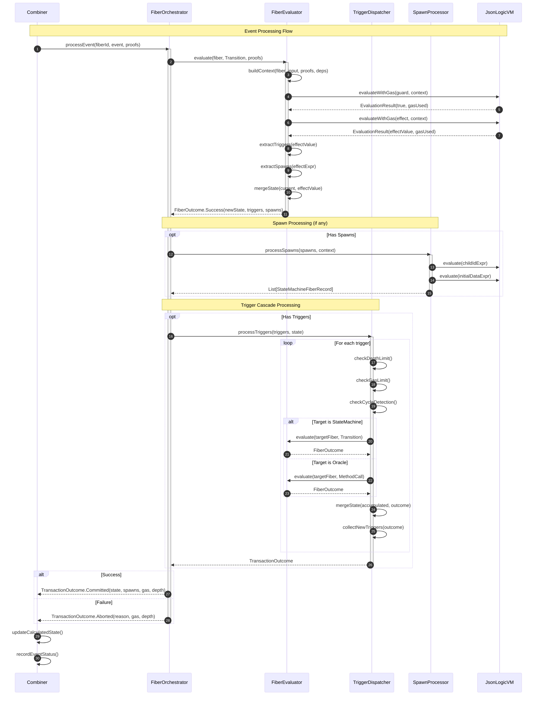
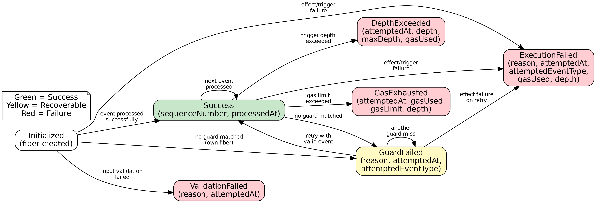

# JLVM Fiber Engine

The fiber engine orchestrates deterministic execution of state machines and oracles on the metagraph. This document covers the internal architecture for engine maintainers.

## Table of Contents

- [Architecture Overview](#architecture-overview)
- [Core Concepts](#core-concepts)
- [Component Reference](#component-reference)
- [Execution Model](#execution-model)
- [Gas Metering](#gas-metering)
- [Error Handling](#error-handling)
- [Reserved Keys](#reserved-keys)
- [Testing](#testing)
- [File Map](#file-map)

---

## Architecture Overview

The fiber engine uses a layered architecture with tagless-final algebras and interpreters.

### Component Diagram


*Source: [diagrams/src/component-architecture.mmd](diagrams/src/component-architecture.mmd)*

### MTL Stack

The engine uses monad transformers for effect management:

```scala
// Base execution monad with state tracking
type ExecutionT[F[_], A] = StateT[F, ExecutionState, A]

// Full fiber monad with context access
type FiberT[F[_], A] = ReaderT[ExecutionT[F, *], FiberContext, A]
```

**ExecutionState** tracks mutable execution concerns:
- `gasUsed: Long` - Cumulative gas consumption
- `depth: Int` - Current trigger nesting depth
- `processedInputs: Set[(UUID, FiberInput)]` - Cycle detection

**FiberContext** provides read-only configuration:
- `calculatedState` - Current metagraph state
- `ordinal` - Snapshot ordinal
- `limits` - Execution limits (maxGas, maxDepth)
- `gasConfig` - VM gas costs
- `fiberGasConfig` - Fiber-level gas costs

---

## Core Concepts

### Fibers

A fiber is an independently addressable execution unit. Two types exist:

| Type | Record | Input | Purpose |
|------|--------|-------|---------|
| State Machine | `StateMachineFiberRecord` | `Transition` | Guarded state transitions with effects |
| Oracle | `ScriptOracleFiberRecord` | `MethodCall` | Stateless computations with access control |

### FiberInput

Discriminated union for fiber invocation:

```scala
sealed trait FiberInput
case class Transition(eventType: EventType, payload: JsonLogicValue) extends FiberInput
case class MethodCall(method: String, args: JsonLogicValue, caller: Address, idempotencyKey: Option[String]) extends FiberInput
```

### FiberOutcome

Result of evaluating a single fiber:

```scala
sealed trait FiberOutcome
case class Success(
  newStateData: JsonLogicValue,
  newStateId: Option[StateId],      // Only for state machines
  triggers: List[TriggerEvent],
  spawns: List[SpawnDirective],
  outputs: List[StructuredOutput],
  returnValue: Option[JsonLogicValue],
  gasUsed: Long
) extends FiberOutcome

case class Failed(reason: FailureReason) extends FiberOutcome
// EVM semantics: gasUsed includes gas consumed by all guard evaluations (including failed guards)
case class GuardFailed(attemptedGuards: Int, gasUsed: Long = 0L) extends FiberOutcome
```

### TransactionOutcome

Result of a complete transaction (including cascades):

```scala
sealed trait TransactionOutcome
case class Committed(
  updatedStateMachines: Map[UUID, Records.StateMachineFiberRecord],
  updatedOracles: Map[UUID, Records.ScriptOracleFiberRecord],
  statuses: List[(UUID, Records.EventProcessingStatus)],
  totalGasUsed: Long,
  maxDepth: Int = 0,
  operationCount: Long = 0L
) extends TransactionOutcome

case class Aborted(
  reason: FailureReason,
  gasUsed: Long,
  depth: Int = 0
) extends TransactionOutcome
```

### FiberTrigger

Represents a trigger from one fiber to another:

```scala
case class FiberTrigger(
  targetFiberId: UUID,
  input: FiberInput,
  sourceFiberId: Option[UUID]
)
```

---

## Component Reference

### FiberOrchestrator

**Location:** `fiber/engine/FiberOrchestrator.scala`

Top-level coordinator that:
1. Receives events from Combiner
2. Evaluates the primary fiber
3. Processes spawns via SpawnProcessor
4. Delegates trigger cascades to TriggerDispatcher
5. Returns TransactionOutcome

**Key method:**
```scala
def processEvent(
  fiberId: UUID,
  event: StateMachine.Event,
  proofs: List[SignatureProof]
): F[TransactionOutcome]
```

### FiberEvaluator

**Location:** `fiber/engine/FiberEvaluator.scala`

Evaluates a single fiber without cascading. Dispatches based on fiber/input combination:

| Fiber Type | Input Type | Action |
|------------|------------|--------|
| StateMachine | Transition | Guard evaluation → Effect execution |
| Oracle | MethodCall | Access control → Script evaluation |
| StateMachine | MethodCall | Error: invalid combination |
| Oracle | Transition | Error: invalid combination |

**State Machine Evaluation:**
1. Validate event against limits
2. Look up transitions for (currentState, eventType)
3. Evaluate guards in order until one passes
4. Execute effect expression
5. Extract triggers, spawns, outputs from effect result
6. Merge effect into current state

**Oracle Evaluation:**
1. Validate caller against access control policy
2. Build input data: `{ _method, _args, _state }`
3. Evaluate script program
4. Extract `_state` and `_result` from output

### TriggerDispatcher

**Location:** `fiber/engine/TriggerDispatcher.scala`

Processes trigger cascades with:
- **Depth limiting:** Increments depth per trigger, fails if `depth > maxDepth`
- **Gas limiting:** Charges gas per trigger, fails if exhausted
- **Cycle detection:** Tracks `(fiberId, input)` pairs, fails on repeat
- **Atomic rollback:** Any failure aborts entire transaction

**Trigger processing for state machines:**
```scala
def processStateMachineTrigger(
  trigger: UnifiedTrigger,
  fiber: StateMachineFiberRecord,
  state: CalculatedState
): FiberT[F, Either[FailureReason, TriggerResult]]
```

**Trigger processing for oracles:**
- Converts `Transition` input to `MethodCall` with caller address from source fiber
- Increments depth (prevents unbounded oracle chains)

**Target not found:**
- Returns `TriggerTargetNotFound` failure
- Logs warning with source/target/input details

### SpawnProcessor

**Location:** `fiber/engine/SpawnProcessor.scala`

Creates child fibers from SpawnDirective:
1. Evaluate `childIdExpr` to get UUID
2. Evaluate `initialDataExpr` for starting state
3. Evaluate `ownersExpr` or inherit from parent
4. Validate definition structure
5. Create `StateMachineFiberRecord` with parent reference

### ContextProvider

**Location:** `fiber/engine/ContextProvider.scala`

Builds evaluation context for guards/effects:

```scala
def buildContext(
  fiber: FiberRecord,
  input: FiberInput,
  proofs: List[SignatureProof],
  dependencies: List[Dependency]
): F[JsonLogicValue]
```

Context structure:
```json
{
  "state": { /* current fiber state */ },
  "event": { /* event type and payload */ },
  "proofs": [ /* signature proofs */ ],
  "parent": { /* parent fiber state if exists */ },
  "children": { /* child fiber states by ID */ },
  "dependencies": { /* resolved dependency values */ }
}
```

Also provides `buildTriggerContext` for simplified trigger evaluation context.

### StateMerger

**Location:** `fiber/engine/StateMerger.scala`

Merges effect results into fiber state:

```scala
def mergeEffectIntoState(
  currentState: MapValue,
  effectResult: JsonLogicValue
): F[Either[FailureReason, MapValue]]
```

**Merge semantics:**
- `MapValue` effect: Deep merge, effect keys override current
- `ArrayValue` with `[old, new]`: Replace old with new
- Filters reserved keys (`_triggers`, `_spawn`, etc.) from merged state

---

## Execution Model

### Event Processing Sequence



*Source: [diagrams/src/execution-sequence.mmd](diagrams/src/execution-sequence.mmd)*

1. **Combiner receives update** (ProcessFiberEvent, InvokeScriptOracle)
2. **FiberOrchestrator.processEvent** coordinates transaction
3. **FiberEvaluator.evaluate** processes primary fiber
4. **SpawnProcessor** creates any child fibers
5. **TriggerDispatcher.processTriggers** handles cascades
6. **Combiner** updates CalculatedState and records event status

### Atomicity

All changes within a transaction are atomic:
- If any trigger fails, entire transaction aborts
- State changes only committed on success
- Spawned fibers only added on success

### Determinism

Execution must be deterministic across nodes:
- No timestamps (use ordinal instead)
- No random values
- Triggers processed in order emitted
- Same inputs → same outputs

---

## Gas Metering

### Two-Level Gas System

**VM Gas (GasConfig):** Costs for JsonLogic expression evaluation
- Defined in metakit
- 75+ operation costs
- Depth penalties

**Fiber Gas (FiberGasConfig):** Costs for fiber engine operations
- Defined in ottochain
- `triggerEvent`: Cost per trigger dispatch (default: 5)
- `spawnDirective`: Cost per spawn (default: 50)
- `contextBuild`: Cost per context build (default: 10)

### Gas Flow

```
Total Gas = guard_eval + effect_eval + (triggers × triggerCost) + (spawns × spawnCost)
```

1. Guard evaluation consumes VM gas
2. Effect evaluation consumes VM gas
3. Trigger/spawn counts multiplied by fiber gas costs
4. Cascaded triggers add their own gas recursively

### Profiles

```scala
FiberGasConfig.Default   // Development: 5/50/10
FiberGasConfig.Mainnet   // Production: 10/100/20
FiberGasConfig.Minimal   // Testing: 1/1/1
```

---

## Error Handling

### FailureReason ADT

```scala
sealed trait FailureReason

// Transition failures
case class NoTransitionFound(fromState, eventType)
case class NoGuardMatched(fromState, eventType, attemptedGuards)
case class EvaluationError(phase, message)  // phase: Guard | Effect | Oracle

// Execution limit failures
case class CycleDetected(fiberId, eventType)
case class DepthExceeded(depth, maxDepth)
case class GasExhaustedFailure(gasUsed: Long, gasLimit: Long, phase: GasExhaustionPhase)

// Fiber resolution failures
case class FiberNotFound(fiberId)
case class FiberNotActive(fiberId, status)  // e.g., fiber is Archived
case class FiberInputMismatch(fiberId, fiberType, inputType)
case class TriggerTargetNotFound(targetFiberId, sourceFiberId)

// Spawn failures
case class SpawnValidationFailed(parentId, errors: List[String])

// Oracle failures
case class OracleInvocationFailed(oracleId, method, errorMsg)
case class CallerResolutionFailed(oracleId, sourceId)
case class AccessDenied(caller, resourceId, policyType, details)
case class MissingProof(fiberId, operation)

// Validation
case class ValidationFailed(message, attemptedAt)

// Phase where gas was exhausted
sealed trait GasExhaustionPhase
object GasExhaustionPhase {
  case object Guard   // During guard evaluation
  case object Effect  // During effect evaluation
  case object Oracle  // During oracle script evaluation
  case object Trigger // During trigger dispatch
  case object Spawn   // During spawn processing
}
```

### EventProcessingStatus

Recorded on the fiber after each event:

```scala
sealed trait EventProcessingStatus

case class Success(sequenceNumber, processedAt)
case class GuardFailed(reason, attemptedAt, attemptedEventType)
case class ExecutionFailed(reason, attemptedAt, attemptedEventType, gasUsed, depth)
case class ValidationFailed(reason, attemptedAt)
case class DepthExceeded(attemptedAt, depth, maxDepth, gasUsed)
case class GasExhausted(attemptedAt, gasUsed, gasLimit, depth)
case object Initialized
```



*Source: [diagrams/src/event-status-states.dot](diagrams/src/event-status-states.dot)*

### Rollback Semantics

On failure:
1. Transaction returns `Aborted` with reason
2. Combiner records failure status on originating fiber
3. No state changes applied
4. No spawned fibers created

### Strict Validation Behavior

The fiber engine enforces strict validation - failures abort the transaction rather than silently skipping:

| Scenario | Behavior |
|----------|----------|
| Archived/inactive fiber receives event | Raises error (`FiberNotActive`) |
| Trigger targets non-existent fiber | Aborts transaction (`TriggerTargetNotFound`) |
| Invalid spawn expression | Aborts transaction (`SpawnValidationFailed`) |
| Gas exhaustion | Aborts transaction (`GasExhaustedFailure`) |
| Cycle detected | Aborts transaction (`CycleDetected`) |
| Depth limit exceeded | Aborts transaction (`DepthExceeded`) |

This strict behavior ensures deterministic execution and surfaces bugs immediately rather than masking them through silent skipping.

---

## Reserved Keys

Keys starting with underscore (`_`) are "internal" - used for side effects that are extracted from results but not merged into state.

### Context Input Keys (State Machine)

Available via `var` expressions in guards/effects:

| Key | Type | Description |
|-----|------|-------------|
| `state` | `MapValue` | Current fiber state data |
| `event` | `MapValue` | Event payload |
| `eventType` | `String` | Event type name |
| `machineId` | `String` | Fiber UUID |
| `currentStateId` | `String` | Current state ID |
| `sequenceNumber` | `Int` | Event sequence number |
| `proofs` | `Array` | Signature proofs |
| `machines` | `Map` | Dependent machine states |
| `parent` | `MapValue?` | Parent fiber state (if exists) |
| `children` | `Map` | Child fiber states |
| `scriptOracles` | `Map` | Available oracle states |

### Context Input Keys (Oracle)

Available via `var` expressions in oracle scripts:

| Key | Type | Description |
|-----|------|-------------|
| `method` | `String` | Method being invoked |
| `args` | `JsonLogicValue` | Method arguments |
| `state` | `JsonLogicValue?` | Current oracle state (if exists) |

### Output Side-Effect Keys (State Machine)

Extracted from effect results, not merged into state:

| Key | Type | Purpose |
|-----|------|---------|
| `_triggers` | `Array[TriggerSpec]` | Trigger events on other fibers |
| `_oracleCall` | `OracleCallSpec` | Invoke an oracle |
| `_spawn` | `Array[SpawnSpec]` | Spawn child state machines |
| `_outputs` | `Array[OutputSpec]` | Emit output values |

### Output Return Convention Keys (Oracle)

Oracle scripts return results using these keys:

| Key | Type | Purpose |
|-----|------|---------|
| `_state` | `JsonLogicValue?` | New oracle state (optional) |
| `_result` | `JsonLogicValue` | Return value to caller |

If neither `_state` nor `_result` is present, the entire output is used as both.

### TriggerSpec

```json
{
  "targetMachineId": "uuid-string",
  "eventType": "event_name",
  "payload": { /* any JsonLogicValue */ }
}
```

### OracleCallSpec

```json
{
  "oracleId": "uuid-string",
  "method": "method_name",
  "args": { /* any JsonLogicValue */ }
}
```

### SpawnSpec (in transition definition)

```json
{
  "childIdExpr": { /* expression returning UUID string */ },
  "definition": { /* StateMachineDefinition */ },
  "initialDataExpr": { /* expression returning initial state */ },
  "ownersExpr": { /* optional: expression returning owner addresses */ }
}
```

---

## Testing

### Test Suites

| Suite | Coverage |
|-------|----------|
| `DeterministicExecutionSuite` | FiberOrchestrator, TriggerDispatcher integration |
| `SpawnMachinesSuite` | Spawn lifecycle, nested spawns, gas limits |
| `TriggerEventsSuite` | Basic triggers, cascades, cycles, missing targets |
| `ExecutionLimitsSuite` | Depth limits, gas exhaustion, cycle detection |
| `BasicStateMachineSuite` | State machine CRUD, transitions, guards |

### Writing Tests

1. Use `Combiner.make[IO]` as entry point
2. Create fibers with `Updates.CreateStateMachineFiber`
3. Process events with `Updates.ProcessFiberEvent`
4. Assert on `CalculatedState` and `lastEventStatus`

Example pattern:
```scala
for {
  combiner <- Combiner.make[IO].pure[IO]

  // Create fiber
  createUpdate = Updates.CreateStateMachineFiber(cid, definition, initialData)
  proof <- registry.generateProofs(createUpdate, Set(owner))
  stateAfterCreate <- combiner.insert(initialState, Signed(createUpdate, proof))

  // Process event
  eventUpdate = Updates.ProcessFiberEvent(cid, event)
  eventProof <- registry.generateProofs(eventUpdate, Set(owner))
  finalState <- combiner.insert(stateAfterCreate, Signed(eventUpdate, eventProof))

  // Assert
  fiber = finalState.calculated.stateMachines.get(cid)
} yield expect(fiber.map(_.currentState).contains(expectedState))
```

---

## File Map

```
modules/shared-data/src/main/scala/xyz/kd5ujc/shared_data/
├── fiber/
│   ├── domain/
│   │   ├── ExecutionState.scala      # ExecutionState, ExecutionLimits
│   │   ├── FiberContext.scala        # Read-only context for FiberT
│   │   ├── FiberGasConfig.scala      # Fiber-level gas costs
│   │   ├── FiberInput.scala          # Transition, MethodCall inputs
│   │   ├── FiberOutcome.scala        # Success, GuardFailed, Failed
│   │   ├── FiberTrigger.scala        # Trigger between fibers
│   │   ├── ReservedKeys.scala        # Reserved key constants
│   │   └── TransactionOutcome.scala  # Committed, Aborted
│   └── engine/
│       ├── ContextProvider.scala     # Context building algebra
│       ├── EffectExtractor.scala     # Parse triggers/spawns from effects
│       ├── ExecutionOps.scala        # MTL state operations
│       ├── ExpressionParser.scala    # Expression parsing utilities
│       ├── FiberEvaluator.scala      # Single fiber evaluation
│       ├── FiberOrchestrator.scala   # Transaction coordinator
│       ├── OracleProcessor.scala     # Oracle CRUD helpers
│       ├── SpawnProcessor.scala      # Child fiber creation
│       ├── StateMerger.scala         # State composition
│       ├── TriggerDispatcher.scala   # Cascade processing
│       └── package.scala             # Type aliases (ExecutionT, FiberT)
└── lifecycle/
    ├── Combiner.scala                # Entry point, state management
    └── InputValidation.scala         # Input validation utilities

modules/models/src/main/scala/xyz/kd5ujc/schema/
├── CalculatedState.scala             # Metagraph calculated state
├── Records.scala                     # FiberRecord, EventProcessingStatus, maxEventBatchSize
├── StateMachine.scala                # State machine types, FailureReason, GasExhaustionPhase
└── Updates.scala                     # Update types (CreateFiber, ProcessEvent)
```

---

## Appendix: Design Decisions

### Why Tagless-Final?

- Testability: Swap interpreters for testing
- Flexibility: Different effect types per environment
- Composition: Algebras compose cleanly

### Why Two Gas Systems?

VM gas measures computation cost. Fiber gas measures orchestration cost. Separating them allows:
- Independent tuning
- Clear responsibility boundaries
- Easier reasoning about limits

### Why Atomic Transactions?

Partial state updates would create inconsistencies across nodes. Atomic rollback ensures deterministic state regardless of failure point.

### Why Fail on Missing Trigger Target?

Silent skipping could mask bugs (typos in IDs, deleted fibers). Explicit failure surfaces issues immediately and allows intentional handling.

### Why Reject Events on Archived Fibers?

Archived fibers represent completed or terminated execution units. Processing events on them would be semantically incorrect - if the fiber is archived, no further state transitions should occur. Raising an error (`FiberNotActive`) makes this explicit and prevents subtle bugs where events are silently dropped.

### Why Strict Validation Throughout?

A deterministic execution system requires predictable outcomes. If the system silently skips invalid operations (missing triggers, bad spawn expressions, inactive fibers), different nodes might interpret these situations differently based on timing or state. Strict validation ensures all nodes either succeed or fail identically, maintaining consensus.
