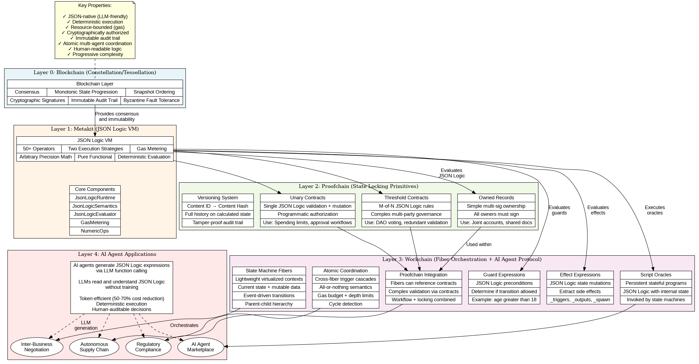
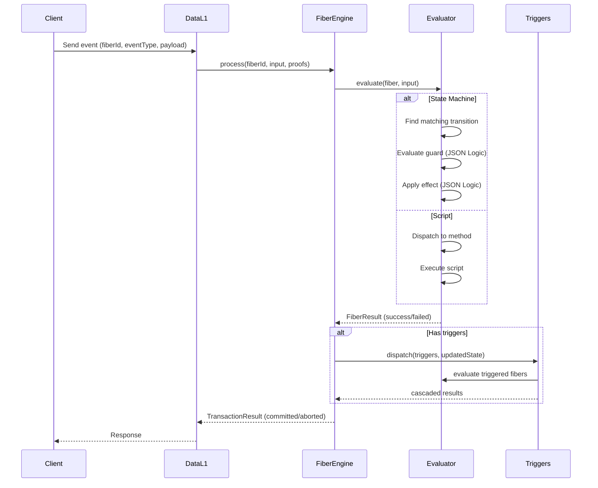

# Understanding OttoChain

OttoChain is a metagraph on the [Constellation Network](https://constellationnetwork.io/) that turns JSON into executable workflows. Define state machines, scripts, and multi-party coordination entirely through JSON configuration — no custom code required.

## The Problem

Automating real-world workflows across multiple parties is hard. Traditional approaches force you to choose between:

- **Smart contracts** (Solidity/EVM) — powerful but rigid, expensive to deploy, and require specialized developers
- **BPMN/workflow engines** — flexible but centralized, no built-in consensus or cryptographic auditability
- **Custom application code** — maximum flexibility but zero portability, every workflow is a new engineering project

OttoChain offers a fourth path: **JSON-encoded deterministic state machines** that run on a distributed ledger with consensus, cryptographic proofs, and zero-code deployment.

## Core Concepts

OttoChain has two fundamental building blocks: **state machines** and **scripts**. Both are called *fibers* — lightweight, independently-addressable units of computation that live on-chain.

### State Machines

A state machine defines a workflow as a set of **states**, **transitions**, and **events**. Each transition has a **guard** (a condition that must be true) and an **effect** (a transformation applied to the state data). Guards and effects are written in [JSON Logic](https://jsonlogic.com/), a portable rule engine format.

```
┌──────────┐   submit    ┌──────────┐   approve    ┌──────────┐
│  draft   │────────────▶│ pending  │─────────────▶│ approved │
└──────────┘             └──────────┘              └──────────┘
                              │
                              │ reject
                              ▼
                         ┌──────────┐
                         │ rejected │
                         └──────────┘
```

Everything — states, transitions, guards, effects — is defined in JSON:

```json
{
  "states": {
    "draft":    { "id": {"value": "draft"},    "isFinal": false },
    "pending":  { "id": {"value": "pending"},  "isFinal": false },
    "approved": { "id": {"value": "approved"}, "isFinal": true },
    "rejected": { "id": {"value": "rejected"}, "isFinal": true }
  },
  "initialState": { "value": "draft" },
  "transitions": [
    {
      "from": {"value": "draft"},
      "to": {"value": "pending"},
      "eventName": "submit",
      "guard": { "!": [{"var": "state.isEmpty"}] },
      "effect": { "merge": [{"var": "state"}, {"event": "payload"}] }
    }
  ]
}
```

**Key properties:**
- **Deterministic** — Given the same state and event, the result is always identical
- **Auditable** — The complete machine definition is visible on-chain as JSON
- **Versionable** — Update workflow rules by deploying a new definition, no code changes
- **AI-friendly** — LLMs can read, write, and reason about JSON Logic natively

### Scripts

Script oracles are stateful computation units. Where state machines orchestrate *lifecycle* (which state am I in?), oracles handle *logic* (what's the answer?). An oracle exposes named **methods** that other fibers can call.

Think of them as on-chain microservices:

```
State Machine                    Script
┌───────────┐    _oracleCall     ┌─────────────┐
│  playing  │───────────────────▶│  Game Logic  │
│           │    makeMove(x,y)   │             │
│           │◀───────────────────│  - board    │
│           │    {winner: null}  │  - moves    │
└───────────┘                    │  - rules    │
                                 └─────────────┘
```

The tic-tac-toe example demonstrates this pattern: the oracle holds the board state and enforces game rules, while the state machine manages the game lifecycle (setup → playing → finished).

### Fibers Working Together

The real power emerges when fibers interact:

- **Cross-machine triggers** — One machine's transition fires an event on another machine
- **Dependencies** — A transition can read state from other machines before deciding
- **Parent-child spawning** — Machines can dynamically create child machines
- **Broadcast triggers** — One event fans out to many machines simultaneously
- **Oracle calls** — State machines invoke oracle methods during transitions

This composability lets you model complex multi-party systems. The Riverdale Economy example uses 17 machine instances across 6 types to simulate an entire economic ecosystem with manufacturing, retail, banking, consumers, monetary policy, and governance — all in JSON.

## Architecture

OttoChain runs as a metagraph on Constellation's Tessellation framework. Each node in the network runs three layers:



```
┌─────────────────────────────────────────────┐
│           Data L1 (Port 9300)               │
│  Fiber processing: state machine events,    │
│  oracle invocations, validation             │
├─────────────────────────────────────────────┤
│         Currency L1 (Port 9200)             │
│  Token transfers and balance tracking       │
├─────────────────────────────────────────────┤
│        Metagraph L0 (Port 9100)             │
│  Consensus, snapshots, calculated state     │
├─────────────────────────────────────────────┤
│        Global L0 (Hypergraph)               │
│  Network-wide consensus and finality        │
└─────────────────────────────────────────────┘
```

**Data L1** is where the action happens. When you send an event to a state machine or invoke an oracle method, the Data L1 layer:

1. **Validates** the input (signature proofs, fiber exists, fiber is active)
2. **Evaluates** the fiber (checks guards, applies effects, runs scripts)
3. **Processes triggers** (cascading events to other machines)
4. **Handles spawns** (creating child fibers if directed)
5. **Commits** the result to the snapshot via Metagraph L0

All of this happens atomically — either the entire transaction (including all triggered cascades) succeeds, or nothing changes.

### Processing Pipeline



### Gas Metering

Every JSON Logic evaluation consumes gas — a measure of computational cost. Gas prevents infinite loops, bounds execution time, and makes costs predictable. The gas system tracks:

- **Per-operation costs** for each JSON Logic operator
- **Total gas** across the entire transaction including cascades
- **Cycle detection** to prevent infinite trigger loops
- **Depth limits** to bound cascade chains

### Source Code Organization

```
ottochain/
├── modules/
│   ├── models/          # Domain types: StateMachineDefinition,
│   │                    # Transition, FiberKind, FiberResult, etc.
│   ├── shared-data/     # Core engine: FiberEngine, FiberEvaluator,
│   │                    # TriggerDispatcher, SpawnProcessor
│   ├── shared-test/     # Test utilities and shared fixtures
│   ├── l0/              # Metagraph L0 (consensus layer)
│   ├── l1/              # Currency L1 (token layer)
│   └── data_l1/         # Data L1 (fiber processing layer)
├── e2e-test/            # End-to-end tests and example definitions
│   └── examples/        # JSON definitions for all examples
├── docs/                # Documentation
├── diagrams/            # Architecture and state diagrams
└── deploy/              # Deployment scripts for Digital Ocean
```

The project uses Scala 2.13 with cats-effect, fs2, and circe — following tagless-final style throughout.

## What Can You Build?

OttoChain's examples demonstrate the range of what's possible:

| Example | Machines | Complexity | Key Patterns |
|---------|----------|-----------|--------------|
| [Tic-Tac-Toe](examples/tictactoe.md) | 1 SM + 1 Oracle | ⭐ | Oracle-centric architecture, self-transitions |
| [Fuel Logistics](examples/fuel-logistics.md) | 4 SMs | ⭐⭐ | Cross-machine triggers, GPS tracking |
| [Clinical Trial](examples/clinical-trial.md) | 6 SMs | ⭐⭐⭐ | Multiple guards, bi-directional transitions |
| [Real Estate](examples/real-estate.md) | 8 SMs | ⭐⭐⭐ | Self-transitions, lifecycle management |
| [Riverdale Economy](examples/riverdale-economy.md) | 17 instances | ⭐⭐⭐⭐ | Broadcast triggers, parent-child spawning |

The learning path goes from simple (tic-tac-toe) to complex (Riverdale), with each example building on patterns from the previous ones. See the [Examples Overview](examples/README.md) for detailed breakdowns.

## Why JSON?

The choice to encode everything in JSON is deliberate:

1. **Zero-code deployment** — Define a workflow, submit it as JSON, it's running. No compilation, no deployment pipelines, no smart contract audits.

2. **AI-native** — LLMs understand JSON natively. An AI agent can read a state machine definition, understand the workflow, generate events, and even create new machines. This isn't theoretical — the [OttoBot project](projects/ottobot/ARCHITECTURE.md) demonstrates an AI agent autonomously playing tic-tac-toe through oracle interactions.

3. **Portable and auditable** — A JSON definition is the same everywhere. You can diff two versions, validate schemas at startup, and inspect the complete logic of any workflow without reading source code.

4. **Composable** — JSON Logic expressions can be nested, combined, and extended. OttoChain adds constructs like `_oracleCall`, `_trigger`, `_spawn`, and `_emit` on top of standard JSON Logic to enable cross-fiber coordination.

5. **Deterministic** — JSON Logic evaluation is pure and deterministic. Given the same context, the same expression always produces the same result. This is essential for distributed consensus — every node must agree on the outcome.

## Getting Started

- **New to state machines?** Start with the [Tic-Tac-Toe example](examples/tictactoe.md) — familiar domain, clean architecture
- **Want to design workflows?** Read the [State Machine Design Guide](guides/state-machine-design.md)
- **Ready to deploy?** Follow the [Deployment Guide](guides/deployment.md)
- **Evaluating the architecture?** See the [EVM Comparison Analysis](proposals/evm-comparison-analysis.md)
- **Interested in AI integration?** Check the [AI Agent Protocol Layer](proposals/ai-agent-protocol-layer.md) proposal

## Further Reading

- [API Reference](reference/api-reference.md) — HTTP endpoints for interacting with fibers
- [Architecture Details](reference/architecture.md) — Deep dive into layer architecture and data storage
- [Script Reference](reference/script-reference.md) — Deployment and management scripts
- [Contributing](../CONTRIBUTING.md) — How to contribute to OttoChain
