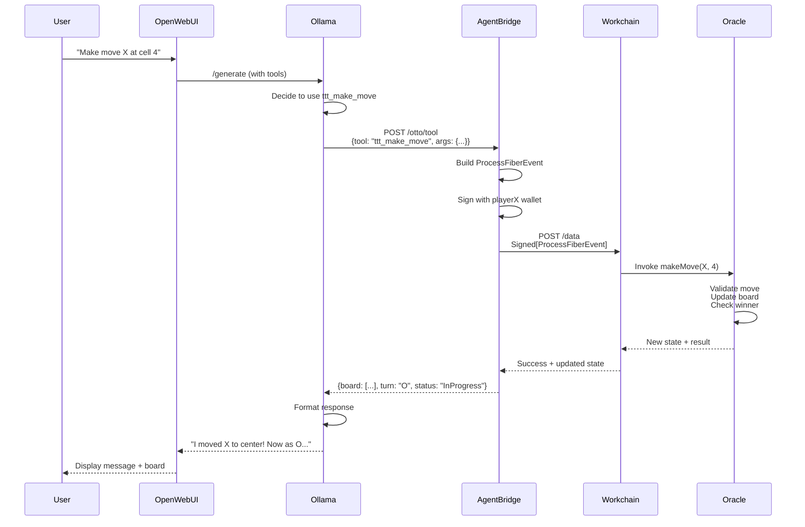

# Otto Agent-Bridge Architecture

## Overview

The Otto Agent-Bridge is a microservice that enables an LLM agent (Otto the Otter) to autonomously play tic-tac-toe against itself using Workchain's state machine and script oracle infrastructure.

## System Architecture

```
┌─────────────────────┐
│   Open WebUI        │  User chat interface
│   (Frontend)        │
└──────────┬──────────┘
           │ HTTP
┌──────────▼──────────┐
│   Ollama            │  Local LLM inference
│   (llama3.2/etc)    │
└──────────┬──────────┘
           │ HTTP (function calling)
┌──────────▼──────────────────────────────────┐
│         Agent-Bridge                         │
│  (Scala/http4s/cats-effect)                  │
│                                              │
│  ┌────────────────┐  ┌─────────────────┐    │
│  │ Wallet Manager │  │  Tool Catalog   │    │
│  │ (playerX/O)    │  │  (6 tools)      │    │
│  └────────────────┘  └─────────────────┘    │
│                                              │
│  ┌────────────────┐  ┌─────────────────┐    │
│  │ Workchain      │  │  Ollama Proxy   │    │
│  │ Client         │  │  (/generate)    │    │
│  └────────────────┘  └─────────────────┘    │
└──────────┬───────────────────────────────────┘
           │ HTTP (WorkchainMessage)
┌──────────▼───────────────────────────────────┐
│         Workchain Metagraph                  │
│  (Your existing L1/L0 nodes)                 │
│                                              │
│  ┌────────────────────────────────────────┐ │
│  │  Script Oracle (Game Engine)           │ │
│  │  - Board state (9 cells)               │ │
│  │  - Player addresses                    │ │
│  │  - Move validation                     │ │
│  │  - Win/draw detection                  │ │
│  │  - Reset/cancel logic                  │ │
│  └────────────────────────────────────────┘ │
│                                              │
│  ┌────────────────────────────────────────┐ │
│  │  State Machine (Lifecycle)             │ │
│  │  - setup → playing → finished/cancelled │ │
│  │  - Self-transitions on moves            │ │
│  │  - Oracle invocations                   │ │
│  └────────────────────────────────────────┘ │
└──────────────────────────────────────────────┘
```

## Component Responsibilities

### 1. Open WebUI
- **Purpose**: Chat interface for interacting with Otto
- **Responsibilities**: Display conversation, render board state, handle user input

### 2. Ollama
- **Purpose**: Local LLM inference engine
- **Model**: llama3.2 or compatible with function calling
- **Responsibilities**: Generate responses, decide when to call tools, parse tool results

### 3. Agent-Bridge Microservice

#### Wallet Manager
- **Purpose**: Manage cryptographic wallets for both players
- **Wallets**:
  - `playerX.p12` - Player X's private key
  - `playerO.p12` - Player O's private key
- **Responsibilities**:
  - Load p12 keystores on startup
  - Sign WorkchainMessages as playerX or playerO
  - Provide wallet addresses for game initialization

#### Tool Catalog
- **Purpose**: Registry of LLM-callable functions
- **Tools**: 6 tic-tac-toe tools (see TOOL_CATALOG.md)
- **Responsibilities**:
  - Dispatch tool calls from LLM
  - Build and sign Workchain transactions
  - Return structured results to LLM

#### Workchain Client
- **Purpose**: HTTP client for metagraph interaction
- **Endpoints**:
  - `POST /data` - Submit WorkchainMessages
  - `GET /data-application/calculated-state` - Query current state
- **Responsibilities**:
  - Serialize/deserialize Workchain types
  - Handle request/response lifecycle
  - Poll for transaction confirmations

#### Ollama Proxy
- **Purpose**: Forward `/generate` requests to Ollama
- **Responsibilities**:
  - Transparent proxy for LLM inference
  - Inject tool definitions into system prompt
  - Parse tool calls from LLM responses

### 4. Script Oracle (Game Engine)

**Role**: Deterministic tic-tac-toe game engine

**State Schema**:
```json
{
  "board": [null, null, "X", null, "O", null, null, null, null],
  "currentTurn": "X",
  "moveCount": 3,
  "status": "InProgress",
  "playerX": "DAG...",
  "playerO": "DAG...",
  "gameId": "uuid",
  "moveHistory": [
    {"player": "X", "cell": 2, "moveNum": 1},
    {"player": "O", "cell": 4, "moveNum": 2}
  ]
}
```

**Methods**:
- `initialize(playerX, playerO, gameId)` - Set up new game
- `makeMove(player, cell)` - Validate and apply move
- `getBoard()` - Return current board
- `checkWinner()` - Determine game status
- `resetGame()` - Clear board, keep players
- `cancelGame(requestedBy)` - Mark game cancelled

**Implementation**: JSON Logic expression (see ORACLE_DESIGN.md)

### 5. State Machine (Lifecycle Orchestrator)

**Role**: Manage game lifecycle, trigger oracle calls

**States**:
- `setup` - Initial, waiting for players
- `playing` - Active game
- `finished` - Won or draw (final)
- `cancelled` - Cancelled by user (final)

**Transitions**:
1. `setup → playing` on `start_game` (initialize oracle)
2. `playing → playing` on `make_move` (self-transition while in progress)
3. `playing → finished` on `make_move` (when win/draw)
4. `playing → playing` on `reset_board` (oracle reset)
5. `playing → cancelled` on `cancel_game`

**Implementation**: JSON state machine definition (see STATE_MACHINE_DESIGN.md)

## Data Flow: Making a Move



## Design Principles

### 1. Oracle-Centric Architecture
**Why**: Keeps state machine simple and oracle deterministic
- Oracle = game rules (pure, testable)
- State machine = lifecycle only (minimal logic)

### 2. Autonomous Agent
**Why**: Smooth demo UX, no manual signing
- Agent controls both wallets
- Auto-signs all transactions
- User just observes gameplay

### 3. Idempotent Operations
**Why**: Safe retries, no duplicate moves
- Every event includes idempotencyKey (UUID)
- Oracle validates move hasn't been applied
- Workchain deduplicates by key

### 4. Pre-flight Validation
**Why**: Avoid wasted on-chain transactions
- `ttt_simulate_move` validates locally first
- Checks: valid cell, correct turn, cell not occupied
- Only submit if pre-flight passes

### 5. Continuous Play
**Why**: Enable multi-round games
- Reset board without creating new oracle
- Track stats across resets (future)
- Cancel cleanly at any point

## Technology Stack

### Agent-Bridge
- **Language**: Scala 2.13
- **Effect System**: cats-effect 3
- **HTTP Server**: http4s-ember
- **HTTP Client**: http4s-ember-client
- **JSON**: circe
- **Config**: pureconfig
- **Crypto**: dag4-keystore (or existing signing utils)

### Workchain
- **Existing**: Your L1/L0 nodes with DeterministicEventProcessor
- **Languages**: Scala, JSON Logic
- **State**: Script oracles, state machine fibers

### LLM
- **Inference**: Ollama (local)
- **Model**: llama3.2 or compatible
- **Interface**: Open WebUI

## Deployment Topology

```
┌─────────────────────────────────────┐
│  Development Machine                │
│                                     │
│  ┌───────────┐  ┌────────────────┐ │
│  │ Ollama    │  │ Open WebUI     │ │
│  │ :11434    │  │ :3000          │ │
│  └───────────┘  └────────────────┘ │
│                                     │
│  ┌────────────────────────────────┐ │
│  │ Agent-Bridge                   │ │
│  │ :8080                          │ │
│  │ (wallets in resources/)        │ │
│  └────────────────────────────────┘ │
└─────────────────────────────────────┘
           │
           │ HTTP
           ▼
┌─────────────────────────────────────┐
│  Workchain Metagraph                │
│  (Local dev cluster or testnet)     │
│                                     │
│  ┌───────────┐  ┌───────────┐      │
│  │ Data L1   │  │ L0 Node   │      │
│  │ :9000     │  │ :9100     │      │
│  └───────────┘  └───────────┘      │
└─────────────────────────────────────┘
```

## Security Considerations

### Wallet Management
- ✅ Private keys stored in password-protected p12 files
- ✅ Never expose private keys via API
- ⚠️ Demo uses auto-signing (not for production)
- 🔒 Production would require hardware wallet/HSM

### Access Control
- Oracle uses `Public` access policy (demo)
- State machine validates owner signatures
- Production could add whitelist/role-based access

### Idempotency
- All events require unique idempotencyKey
- Prevents replay attacks
- Safe concurrent operations

## Scalability Considerations

### Current Scope (Demo)
- Single agent-bridge instance
- Single game session at a time
- In-memory session state

### Future Enhancements
- Multiple concurrent games (session management)
- Multi-tenant (multiple users/agents)
- Persistent session store (Redis/Postgres)
- Horizontal scaling (stateless bridge, shared wallet service)

## Error Handling

### Strategy
1. **Pre-flight validation**: Catch errors before on-chain submission
2. **Graceful degradation**: Return error to LLM, let it retry
3. **Structured logging**: Track all tool calls and outcomes
4. **User-friendly messages**: LLM translates errors to natural language

### Error Types
- **Invalid move**: Cell occupied, wrong turn, out of bounds
- **Oracle failure**: Script execution error
- **Network error**: Workchain unreachable
- **Wallet error**: Signing failure, address mismatch
- **State error**: State machine in wrong state

## Observability

### Logging
- **Structured logs** (JSON) for all tool calls
- **Trace IDs** linking LLM request → Workchain transaction
- **Performance metrics**: Latency per tool, per on-chain operation

### Monitoring
- Agent-bridge health endpoint: `/health`
- Wallet address endpoint: `/wallets`
- Game state endpoint: `/otto/games/:id/state`

### Debugging
- `WORK_LOG.md` for design decisions
- Tool catalog documentation
- Oracle/state machine test suites

## Next Steps

See implementation plan in main README and track progress in `WORK_LOG.md`.
