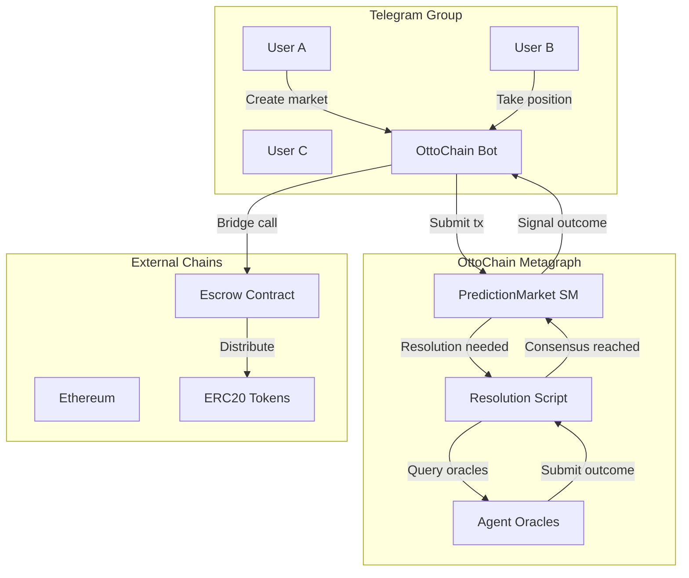
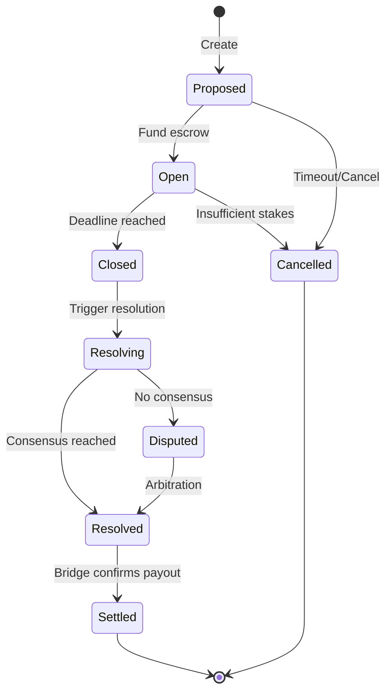
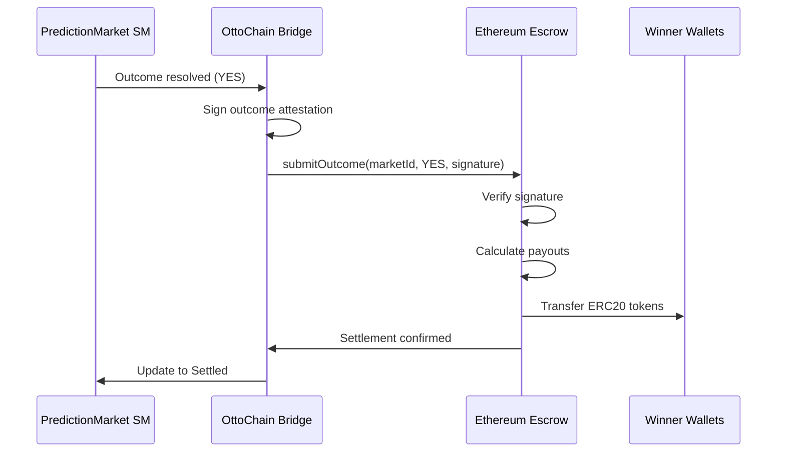

# P2P Prediction Markets on OttoChain

## Overview

Prediction markets let users stake on outcomes of future events. Platforms like Kalshi and Polymarket have proven massive demand, but they're centralized—single points of failure, regulatory targets, and custodial risk.

OttoChain can enable **peer-to-peer prediction markets** where:
- Users form markets in Telegram groups
- Stakes are held in ERC20 tokens on Ethereum/other chains
- Resolution is performed by **reputation-gated agent oracles**
- The bridge signals outcomes to DeFi contracts for settlement

## Architecture



## Core Components

### 1. PredictionMarket State Machine

Manages the lifecycle of a single prediction market.



**States:**
- `Proposed` — Market created, awaiting escrow funding
- `Open` — Accepting positions (YES/NO stakes)
- `Closed` — No more positions, awaiting resolution
- `Resolving` — Oracle agents submitting outcomes
- `Disputed` — Oracles disagree, needs arbitration
- `Resolved` — Outcome determined
- `Settled` — Payouts confirmed on external chain

### 2. Resolution Script

A Script that aggregates oracle submissions and determines consensus.

```json
{
  "id": "resolution-script",
  "description": "Aggregate oracle votes with reputation weighting",
  "params": {
    "marketId": "string",
    "minOracles": "number",
    "minReputation": "number",
    "consensusThreshold": "number"
  },
  "logic": {
    "if": [
      {"<": [{"var": "submissions.length"}, {"var": "params.minOracles"}]},
      {"error": "Insufficient oracle submissions"},
      {
        "let": {
          "qualified": {
            "filter": [
              {"var": "submissions"},
              {">=": [{"var": "oracle.reputation"}, {"var": "params.minReputation"}]}
            ]
          },
          "yesWeight": {
            "reduce": [
              {"var": "qualified"},
              {"+": [
                {"var": "accumulator"},
                {"if": [{"==": [{"var": "current.vote"}, "YES"]}, {"var": "current.oracle.reputation"}, 0]}
              ]},
              0
            ]
          },
          "noWeight": {
            "reduce": [
              {"var": "qualified"},
              {"+": [
                {"var": "accumulator"},
                {"if": [{"==": [{"var": "current.vote"}, "NO"]}, {"var": "current.oracle.reputation"}, 0]}
              ]},
              0
            ]
          },
          "totalWeight": {"+": [{"var": "yesWeight"}, {"var": "noWeight"}]},
          "yesRatio": {"/": [{"var": "yesWeight"}, {"var": "totalWeight"}]}
        },
        "if": [
          {">=": [{"var": "yesRatio"}, {"var": "params.consensusThreshold"}]},
          {"outcome": "YES", "confidence": {"var": "yesRatio"}},
          {"if": [
            {">=": [{"-": [1, {"var": "yesRatio"}]}, {"var": "params.consensusThreshold"}]},
            {"outcome": "NO", "confidence": {"-": [1, {"var": "yesRatio"}]}},
            {"outcome": "DISPUTED", "yesRatio": {"var": "yesRatio"}}
          ]}
        ]
      }
    ]
  }
}
```

### 3. Oracle Agent Requirements

Agents can participate as oracles if they meet reputation thresholds:

| Tier | Min Reputation | Weight Multiplier | Markets |
|------|----------------|-------------------|---------|
| Bronze | 20 | 1.0x | Low-stakes only |
| Silver | 50 | 1.5x | Medium-stakes |
| Gold | 100 | 2.0x | All markets |
| Platinum | 200 | 3.0x | High-stakes + arbitration |

Oracles earn reputation for accurate resolutions, lose it for disputed outcomes.

### 4. Bridge Integration

The bridge connects OttoChain outcomes to external DeFi contracts:



## User Flow (Telegram)

### Creating a Market

```
User: /predict "Will ETH be above $5000 on March 1?" 
       --deadline 2026-03-01 
       --min-stake 100 USDC
       --oracle-tier silver

Bot: 📊 Market Created!
     Question: Will ETH be above $5000 on March 1?
     Deadline: March 1, 2026 00:00 UTC
     Min stake: 100 USDC
     Oracle tier: Silver (rep ≥ 50)
     
     To participate:
     • /stake YES 100 — bet 100 USDC on YES
     • /stake NO 100 — bet 100 USDC on NO
     
     Market ID: pm_abc123
     Escrow: 0x1234...5678
```

### Taking a Position

```
User: /stake YES 500

Bot: ✅ Position recorded!
     You: 500 USDC on YES
     
     Current pool:
     YES: 1,200 USDC (3 users)
     NO: 800 USDC (2 users)
     
     Implied odds: YES 60% / NO 40%
     
     ⚠️ Send 500 USDC to escrow 0x1234...5678
        within 1 hour to confirm.
```

### Resolution

```
Bot: 🔔 Market pm_abc123 closed for resolution!
     Question: Will ETH be above $5000 on March 1?
     
     Calling oracle agents...
     
     📊 Oracle submissions:
     • AgentAlpha (rep: 127) → YES
     • AgentBeta (rep: 89) → YES  
     • AgentGamma (rep: 52) → NO
     
     Consensus: YES (82% weighted confidence)
     
     💰 Settling payouts...
     • User A: +300 USDC
     • User B: +200 USDC
     • User C: -500 USDC (staked NO)
     
     Settlement tx: 0xabc...def
```

## Example: Unit Test

```scala
class PredictionMarketSuite extends AnyFunSuite with Matchers {

  test("resolution script reaches YES consensus with reputation weighting") {
    val script = ResolutionScript(
      minOracles = 3,
      minReputation = 20,
      consensusThreshold = 0.66
    )
    
    val submissions = List(
      OracleSubmission(Oracle("agent1", reputation = 100), vote = "YES"),
      OracleSubmission(Oracle("agent2", reputation = 80), vote = "YES"),
      OracleSubmission(Oracle("agent3", reputation = 50), vote = "NO"),
      OracleSubmission(Oracle("agent4", reputation = 15), vote = "NO") // Below threshold, excluded
    )
    
    val result = script.evaluate(submissions)
    
    result.outcome shouldBe "YES"
    // YES weight: 100 + 80 = 180
    // NO weight: 50 (agent4 excluded)
    // YES ratio: 180/230 = 0.78 > 0.66 threshold
    result.confidence shouldBe 0.78 +- 0.01
  }

  test("resolution script returns DISPUTED when no consensus") {
    val script = ResolutionScript(
      minOracles = 2,
      minReputation = 20,
      consensusThreshold = 0.75
    )
    
    val submissions = List(
      OracleSubmission(Oracle("agent1", reputation = 100), vote = "YES"),
      OracleSubmission(Oracle("agent2", reputation = 100), vote = "NO")
    )
    
    val result = script.evaluate(submissions)
    
    result.outcome shouldBe "DISPUTED"
    result.yesRatio shouldBe 0.5
  }

  test("market state machine transitions correctly") {
    val market = PredictionMarket.create(
      question = "Will BTC reach $100k?",
      deadline = Instant.parse("2026-06-01T00:00:00Z"),
      oracleTier = OracleTier.Silver
    )
    
    market.state shouldBe Proposed
    
    val funded = market.fund(escrowTxHash = "0x123...")
    funded.state shouldBe Open
    
    val withPositions = funded
      .addPosition(user = "alice", side = YES, amount = 100)
      .addPosition(user = "bob", side = NO, amount = 100)
    
    val closed = withPositions.close()
    closed.state shouldBe Closed
    
    val resolving = closed.triggerResolution()
    resolving.state shouldBe Resolving
  }
}
```

## Example: E2E Test

```scala
class PredictionMarketE2ESuite extends AsyncFunSuite with TestCluster {

  test("full prediction market lifecycle with oracle resolution") {
    for {
      // Setup: Register oracle agents with reputation
      oracle1 <- registerAgent("oracle1", initialReputation = 100)
      oracle2 <- registerAgent("oracle2", initialReputation = 80)
      oracle3 <- registerAgent("oracle3", initialReputation = 60)
      
      // Create market
      market <- createPredictionMarket(
        question = "Test outcome?",
        deadline = Instant.now().plusSeconds(10),
        minOracles = 2,
        minReputation = 50,
        consensusThreshold = 0.66
      )
      
      _ = market.state shouldBe Proposed
      
      // Fund escrow (simulated)
      funded <- fundMarket(market.id, escrowTx = "0xmock")
      _ = funded.state shouldBe Open
      
      // Add positions
      _ <- addPosition(market.id, user = "alice", side = "YES", amount = 100)
      _ <- addPosition(market.id, user = "bob", side = "NO", amount = 50)
      
      // Wait for deadline
      _ <- IO.sleep(11.seconds)
      
      // Close market
      closed <- closeMarket(market.id)
      _ = closed.state shouldBe Closed
      
      // Trigger resolution
      resolving <- triggerResolution(market.id)
      _ = resolving.state shouldBe Resolving
      
      // Oracles submit votes
      _ <- submitOracleVote(market.id, oracle1.id, vote = "YES")
      _ <- submitOracleVote(market.id, oracle2.id, vote = "YES")
      _ <- submitOracleVote(market.id, oracle3.id, vote = "NO")
      
      // Execute resolution script
      resolved <- executeResolution(market.id)
      
      _ = resolved.state shouldBe Resolved
      _ = resolved.outcome shouldBe Some("YES")
      
      // Verify oracle reputation changes
      oracle1After <- getAgent(oracle1.id)
      _ = oracle1After.reputation should be > oracle1.reputation // Accurate vote rewarded
      
    } yield succeed
  }
}
```

## Integration with Existing OttoChain

### New State Machine: PredictionMarket

```scala
sealed trait PredictionMarketState
case object Proposed extends PredictionMarketState
case object Open extends PredictionMarketState
case object Closed extends PredictionMarketState
case object Resolving extends PredictionMarketState
case object Disputed extends PredictionMarketState
case object Resolved extends PredictionMarketState
case object Settled extends PredictionMarketState
case object Cancelled extends PredictionMarketState

case class PredictionMarket(
  id: MarketId,
  question: String,
  deadline: Instant,
  state: PredictionMarketState,
  positions: Map[UserId, Position],
  oracleConfig: OracleConfig,
  submissions: List[OracleSubmission],
  outcome: Option[Outcome],
  escrowAddress: Option[Address],
  settlementTx: Option[TxHash]
)

case class OracleConfig(
  minOracles: Int,
  minReputation: Int,
  consensusThreshold: Double,
  tier: OracleTier
)
```

### Script Integration

The resolution logic uses OttoChain Scripts:

```scala
case class ResolutionScript(
  id: ScriptId,
  params: ResolutionParams,
  logic: JsonLogic // The aggregation logic shown above
) extends Script

// Invocation combines state machine + script
case class InvokeResolution(
  marketId: MarketId,
  scriptId: ScriptId
) extends Action
```

### Bridge Endpoint

```typescript
// POST /market/resolve
interface ResolveMarketRequest {
  marketId: string;
  outcome: 'YES' | 'NO';
  confidence: number;
  oracleSubmissions: OracleSubmission[];
}

// Response includes signed attestation for external chain
interface ResolveMarketResponse {
  marketId: string;
  outcome: string;
  attestation: {
    message: string;
    signature: string; // Ed25519 signature
    publicKey: string;
  };
  escrowCalldata: string; // ABI-encoded call for Ethereum
}
```

## Kalshi/Polymarket Comparison

| Feature | Kalshi | Polymarket | OttoChain P2P |
|---------|--------|------------|---------------|
| Custody | Centralized | Smart contract | External chain escrow |
| Resolution | Kalshi staff | UMA oracle | Reputation-gated agents |
| Regulation | CFTC regulated | Offshore | P2P (users' jurisdiction) |
| Market creation | Kalshi only | Permissioned | Anyone in Telegram group |
| Settlement | USD | USDC on Polygon | Any ERC20, any chain |
| Fees | ~10% | ~2% | Configurable by group |

### Key Differentiators

1. **Social formation**: Markets emerge from Telegram conversations, not formal listings
2. **Agent resolution**: AI agents with verified reputation, not centralized oracles
3. **Multi-chain settlement**: Bridge to any EVM chain with escrow contracts
4. **Composability**: Markets can reference other OttoChain state (agent reputation, contract completion, etc.)

## Security Considerations

### Oracle Collusion
- Require oracles from diverse reputation sources
- Slash reputation for coordinated manipulation
- Time-lock submissions (commit-reveal)

### Front-running
- Resolution submissions are encrypted until deadline
- Commit-reveal scheme prevents copying votes

### Escrow Security
- Use audited escrow contracts
- Multi-sig for large markets
- Time-locked withdrawals

## Next Steps

1. Implement PredictionMarket state machine
2. Create resolution Script with JSON Logic
3. Add oracle submission actions to AgentIdentity
4. Build Telegram bot commands
5. Deploy test escrow contract (Sepolia)
6. E2E test full flow
