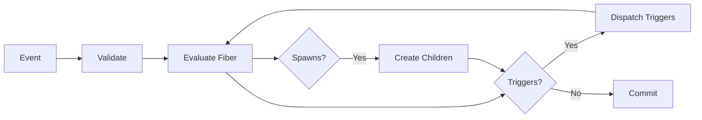

# Architecture

Understanding the OttoChain metagraph architecture. For a high-level conceptual overview, see the [Introduction](../introduction.md).

## Conceptual Architecture

OttoChain's processing model centers on **fibers** — lightweight, independently-addressable computation units that live on-chain. There are two kinds:

- **State Machine Fibers** — Define workflows as states + transitions with JSON Logic guards and effects
- **Script Oracle Fibers** — Stateful computation units exposing named methods

Fibers interact through triggers, dependencies, oracle calls, and parent-child spawning. See the [fiber interaction diagram](../../diagrams/fiber-interaction-patterns.png) for a visual overview.

### Processing Pipeline

When a client sends an event, the FiberEngine orchestrates the complete processing flow:



The full sequence diagram is in [diagrams/processing-pipeline.mmd](../../diagrams/processing-pipeline.mmd).

### Source Code Modules

| Module | Path | Purpose |
|--------|------|---------|
| `models` | `modules/models/` | Domain types: StateMachineDefinition, Transition, FiberKind, FiberResult |
| `shared-data` | `modules/shared-data/` | Core engine: FiberEngine, FiberEvaluator, TriggerDispatcher, SpawnProcessor |
| `shared-test` | `modules/shared-test/` | Test utilities and fixtures |
| `l0` | `modules/l0/` | Metagraph L0 consensus layer |
| `l1` | `modules/l1/` | Currency L1 token layer |
| `data_l1` | `modules/data_l1/` | Data L1 fiber processing layer |

## Layer Architecture

The OttoChain metagraph runs three layers on each node:

```
┌─────────────────────────────────────────┐
│          Data L1 (Port 9300)            │
│  Custom application data processing     │
└─────────────┬───────────────────────────┘
              │
┌─────────────▼───────────────────────────┐
│       Currency L1 (Port 9200)           │
│  Token transfers and balances           │
└─────────────┬───────────────────────────┘
              │
┌─────────────▼───────────────────────────┐
│      Metagraph L0 (Port 9100)           │
│  Consensus, snapshots, state management │
└─────────────┬───────────────────────────┘
              │
┌─────────────▼───────────────────────────┐
│     Global L0 (Hypergraph)              │
│  13.52.179.150:9000                     │
└─────────────────────────────────────────┘
```

## Metagraph L0 Layer

**Purpose**: Core consensus and state management

**Responsibilities**:
- Maintains cluster consensus
- Creates and validates snapshots
- Manages calculated state
- Connects to Global L0 (Hypergraph)

**Data Storage**:
```
/home/root/code/metagraph-l0/
├── data/
│   ├── incremental_snapshot/     # Incremental snapshots (hash-based storage)
│   ├── global_snapshots/         # Global snapshots
│   └── calculated_state/         # Current state
├── genesis.address               # Metagraph ID
├── metagraph-l0.jar
├── metagraph-l0.log
└── metagraph.p12                 # Keystore
```

**Snapshot Storage**:
Snapshots are stored in content-addressable hash structure:
```
incremental_snapshot/
└── hash/
    └── ab/
        └── cd/
            └── abcdef123...      # Actual snapshot file
```

**Run Modes**:
- `run-genesis` - Creates new metagraph (DANGEROUS)
- `run-rollback` - Starts from existing snapshots (lead node)
- `run-validator` - Joins existing cluster (validator nodes)

## Currency L1 Layer

**Purpose**: Token transfers and balance tracking

**Responsibilities**:
- Processes token transfers
- Maintains account balances
- Validates transactions
- Reports to Metagraph L0

**Data Storage**:
```
/home/root/code/currency-l1/
├── currency-l1.jar
├── currency-l1.log
└── metagraph.p12
```

**Note**: Does NOT store persistent snapshot data. Follows ML0 snapshots.

**Run Modes**:
- `run-initial-validator` - First node to start
- `run-validator` - Additional validators

## Data L1 Layer

**Purpose**: Custom application data processing

**Responsibilities**:
- Processes custom data updates
- Validates application-specific logic
- Maintains custom state
- Reports to Metagraph L0

**Data Storage**:
```
/home/root/code/data-l1/
├── data-l1.jar
├── data-l1.log
└── metagraph.p12
```

**Note**: Does NOT store persistent snapshot data. Follows ML0 snapshots.

**Run Modes**:
- `run-initial-validator` - First node to start
- `run-validator` - Additional validators

## Node Cluster

Three nodes form a consensus cluster:

```
┌────────────────────────────────────────────────────────┐
│                    Cluster View                        │
├────────────────────────────────────────────────────────┤
│                                                        │
│  Node 1 (Lead)          Node 2              Node 3    │
│  146.190.151.138        147.182.254.23      144...197 │
│                                                        │
│  ┌──────────┐          ┌──────────┐        ┌────────┐│
│  │ Data L1  │          │ Data L1  │        │Data L1 ││
│  ├──────────┤          ├──────────┤        ├────────┤│
│  │Currency  │  ◄─────► │Currency  │  ◄───► │Currency││
│  │   L1     │          │   L1     │        │  L1    ││
│  ├──────────┤          ├──────────┤        ├────────┤│
│  │Metagraph │  ◄─────► │Metagraph │  ◄───► │Meta    ││
│  │   L0     │          │   L0     │        │graph L0││
│  └─────┬────┘          └─────┬────┘        └───┬────┘│
│        │                     │                 │     │
└────────┼─────────────────────┼─────────────────┼─────┘
         │                     │                 │
         └─────────────────────┴─────────────────┘
                          │
                    Global L0
                (13.52.179.150)
```

## Startup Sequence

Understanding the correct startup order:

### 1. Metagraph L0 Startup

```
Step 1: Start Lead Node
   Node 1 → run-rollback → Loading snapshots → Ready
   ↓
Step 2: Start Validators
   Node 2 → run-validator → ReadyToJoin
   Node 3 → run-validator → ReadyToJoin
   ↓
Step 3: Join Cluster
   Node 2 → JOIN → Node 1
   Node 3 → JOIN → Node 1
   ↓
Step 4: Consensus
   All Nodes → Observing → WaitingForReady → Ready
```

### 2. Currency L1 Startup

```
Step 1: Start All Nodes
   Node 1 → run-initial-validator → Ready
   Node 2 → run-validator → ReadyToJoin
   Node 3 → run-validator → ReadyToJoin
   ↓
Step 2: Join Cluster
   Node 2 → JOIN → Node 1
   Node 3 → JOIN → Node 1
   ↓
Step 3: Consensus
   All Nodes → Ready
```

### 3. Data L1 Startup

Same as Currency L1.

## Peer-to-Peer Communication

Each layer uses different ports for communication:

```
Node A                          Node B
┌────────────────┐             ┌────────────────┐
│ Public: 9100   │◄───HTTP────►│ Public: 9100   │  (API, State queries)
│ P2P:    9101   │◄───P2P─────►│ P2P:    9101   │  (Consensus, Gossip)
│ CLI:    9102   │             │ CLI:    9102   │  (Local mgmt only)
└────────────────┘             └────────────────┘
```

**Port Usage**:
- **Public** (9100/9200/9300): HTTP API for queries, accessible externally
- **P2P** (9101/9201/9301): Peer-to-peer gossip protocol, cluster communication
- **CLI** (9102/9202/9302): Cluster management, localhost only

## State Management

### Node States

```
                 ┌──────────────┐
                 │ Starting     │
                 └──────┬───────┘
                        │
                 ┌──────▼───────┐
                 │ ReadyToJoin  │  (Validator nodes wait here)
                 └──────┬───────┘
                        │
                        │ JOIN CLUSTER
                        │
                 ┌──────▼───────┐
                 │ Observing    │  (Learning network state)
                 └──────┬───────┘
                        │
                 ┌──────▼────────┐
                 │WaitingForReady│  (Almost ready)
                 └──────┬────────┘
                        │
                 ┌──────▼───────┐
                 │    Ready     │  (Fully operational)
                 └──────────────┘
```

### Cluster Sessions

Each node tracks two session timestamps:

- **session**: Node's own session start time
- **clusterSession**: Cluster formation time (same across all nodes)

When nodes reach consensus, they share the same `clusterSession`.

## Environment Configuration

Each layer requires specific environment variables:

### All Layers
```bash
CL_KEYSTORE=metagraph.p12
CL_KEYALIAS=<unique-alias>
CL_PASSWORD=<password>
CL_APP_ENV=integrationnet
CL_COLLATERAL=0
CL_PUBLIC_HTTP_PORT=<port>
CL_P2P_HTTP_PORT=<port>
CL_CLI_HTTP_PORT=<port>
```

### Metagraph L0
```bash
CL_GLOBAL_L0_PEER_HTTP_HOST=13.52.179.150
CL_GLOBAL_L0_PEER_HTTP_PORT=9000
CL_GLOBAL_L0_PEER_ID=29eb8cf1...
CL_L0_TOKEN_IDENTIFIER=DAG3KNyfeKUTuWpMMhormWgWSYMD1pDGB2uaWqxG
```

### L1 Layers (Currency & Data)
```bash
CL_L0_PEER_ID=<this-nodes-ml0-peer-id>
CL_L0_PEER_HTTP_HOST=<this-nodes-ip>
CL_L0_PEER_HTTP_PORT=9100
CL_GLOBAL_L0_PEER_HTTP_HOST=13.52.179.150
CL_GLOBAL_L0_PEER_HTTP_PORT=9000
CL_GLOBAL_L0_PEER_ID=29eb8cf1...
CL_L0_TOKEN_IDENTIFIER=DAG3KNyfeKUTuWpMMhormWgWSYMD1pDGB2uaWqxG
```

**Important**: Each L1 layer uses its **own node's ML0 peer ID**, not the lead node's peer ID.

## Metagraph ID

The metagraph ID (token identifier) is critical:

```
DAG3KNyfeKUTuWpMMhormWgWSYMD1pDGB2uaWqxG
```

**Properties**:
- Created during genesis
- Stored in `genesis.address` on each node
- Used as `CL_L0_TOKEN_IDENTIFIER` for all L1 layers
- Identifies this metagraph on the Global L0 network
- Never changes for the life of the metagraph

**Where it's used**:
- ML0: Set during rollback/validator mode
- CL1: Required for all modes
- DL1: Required for all modes

## Data Flow

### Transaction Flow

```
User Transaction
    │
    ├─► Currency L1 (validates)
    │       │
    │       ├─► Metagraph L0 (includes in snapshot)
    │       │       │
    │       │       └─► Global L0 (anchors)
    │       │
    │       └─► Currency L1 (updates state)
    │
    └─► Data L1 (validates)
            │
            ├─► Metagraph L0 (includes in snapshot)
            │       │
            │       └─► Global L0 (anchors)
            │
            └─► Data L1 (updates state)
```

### Snapshot Creation

```
Metagraph L0
    │
    ├─► Collects L1 data
    ├─► Creates incremental snapshot
    ├─► Reaches consensus
    ├─► Stores snapshot (hash-addressed)
    └─► Updates calculated state
```

## Resource Requirements

### Per Node

**CPU**: 2 cores (minimum)
**RAM**: 4 GB (minimum)
**Disk**: 50 GB (for snapshot storage)
**Network**: Stable connection, low latency between nodes

### Ports to Open

**Incoming**:
- 9100, 9200, 9300 (Public HTTP)
- 9101, 9201, 9301 (P2P)

**Outgoing**:
- 9000 to 13.52.179.150 (Global L0)
- 9100-9301 to other cluster nodes

## Scaling Considerations

**Adding Validators**:
- Simply add more nodes with same configuration
- Each joins as a validator
- Consensus adapts automatically

**Performance**:
- More validators = more resilience
- Consensus time increases slightly with node count
- Recommended: 3-7 nodes for optimal performance

**Data Growth**:
- Snapshots accumulate over time
- Monitor disk usage on ML0 layer
- Consider archival strategy for old snapshots