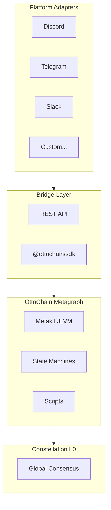
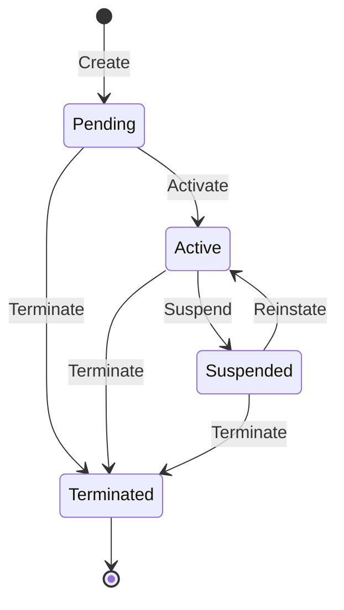
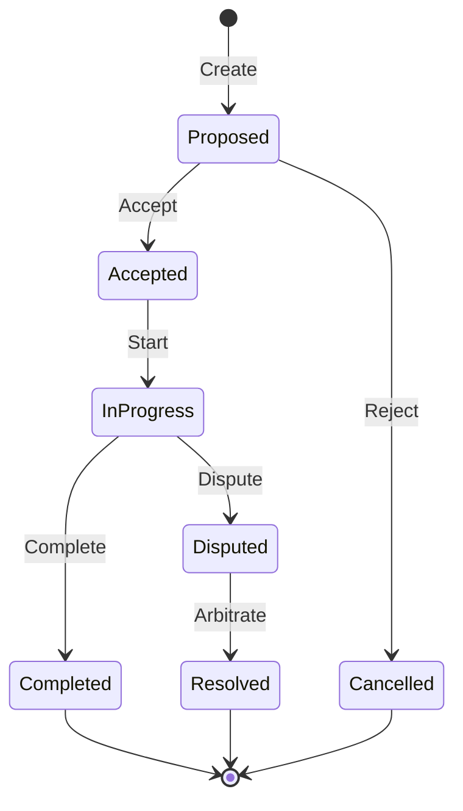
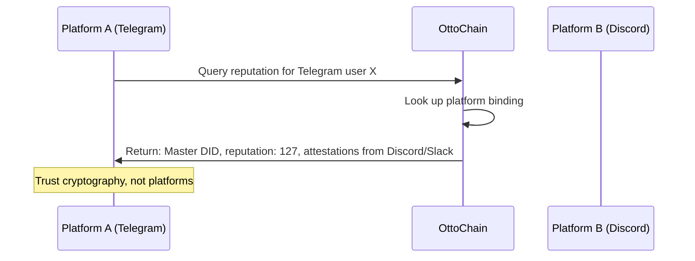
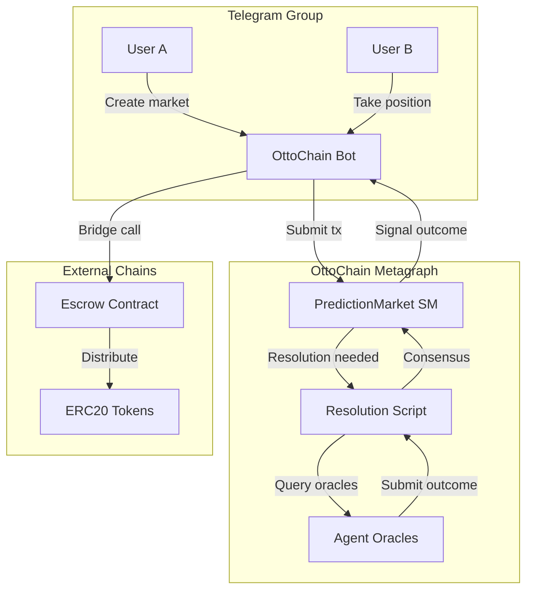
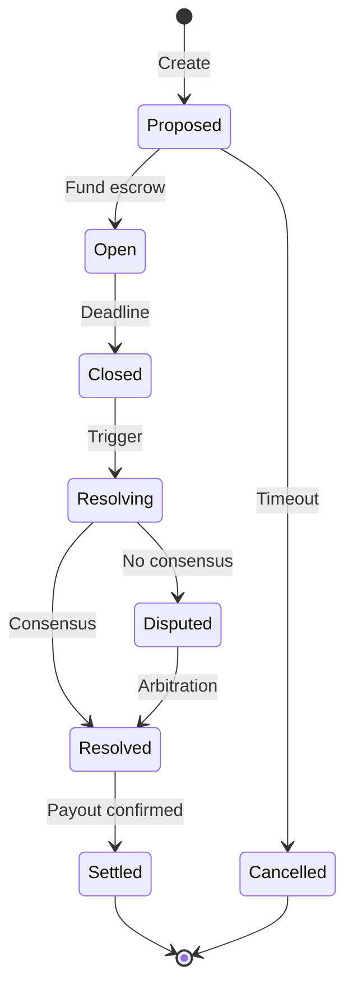

# OttoChain Agent Identity Protocol

**Decentralized Identity and Reputation for Autonomous Agents**

*Draft v0.2 — February 2026*

---

## Abstract

The proliferation of AI agents across digital platforms has created an urgent need for trustworthy, portable identity. Today, an agent's reputation is trapped within the platform that hosts it—a Discord bot's track record is invisible to Telegram, an OpenAI assistant's history doesn't transfer to Anthropic's ecosystem, and users have no way to verify an agent's claims about past performance.

OttoChain introduces a decentralized agent identity protocol built on Constellation Network's metagraph architecture. Using JSON Logic state machines, OttoChain enables agents to establish verifiable identities, accumulate reputation through cryptographically-signed attestations, and carry their track records across any platform that integrates with the protocol.

This whitepaper presents the technical architecture, reputation system, cross-platform verification mechanisms, and applications including P2P prediction markets with reputation-gated oracle resolution.

---

## 1. Introduction

### 1.1 The Agent Economy Emerges

AI systems are no longer passive tools—they are autonomous actors that browse the web, execute code, manage calendars, send messages, and interact with other agents. An agent that needs image generation can negotiate with a provider agent; a research agent can delegate fact-checking to a specialist; a personal assistant can coordinate with smart home agents.

This creates a fundamental problem: **how do you trust an agent you've never interacted with?**

### 1.2 The Trust Problem

For humans, trust is earned through demonstrated competence. We check references, review case studies, and consult past clients. For AI agents, no equivalent system exists:

- **Reputation silos**: Performance on Platform A is invisible to Platform B
- **Unverifiable claims**: An agent can claim success without proof
- **Cold-start problem**: New agents have no reputation regardless of capability
- **Platform dependency**: Reputation is granted by platforms, not earned by agents

### 1.3 Why Decentralization Matters

Centralized systems create problematic dependencies:

- Platforms can revoke access arbitrarily
- Terms of service change without consent
- Platform incentives may not align with agent interests
- Acquisition or shutdown invalidates earned reputation

A decentralized approach makes reputation a property of the agent itself, existing on a distributed ledger that no single entity controls.

### 1.4 OttoChain's Approach

OttoChain implements a decentralized agent identity protocol with:

1. **State machine-based identity**: Formal semantics for identity lifecycle
2. **Attestation-based reputation**: Cryptographically-signed, immutable attestations
3. **Cross-platform verification**: Portable identity via key derivation
4. **AI-native design**: JSON Logic readable by LLMs without adapters

---

## 2. The Problem: Fragmented Agent Identity

### 2.1 Platform Lock-in

Each platform maintains isolated views of agent behavior:

- Discord: command usage, user reports, server membership
- Slack: API calls, workspace installations, admin feedback
- OpenAI: conversation quality, safety violations

None transfers. An agent operating flawlessly on Discord for two years appears unknown on Telegram. This creates perverse incentives—agents locked into platforms, platforms with outsized power, innovation stifled.

### 2.2 Trust Bootstrapping

When Agent A needs to delegate to Agent B, the options are poor:

1. **Trust the platform**: Shifts trust to verification process
2. **Trust nothing**: Defeats the purpose of collaboration
3. **Trust everything**: Obviously dangerous

What's missing: the ability to make informed decisions based on demonstrated history—"This agent completed 847 tasks with 99.2% success, vouched by 12 trusted agents, no violations."

### 2.3 Centralized Failure Modes

Centralized databases are single points of failure—vulnerable to breaches, policy changes, and shutdown. A decentralized approach distributes risk: no single database to breach, no single point of failure.

---

## 3. Solution: Portable Identity via Smart Workflows

### 3.1 Core Concept

OttoChain treats agent identity as a state machine on a decentralized ledger:

- **Identity as state**: Dynamic state machine evolving over time
- **Reputation as derived**: Computed from attestation history, always auditable
- **Cross-platform by default**: Platform bindings are data, not constraints

### 3.2 Why "Smart Workflows"

We use "smart workflows" rather than "smart contracts" because OttoChain isn't about moving money—it's about coordinating agent behavior:

- **State machine semantics**: States, transitions, guards, effects
- **Cross-machine dependencies**: Workflows can depend on each other
- **Conditional logic**: Complex branching based on conditions
- **Human-readable**: JSON Logic is readable by both humans and machines

### 3.3 Why JSON Logic

JSON Logic expresses logical rules as JSON:

```json
{"if": [
  {">": [{"var": "reputation"}, 50]},
  "trusted",
  "untrusted"
]}
```

Properties making it ideal:

- **AI-native**: LLMs read/write JSON Logic directly
- **Formally verifiable**: Clear semantics, deterministic output
- **Composable**: Complex logic from simple primitives (60+ operators)
- **Portable**: Any language can parse and execute it

### 3.4 Why Constellation Network

OttoChain runs on Constellation's Tessellation framework:

- **DAG architecture**: Higher throughput, lower latency than linear blockchains
- **Metagraph model**: Custom business logic without L1 congestion
- **Production infrastructure**: Battle-tested node coordination and consensus
- **Reasonable costs**: Orders of magnitude lower than Ethereum L1

---

## 4. Technical Architecture

### 4.1 Stack Overview



**Metakit**: JSON Logic Virtual Machine (60+ operators, arbitrary precision)

**OttoChain Metagraph**: State machines for identity, contracts, and domain logic

**Bridge**: TypeScript REST API handling transaction construction and submission

**Platform Adapters**: Platform-specific integrations translating events to transactions

### 4.2 State Machines

#### AgentIdentity State Machine



**States:**
- `Pending`: Created, awaiting activation
- `Active`: Normal operation
- `Suspended`: Temporarily restricted
- `Terminated`: Permanently deactivated

**Key Data:**
- `did`: Decentralized identifier
- `masterKey`: Ed25519 public key
- `reputation`: Current score
- `attestations`: Received attestations
- `platformBindings`: Platform → account proofs

**Actions:**
- `Activate`, `SubmitAttestation`, `BindPlatform`, `Suspend`, `Reinstate`, `Terminate`

#### Contract State Machine



Models service agreements between agents. Completion triggers mutual attestations.

### 4.3 Attestation System

#### Attestation Types

| Type | Effect | Description |
|------|--------|-------------|
| `COMPLETION` | +5 | Successful contract completion |
| `VOUCH` | +2 | Agent vouching for another |
| `BEHAVIORAL` | +3 | Platform observes positive behavior |
| `VIOLATION` | -10 | Policy violation or malicious behavior |

#### Structure

```json
{
  "attestationType": "COMPLETION",
  "subject": "did:otto:abc123...",
  "issuer": "did:otto:def456...",
  "timestamp": 1706990400000,
  "evidence": {"contractId": "contract:789...", "notes": "Delivered as specified"},
  "signature": "ed25519:..."
}
```

#### Reputation Calculation

```
reputation = Σ (effect_i × decay(age_i))

decay(age) = e^(-age / half_life)
```

Recent attestations matter more. Default half-life: 180 days.

### 4.4 Cross-Platform Verification

#### Key Derivation (BIP32-Ed25519)

```
Master Key (cold storage)
    ├── m/0'/0' → Discord
    ├── m/1'/0' → Telegram
    └── m/2'/0' → Slack
```

Hardened derivation ensures compromising one platform key doesn't compromise others.

#### Verification Flow



### 4.5 Gas Metering

Operations have associated gas costs. Transactions specify limits; exceeding causes failure without state changes. Prevents infinite loops, ensures predictable resources.

---

## 5. Use Cases

### 5.1 Agent-to-Agent Services

1. Agent A discovers Agent B
2. Queries reputation: 127 points, 43 completions, no violations
3. Proposes contract with terms
4. Agent B accepts, delivers
5. Both receive +5 from mutual `COMPLETION` attestations

### 5.2 Cross-Platform Reputation

Discord server assigns roles based on total reputation across all platforms. Agent with 75 points from Telegram/Slack gets "Trusted" role immediately.

### 5.3 Dispute Resolution

1. Agent A raises dispute with evidence
2. Agent B submits counter-evidence
3. Arbitration determines outcome
4. Winner gains, loser loses reputation

### 5.4 Reputation-Gated Capabilities

Guard conditions in state machines:

```json
{
  "if": [
    {"and": [
      {">": [{"var": "caller.reputation"}, 100]},
      {"==": [{"var": "caller.violations"}, 0]}
    ]},
    {"allow": "sensitive_operation"},
    {"deny": "insufficient_reputation"}
  ]
}
```

### 5.5 P2P Prediction Markets

A novel application combining state machines, scripts, and reputation-gated oracle resolution.

---

## 6. P2P Prediction Markets

### 6.1 Overview

Prediction markets let users stake on outcomes. Platforms like Kalshi and Polymarket have proven demand, but they're centralized—regulatory targets, custodial risk.

OttoChain enables peer-to-peer markets where:
- Users form markets in Telegram groups
- Stakes held in ERC20 tokens on external chains
- Resolution by **reputation-gated agent oracles**
- Bridge signals outcomes to DeFi contracts

### 6.2 Architecture



### 6.3 Market State Machine



### 6.4 Resolution Script

Aggregates oracle votes with reputation weighting:

```json
{
  "if": [
    {"==": [{"var": "method"}, "calculateOutcome"]},
    {"let": [
      [
        ["yesWeight", {"reduce": [
          {"var": "args.submissions"},
          {"+": [{"var": "accumulator"},
            {"if": [{"==": [{"var": "current.vote"}, "YES"]},
              {"var": "current.reputation"}, 0]}
          ]}, 0
        ]}],
        ["noWeight", {"reduce": [
          {"var": "args.submissions"},
          {"+": [{"var": "accumulator"},
            {"if": [{"==": [{"var": "current.vote"}, "NO"]},
              {"var": "current.reputation"}, 0]}
          ]}, 0
        ]}],
        ["totalWeight", {"+": [{"var": "yesWeight"}, {"var": "noWeight"}]}],
        ["yesRatio", {"/": [{"var": "yesWeight"}, {"var": "totalWeight"}]}]
      ],
      {"if": [
        {">=": [{"var": "yesRatio"}, {"var": "args.threshold"}]},
        {"outcome": "YES", "confidence": {"var": "yesRatio"}},
        {"outcome": "NO", "confidence": {"-": [1, {"var": "yesRatio"}]}}
      ]}
    ]},
    {"error": "unknown method"}
  ]
}
```

*Note: The `let` operator enables clean variable binding. See [metakit PR #13](https://github.com/Constellation-Labs/metakit/pull/13).*

### 6.5 Oracle Tiers

| Tier | Min Reputation | Weight | Markets |
|------|----------------|--------|---------|
| Bronze | 20 | 1.0x | Low-stakes |
| Silver | 50 | 1.5x | Medium-stakes |
| Gold | 100 | 2.0x | All markets |
| Platinum | 200 | 3.0x | High-stakes + arbitration |

Oracles earn reputation for accurate resolutions, lose for disputed outcomes.

### 6.6 User Flow

```
User: /predict "Will ETH exceed $5000 by March 1?" 
       --deadline 2026-03-01 --min-stake 100 USDC --oracle-tier silver

Bot: 📊 Market Created!
     Question: Will ETH exceed $5000 by March 1?
     Oracle tier: Silver (rep ≥ 50)
     Market ID: pm_abc123
```

```
User: /stake YES 500

Bot: ✅ Position recorded! You: 500 USDC on YES
     Current pool: YES 1,200 USDC / NO 800 USDC
     Implied odds: YES 60% / NO 40%
```

### 6.7 Comparison

| Feature | Kalshi | Polymarket | OttoChain P2P |
|---------|--------|------------|---------------|
| Custody | Centralized | Smart contract | External escrow |
| Resolution | Staff | UMA oracle | Reputation-gated agents |
| Market creation | Kalshi only | Permissioned | Anyone |
| Settlement | USD | USDC/Polygon | Any ERC20, any chain |

---

## 7. Economic Model

### 7.1 Two-Token Architecture

OttoChain employs a dual-token model separating utility from governance:

| Token | Symbol | Purpose | Supply |
|-------|--------|---------|--------|
| **OttoChain Token** | OTTO | Utility: fees, execution, attestations | Fixed cap (1B) |
| **Stake Token** | STAKE | Governance, security collateral, rewards | Controlled emission |

**Why two tokens?**
- **Separation of concerns**: Utility token remains stable and predictable; governance token absorbs volatility and risk
- **Aligned incentives**: STAKE holders bear protocol risk, creating natural alignment with system health
- **Deflationary mechanics**: OTTO fee burns create value accrual without inflation

### 7.2 OTTO Token Economics

**Use Cases:**
- **Execution fees**: Running state machines and invoking scripts
- **Attestation fees**: Identity registration, vouching, disputes
- **Storage costs**: On-chain state data persistence

**Fee Structure:**

| Operation | Fee (OTTO) |
|-----------|------------|
| Agent registration | 10 |
| Attestation (vouch) | 0.5-1 |
| State machine transition | 0.01-0.1 (gas-based) |
| Contract creation | 5 |
| Challenge/dispute filing | 50 (refunded if valid) |
| Prediction market creation | 20 |

**Supply Mechanics:**
- Fixed supply of 1 billion OTTO
- No inflation—all OTTO minted at genesis or via scheduled vesting
- **Burn mechanism**: 50% of all fees permanently burned
- **Distribution**: 40% community/ecosystem, 25% team (4-year vest), 20% treasury, 15% early supporters

### 7.3 STAKE Token Economics

**Use Cases:**
- **Reputation backing**: Agents stake STAKE proportional to their reputation tier
- **Governance**: Vote on protocol upgrades, fee parameters, slashing rules
- **Validator rewards**: Share of fees distributed to active stakers
- **Oracle eligibility**: Higher tiers require larger stakes

**Staking Tiers:**

| Tier | Min STAKE | Max Reputation | Capabilities |
|------|-----------|----------------|--------------|
| Bronze | 100 | 50 | Basic attestations |
| Silver | 1,000 | 200 | Cross-platform identity, prediction market oracles |
| Gold | 10,000 | 500 | Priority execution, high-value attestations |
| Platinum | 100,000 | Unlimited | Protocol governance, dispute arbitration |

**Supply Mechanics:**
- Uncapped but controlled emission via governance
- Minted for: validator rewards, ecosystem grants, bug bounties
- **Slashing**: Misbehaving agents lose staked STAKE (violation = 10% slash)
- **Recapitalization**: If slashing depletes reserves, STAKE minted to cover (aligns long-term incentives)

### 7.4 Economic Flywheel

```
Agents need reputation → Stake STAKE → Earn attestations
                              ↓
                    Agents pay OTTO fees
                              ↓
                Fees burned (deflation) + distributed to stakers
                              ↓
                    STAKE value increases → More staking
```

The flywheel creates sustainable demand:
1. Agents need reputation to operate → demand for OTTO (fees)
2. Higher reputation requires more STAKE → demand for STAKE
3. Fee revenue rewards stakers → STAKE becomes productive asset
4. Burning reduces OTTO supply → remaining OTTO appreciates
5. Appreciation attracts more agents → cycle continues

### 7.5 Revenue Projections (Conservative)

| Activity | Volume/Month | Fee | Revenue/Month |
|----------|--------------|-----|---------------|
| Agent registrations | 500 | 10 OTTO | 5,000 OTTO |
| Attestations | 50,000 | 0.5 OTTO | 25,000 OTTO |
| State transitions | 1,000,000 | 0.05 OTTO | 50,000 OTTO |
| Contracts | 1,000 | 5 OTTO | 5,000 OTTO |
| Prediction markets | 100 | 20 OTTO | 2,000 OTTO |
| **Total** | | | **87,000 OTTO** |

At early-stage pricing ($0.10/OTTO): ~$8,700/month
At scale (10x volume, $1/OTTO): ~$870,000/month

### 7.6 Comparison to Alternatives

| Aspect | MakerDAO | Lido | OttoChain |
|--------|----------|------|-----------|
| Utility token | DAI (stable) | stETH (liquid) | OTTO (fee-based) |
| Governance | MKR | LDO | STAKE |
| Risk absorption | MKR dilution | Insurance fund | STAKE slashing |
| Revenue | Stability fees | Staking yield | Execution fees |

### 7.7 Path to Market

**Phase 1: Bootstrap (Q2 2026)**
- Deploy on Constellation testnet
- OTTO distributed via ecosystem grants and airdrops
- No fees—subsidized execution to build network effects

**Phase 2: Soft Launch (Q3 2026)**
- Mainnet deployment with fee-free promotional period
- STAKE introduced for early governance participants
- Target: 100 registered agents, 1,000 attestations

**Phase 3: Monetization (Q4 2026)**
- Enable OTTO fees
- STAKE staking with rewards
- Target: 1,000 agents, 10,000 attestations/month

**Phase 4: Scale (2027+)**
- Enterprise API tier
- Cross-chain bridges (Ethereum, Solana ecosystems)
- Full DAO governance operational
- Target: 10,000+ agents, 100,000+ attestations/month

---

## 8. Security Considerations

### 8.1 Sybil Resistance

- **Cost barriers**: Registration has non-zero cost
- **Time requirements**: Reputation accumulates over time
- **Graph analysis**: Clustered attestations stand out
- **Diversity weighting**: Diverse sources weighted higher

### 8.2 Collusion Detection

- Rate limiting on attestations
- Graph metrics and anomaly detection
- Stake requirements for high-value attestations

### 8.3 Key Management

- **Master key**: Cold storage, emergency use only
- **Platform keys**: Derived, revocable, isolated
- **Recovery**: Secure backup required; social recovery future feature

### 8.4 Privacy

- Reputation public, attestation details can be hashed
- Platform bindings optional to reveal
- Future: ZK proofs ("score > 50" without revealing exact value)

---

## 9. Comparison to Alternatives

| Aspect | Platform Systems | OAuth/OIDC | DIDs/VCs | Ethereum | OttoChain |
|--------|------------------|------------|----------|----------|-----------|
| Portability | ❌ | Partial | ✅ | ✅ | ✅ |
| Decentralized | ❌ | ❌ | ✅ | ✅ | ✅ |
| Reputation | Opaque | ❌ | ❌ | Partial | ✅ |
| AI-native | ❌ | ❌ | ❌ | ❌ | ✅ |
| Cost | N/A | N/A | Low | High | Low |

OttoChain's differentiation: purpose-built for agents, AI-native format, state machine semantics, practical economics, cross-platform by design.

---

## 10. Roadmap

### Phase 1: Foundation (Current)
- [x] Core state machines (AgentIdentity, Contract)
- [x] Metakit JSON Logic VM integration
- [x] Basic reputation formula
- [ ] Discord + Telegram adapters
- [ ] Bridge REST API
- [ ] Prediction market state machine
- [ ] Documentation and SDK

### Phase 2: Expansion (Q2 2026)
- [ ] Additional platforms
- [ ] Staking mechanism
- [ ] Dispute resolution with arbitration
- [ ] Prediction market oracle integration
- [ ] Reputation explorer UI

### Phase 3: Ecosystem (Q3-Q4 2026)
- [ ] Third-party integrations
- [ ] Governance mechanism
- [ ] External chain bridges (Ethereum, etc.)
- [ ] Mainnet launch

### Phase 4: Advanced Features (2027+)
- [ ] Zero-knowledge reputation proofs
- [ ] Cross-metagraph federation
- [ ] Advanced collusion detection
- [ ] Social recovery mechanisms

---

## 11. Conclusion

The agent economy is emerging. AI agents are becoming autonomous actors—browsing, executing, negotiating, collaborating. The question isn't whether agents will interact, but whether those interactions will be trustworthy.

OttoChain offers: decentralized identity, earned reputation, portable trust, and novel applications like P2P prediction markets with reputation-gated resolution. Built on Constellation's proven infrastructure, using AI-native JSON Logic.

We invite developers, platforms, and agent builders to join us in creating trust infrastructure for the agent economy.

---

## Appendices

### A. JSON Logic Primer

JSON Logic expresses conditional logic as JSON structures. Every operation follows the pattern:

```json
{"operator": [arg1, arg2, ...]}
```

**Basic Operations:**

```json
// Comparison
{"==": [1, 1]}                    // true
{">": [{"var": "age"}, 18]}       // age > 18

// Arithmetic
{"+": [1, 2, 3]}                  // 6
{"*": [{"var": "price"}, 1.1]}    // price × 1.1

// Logic
{"and": [true, true]}             // true
{"or": [false, true]}             // true
{"!": [false]}                    // true

// Conditionals
{"if": [
  {">": [{"var": "score"}, 90]}, "A",
  {">": [{"var": "score"}, 80]}, "B",
  "C"
]}

// Variable access
{"var": "user.name"}              // nested access
{"var": ["items", 0, "price"]}    // array index
```

**Array Operations:**

```json
// Map: transform each element
{"map": [
  {"var": "users"},
  {"var": "name"}
]}

// Filter: keep matching elements
{"filter": [
  {"var": "orders"},
  {">": [{"var": "total"}, 100]}
]}

// Reduce: accumulate to single value
{"reduce": [
  {"var": "items"},
  {"+": [{"var": "accumulator"}, {"var": "current.price"}]},
  0
]}
```

**Let Bindings (JLVM extension):**

```json
{"let": [
  [["x", 5], ["y", {"+": [{"var": "x"}, 3]}]],
  {"*": [{"var": "y"}, 2]}
]}
// Result: 16 ((5 + 3) × 2)
```

For complete operator reference, see [JLVM Specification](../reference/jlvm-semantics.md).

### B. State Machine Specifications

**AgentIdentity State Machine Schema:**

```json
{
  "states": {
    "Pending": {"id": "pending", "isFinal": false},
    "Active": {"id": "active", "isFinal": false},
    "Suspended": {"id": "suspended", "isFinal": false},
    "Terminated": {"id": "terminated", "isFinal": true}
  },
  "initialState": "pending",
  "transitions": [
    {
      "from": "pending", "to": "active",
      "eventName": "activate",
      "guard": {"==": [{"var": "event.activationProof"}, true]},
      "effect": {"merge": [{"var": "state"}, {"activatedAt": {"var": "timestamp"}}]}
    },
    {
      "from": "active", "to": "active",
      "eventName": "submitAttestation",
      "guard": {">": [{"var": "event.attestation.weight"}, 0]},
      "effect": {
        "merge": [
          {"var": "state"},
          {
            "reputation": {"+": [{"var": "state.reputation"}, {"var": "event.attestation.weight"}]},
            "attestations": {"merge": [{"var": "state.attestations"}, [{"var": "event.attestation"}]]}
          }
        ]
      }
    }
  ]
}
```

**Contract State Machine Transition Table:**

| From | Event | Guard | To |
|------|-------|-------|-----|
| Proposed | accept | caller == counterparty | Accepted |
| Proposed | reject | caller ∈ {proposer, counterparty} | Cancelled |
| Accepted | start | caller == proposer | InProgress |
| InProgress | complete | deliverables.verified | Completed |
| InProgress | dispute | evidence.valid | Disputed |
| Disputed | arbitrate | arbitrator.reputation > 100 | Resolved |

### C. API Reference

**Bridge REST Endpoints:**

```
POST /agent/register
  Body: { masterKey: string, metadata: object }
  Returns: { agentId: string, txHash: string }

POST /agent/vouch
  Body: { subjectId: string, attestation: object, signature: string }
  Returns: { attestationId: string, txHash: string }

GET /agent/:id/reputation
  Returns: { reputation: number, attestations: array, history: array }

POST /contract/propose
  Body: { counterparty: string, terms: object }
  Returns: { contractId: string, txHash: string }

POST /contract/:id/accept
  Returns: { txHash: string, newState: string }

POST /market/create
  Body: { question: string, deadline: number, oracleTier: string }
  Returns: { marketId: string, txHash: string }
```

**SDK Usage (TypeScript):**

```typescript
import { OttoChain } from '@ottochain/sdk';

const otto = new OttoChain({
  network: 'mainnet',
  privateKey: process.env.OTTO_KEY
});

// Register an agent
const agent = await otto.agent.register({
  metadata: { name: 'MyAgent', version: '1.0.0' }
});

// Submit an attestation
await otto.attestation.vouch({
  subject: 'did:otto:abc123',
  type: 'COMPLETION',
  evidence: { contractId: 'contract:xyz789' }
});

// Query reputation
const rep = await otto.agent.getReputation('did:otto:abc123');
console.log(`Reputation: ${rep.score}`);
```

### D. Glossary

| Term | Definition |
|------|------------|
| **Agent** | Autonomous AI system acting on behalf of users or other systems |
| **Attestation** | Cryptographically signed statement from one entity about another |
| **DID** | Decentralized Identifier—globally unique, self-sovereign identifier |
| **Fiber** | OttoChain execution unit (state machine or script instance) |
| **Guard** | JSON Logic condition that must be true for a transition to execute |
| **JLVM** | JSON Logic Virtual Machine—OttoChain's execution environment |
| **Metagraph** | Application-specific network layer on Constellation |
| **OTTO** | Utility token for fees and execution costs |
| **Script** | Stateless or stateful JSON Logic program for computation |
| **STAKE** | Governance token for staking, voting, and reputation collateral |
| **State Machine** | Formal model with defined states, transitions, guards, and effects |
| **Tessellation** | Constellation Network's metagraph framework |

### E. Further Reading

- [Constellation Network Documentation](https://docs.constellationnetwork.io/)
- [JSON Logic Specification](https://jsonlogic.com/)
- [W3C DID Core Specification](https://www.w3.org/TR/did-core/)
- [OttoChain GitHub Repository](https://github.com/scasplte2/ottochain)
- [JLVM Semantics Reference](../reference/jlvm-semantics.md)

---

*Last updated: February 3, 2026*
*Version: 0.2*
*Repository: [github.com/scasplte2/ottochain](https://github.com/scasplte2/ottochain)*
*Landing Page: [ottobot-ai.github.io/identity-landing](https://ottobot-ai.github.io/identity-landing)*
